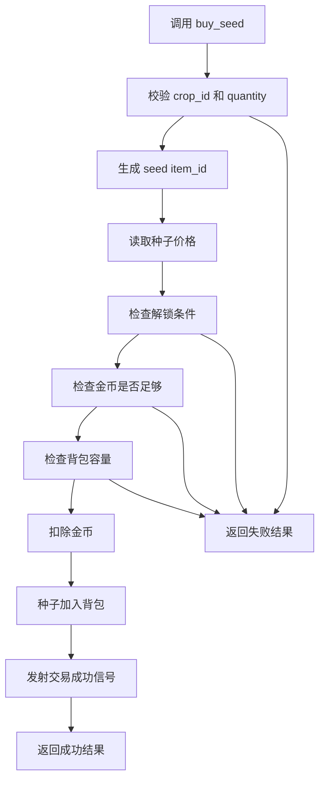
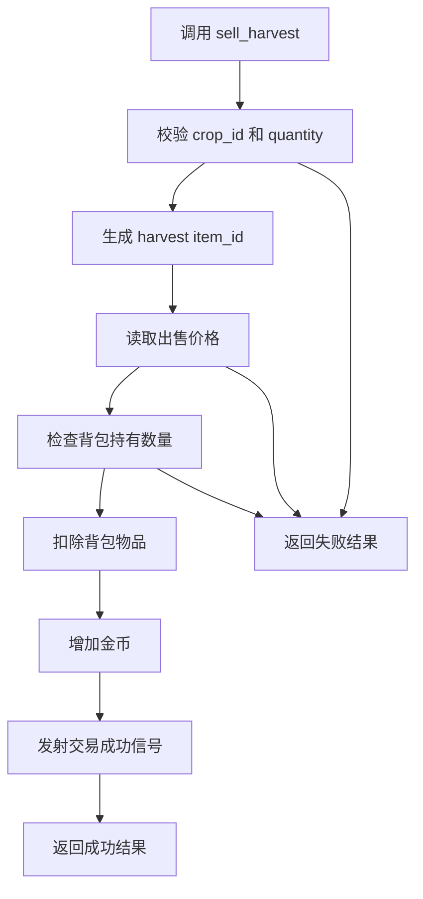

# PRD4: 经济系统 + 商店逻辑（数据层）

> **优先级**: P0 — 核心玩法闭环基础
> **美术依赖**: 无（纯逻辑/数据层，无 UI、无视觉表现）
> **前置依赖**: PRD1（项目骨架 + 核心数据系统）、PRD3（背包/库存系统）
> **产出**: EconomyManager 全局单例 + 商店数据结构 + 购买/出售交易逻辑 + 单元测试场景
> **最后更新**: 2026-05-22

---

## 1. 目标

实现《像素田园》的经济系统与商店数据层，包含：

- 金币增减的统一入口与交易校验
- 种子购买逻辑（金币扣除 + 背包入库）
- 作物出售逻辑（背包扣除 + 金币增加）
- 商店商品列表与价格查询
- 商品解锁与可购买性校验（预留 PRD5 等级系统接入）
- 交易结果结构化返回，便于后续 UI 展示失败原因
- 与 EventBus 的交易信号联动
- 自动化测试场景验证完整交易流程

完成后，可通过代码调用跑通完整的「出售作物 → 获得金币 → 购买种子 → 种子进入背包」经济循环，为后续 PRD12 商店 UI 与 PRD10 种植交互提供稳定的数据接口。

---

## 2. 核心设计决策（已确认）

| 决策 | 内容 | 来源 |
|------|------|------|
| 单一货币优先 | PRD4 仅实现金币，友情点、季节币后续扩展 | 《游戏设计文档》9.2 |
| 交易数据来源 | 种子价格来自 `crops.json` 的 `seed_price`，收获物售价来自 `items.json` 的 `sell_price`，必要时回退到 `crops.json` 的 `sell_price` | PRD1 / PRD3 数据结构 |
| 背包为交易库存权威 | 购买入库、出售扣除全部通过 InventoryManager 完成 | PRD3 |
| GameManager 保留金币权威 | 金币数值仍由 GameManager.gold 持有，EconomyManager 作为经济操作统一入口调用 GameManager | 现有项目结构 |
| 纯数据层 | 不实现商店场景、NPC、按钮、确认弹窗等 UI 交互 | PRD 拆分大纲 |
| 失败不产生副作用 | 任一校验失败时，不扣金币、不改背包、不发成功交易信号 | 设计决定 |

---

## 3. 功能需求

### 3.1 EconomyManager 全局单例

新增 `scripts/autoload/economy_manager.gd`，注册为 Autoload。

**职责**:

- 提供购买、出售、价格查询、商品列表查询接口
- 统一校验金币、背包空间、物品类型、解锁条件
- 调用 GameManager 完成金币变更
- 调用 InventoryManager 完成库存变更
- 发射交易相关 EventBus 信号
- 维护基础交易统计数据

#### 3.1.1 公共接口

```gdscript
extends Node

# ─── 购买相关 ───

## 购买指定数量的种子，返回交易结果
func buy_seed(crop_id: String, quantity: int = 1) -> Dictionary

## 购买任意商店商品，当前版本主要支持 seed / consumable / decoration
func buy_item(item_id: String, quantity: int = 1) -> Dictionary

## 判断指定商品是否可购买
func can_buy_item(item_id: String, quantity: int = 1) -> Dictionary

# ─── 出售相关 ───

## 出售指定数量的收获物，返回交易结果
func sell_harvest(crop_id: String, quantity: int = 1) -> Dictionary

## 出售任意可出售物品，返回交易结果
func sell_item(item_id: String, quantity: int = 1) -> Dictionary

## 判断指定物品是否可出售
func can_sell_item(item_id: String, quantity: int = 1) -> Dictionary

# ─── 查询相关 ───

## 获取指定商品购买价格
func get_buy_price(item_id: String) -> int

## 获取指定物品出售价格
func get_sell_price(item_id: String) -> int

## 获取可购买种子列表
func get_seed_shop_items() -> Array

## 获取全部商店商品列表
func get_shop_items() -> Array

## 获取背包内可出售物品列表
func get_sellable_inventory_items() -> Array

## 获取指定商品的展示数据
func get_shop_item_info(item_id: String) -> Dictionary

# ─── 存档/统计相关 ───

## 导出经济统计数据
func export_save_data() -> Dictionary

## 导入经济统计数据
func import_save_data(data: Dictionary) -> void
```

### 3.2 交易结果结构

所有购买/出售接口返回统一 Dictionary，避免 UI 或测试层依赖字符串解析。

```gdscript
var result := {
    "success": true,
    "type": "buy",                 # buy / sell
    "item_id": "seed_carrot",
    "crop_id": "carrot",
    "quantity": 3,
    "unit_price": 10,
    "total_price": 30,
    "gold_before": 100,
    "gold_after": 70,
    "message": "购买成功",
    "error_code": "",              # success 时为空
}
```

失败结果示例：

```gdscript
var result := {
    "success": false,
    "type": "buy",
    "item_id": "seed_pumpkin",
    "crop_id": "pumpkin",
    "quantity": 1,
    "unit_price": 35,
    "total_price": 35,
    "gold_before": 20,
    "gold_after": 20,
    "message": "金币不足",
    "error_code": "NOT_ENOUGH_GOLD",
}
```

#### 3.2.1 错误码

| error_code | 场景 | 是否产生副作用 |
|------------|------|:---:|
| `INVALID_ITEM` | item_id 为空或 DataManager 中不存在 | 否 |
| `INVALID_CROP` | crop_id 为空或 DataManager 中不存在 | 否 |
| `INVALID_QUANTITY` | quantity 小于等于 0 | 否 |
| `NOT_SELLABLE` | 物品不可出售 | 否 |
| `NOT_BUYABLE` | 物品不可购买 | 否 |
| `NOT_ENOUGH_GOLD` | 金币不足 | 否 |
| `NOT_ENOUGH_ITEMS` | 背包中物品数量不足 | 否 |
| `INVENTORY_FULL` | 背包无法容纳全部购买数量 | 否 |
| `LOCKED` | 等级或条件未满足 | 否 |

### 3.3 购买逻辑

#### 3.3.1 种子购买

```gdscript
func buy_seed(crop_id: String, quantity: int = 1) -> Dictionary
```

前置条件：

- `crop_id` 在 DataManager.crops 中存在
- `quantity > 0`
- 对应种子物品 `seed_` + `crop_id` 在 DataManager.items 中存在
- 玩家金币足够支付 `seed_price * quantity`
- InventoryManager 可以完整容纳购买数量
- 当前玩家等级满足作物 `unlock_level`（PRD5 未实现前使用 GameManager.level）

行为：

1. 根据 `crop_id` 生成 `item_id = "seed_" + crop_id`
2. 读取作物数据中的 `seed_price`
3. 计算 `total_price = seed_price * quantity`
4. 校验金币、背包容量、解锁条件
5. 调用 `GameManager.spend_gold(total_price)` 扣除金币
6. 调用 `InventoryManager.add_item(item_id, quantity)` 添加种子
7. 更新交易统计
8. 发射 `EventBus.item_purchased(item_id, total_price)`
9. 发射新增信号 `EventBus.transaction_completed(result)`
10. 返回成功结果

失败时：

- 返回 `success = false` 的交易结果
- 不扣金币
- 不改变背包
- 不发射成功交易信号
- 可发射 `EventBus.ui_notification(message, "warning")` 提示原因

#### 3.3.2 通用商品购买

```gdscript
func buy_item(item_id: String, quantity: int = 1) -> Dictionary
```

支持类型：

| type | 是否可购买 | 价格字段 | 说明 |
|------|:---:|----------|------|
| `seed` | ✅ | `price` 或对应 crop 的 `seed_price` | 当前核心商品 |
| `consumable` | ✅ | `price` | 如肥料 |
| `decoration` | ✅ | `price` | 如木栅栏、石子路 |
| `tool` | 条件购买 | `price` | 基础水壶初始拥有，重复购买可先禁止 |
| `harvest` | ❌ | — | 收获物不可从商店购买 |

### 3.4 出售逻辑

#### 3.4.1 作物出售

```gdscript
func sell_harvest(crop_id: String, quantity: int = 1) -> Dictionary
```

前置条件：

- `crop_id` 在 DataManager.crops 中存在
- 对应收获物 `harvest_` + `crop_id` 在 DataManager.items 中存在
- `quantity > 0`
- 背包中拥有足够数量的对应收获物
- 该物品有有效 `sell_price`

行为：

1. 根据 `crop_id` 生成 `item_id = "harvest_" + crop_id`
2. 读取出售单价
3. 计算 `total_price = sell_price * quantity`
4. 调用 `InventoryManager.remove_item(item_id, quantity)` 扣除收获物
5. 调用 `GameManager.add_gold(total_price, "sell")` 增加金币
6. 给予出售经验（PRD5 正式实现前可暂不接入或通过 GameManager.add_xp 预留）
7. 更新交易统计
8. 发射 `EventBus.item_sold(item_id, total_price)`
9. 发射新增信号 `EventBus.transaction_completed(result)`
10. 返回成功结果

#### 3.4.2 通用物品出售

```gdscript
func sell_item(item_id: String, quantity: int = 1) -> Dictionary
```

可出售规则：

| type | 是否可出售 | 说明 |
|------|:---:|------|
| `harvest` | ✅ | 核心出售对象 |
| `seed` | 可选 | 当前版本建议允许半价回收或禁止，默认禁止以避免套利 |
| `consumable` | 可选 | 当前版本默认禁止 |
| `decoration` | 可选 | 当前版本默认禁止 |
| `tool` | ❌ | 工具不可出售 |

PRD4 默认仅允许 `harvest` 类型出售，后续商店 UI 可根据设计扩展其它类型回收。

### 3.5 价格查询规则

#### 3.5.1 购买价格

```gdscript
func get_buy_price(item_id: String) -> int
```

规则优先级：

1. 若 item 数据存在 `price` 字段，返回该字段
2. 若 item 类型为 `seed` 且存在 `crop_id`，返回对应 crop 的 `seed_price`
3. 否则返回 `-1` 表示不可购买或价格无效

#### 3.5.2 出售价格

```gdscript
func get_sell_price(item_id: String) -> int
```

规则优先级：

1. 若 item 数据存在 `sell_price` 字段，返回该字段
2. 若 item 类型为 `harvest` 且存在 `crop_id`，返回对应 crop 的 `sell_price`
3. 否则返回 `-1` 表示不可出售或价格无效

### 3.6 商店商品列表

#### 3.6.1 种子商品列表

```gdscript
func get_seed_shop_items() -> Array
```

返回结构：

```gdscript
[
    {
        "item_id": "seed_carrot",
        "crop_id": "carrot",
        "name": "胡萝卜种子",
        "type": "seed",
        "price": 10,
        "unlocked": true,
        "unlock_level": 1,
        "owned_count": 5,
        "can_afford_one": true,
    }
]
```

列表来源：

- 遍历 DataManager.get_all_crops()
- 每个 crop 生成对应种子商品
- 通过 `unlock_level` 与 GameManager.level 判断是否解锁
- 通过 `GameManager.gold >= price` 判断是否买得起 1 个
- 通过 `InventoryManager.get_item_count(item_id)` 获取持有数量

#### 3.6.2 全部商店商品列表

```gdscript
func get_shop_items() -> Array
```

包含：

- 所有种子商品
- `type = consumable` 且有 `price` 的物品，如肥料
- `type = decoration` 且有 `price` 的物品，如木栅栏、稻草人、石子路

PRD4 只提供数据查询，商品分类、排序、分页、按钮展示由 PRD12 处理。

#### 3.6.3 背包可出售列表

```gdscript
func get_sellable_inventory_items() -> Array
```

返回背包中所有可出售物品：

```gdscript
[
    {
        "item_id": "harvest_carrot",
        "name": "胡萝卜",
        "quantity": 12,
        "unit_price": 25,
        "total_price": 300,
        "slot_indexes": [3, 4]
    }
]
```

### 3.7 解锁条件

PRD4 需要预留等级解锁查询，但不实现完整等级系统。

当前版本规则：

```gdscript
func _is_item_unlocked(item_id: String) -> bool:
    var item_data := DataManager.get_item(item_id)
    if item_data.get("type", "") == "seed":
        var crop_id := item_data.get("crop_id", "")
        var crop_data := DataManager.get_crop(crop_id)
        return GameManager.level >= int(crop_data.get("unlock_level", 1))
    return true
```

PRD5 完成后，可改为调用等级系统接口：

```gdscript
LevelManager.is_crop_unlocked(crop_id)
LevelManager.is_feature_unlocked(feature_id)
```

### 3.8 交易统计

EconomyManager 维护以下统计，供存档、成就、测试使用：

```gdscript
var stats := {
    "total_gold_spent": 0,
    "total_gold_earned_from_sales": 0,
    "total_items_bought": 0,
    "total_items_sold": 0,
    "total_transactions": 0,
}
```

同步规则：

- 成功购买后增加 `total_gold_spent`、`total_items_bought`、`total_transactions`
- 成功出售后增加 `total_gold_earned_from_sales`、`total_items_sold`、`total_transactions`
- 出售获得金币时也会通过 GameManager 更新 `total_gold_earned`

### 3.9 与 EventBus 的信号交互

#### 3.9.1 已有信号

| 信号 | 时机 | 参数 |
|------|------|------|
| `gold_changed` | GameManager 金币变更 | `new_amount, delta` |
| `item_purchased` | 成功购买商品 | `item_id, price` |
| `item_sold` | 成功出售商品 | `item_id, price` |
| `item_added` | 背包入库 | `item_id, quantity, slot_index` |
| `item_removed` | 背包扣除 | `item_id, quantity` |
| `inventory_full` | 背包已满 | 无 |
| `ui_notification` | 交易失败提示 | `message, type` |

#### 3.9.2 新增信号

需要在 `scripts/autoload/event_bus.gd` 增加：

```gdscript
signal transaction_completed(result: Dictionary)
signal transaction_failed(result: Dictionary)
```

信号规则：

- `transaction_completed` 仅在交易成功并且所有状态已更新后发射
- `transaction_failed` 在校验失败时发射，但不改变金币或背包
- UI 可监听这两个信号展示金币动画、错误提示、交易记录

---

## 4. 数据表要求

### 4.1 `data/crops.json`

PRD4 依赖以下字段：

| 字段 | 类型 | 用途 | 示例 |
|------|------|------|------|
| `id` | String | 生成种子/收获物 item_id | `carrot` |
| `name` | String | 商品展示名称 | `胡萝卜` |
| `seed_price` | int | 种子购买价格 | `10` |
| `sell_price` | int | 收获物出售价格回退值 | `25` |
| `unlock_level` | int | 种子解锁等级 | `1` |

### 4.2 `data/items.json`

PRD4 依赖以下字段：

| 字段 | 类型 | 用途 | 示例 |
|------|------|------|------|
| `id` | String | 物品唯一标识 | `seed_carrot` |
| `name` | String | 展示名称 | `胡萝卜种子` |
| `type` | String | 判断购买/出售类型 | `seed` / `harvest` |
| `crop_id` | String | 关联作物 | `carrot` |
| `price` | int | 购买价格 | `10` |
| `sell_price` | int | 出售价格 | `25` |
| `stackable` | bool | 背包堆叠规则 | `true` |
| `max_stack` | int | 最大堆叠数量 | `99` |

当前项目中 `items.json` 已包含：

- 10 个种子物品：`seed_carrot` 到 `seed_broccoli`
- 10 个收获物品：`harvest_carrot` 到 `harvest_broccoli`
- 若干消耗品/装饰物：`fertilizer`、`fence_wood`、`scarecrow`、`stone_path`

PRD4 不要求新增商品数据，但要求实现时对缺失价格字段有明确回退与错误处理。

---

## 5. 边界情况处理

| 场景 | 行为 |
|------|------|
| 购买数量为 0 或负数 | 返回 `INVALID_QUANTITY`，无副作用 |
| 购买不存在的 item_id | 返回 `INVALID_ITEM`，无副作用 |
| 购买不存在的 crop_id | 返回 `INVALID_CROP`，无副作用 |
| 购买收获物 | 返回 `NOT_BUYABLE`，无副作用 |
| 金币不足 | 返回 `NOT_ENOUGH_GOLD`，无副作用 |
| 背包剩余容量不足 | 返回 `INVENTORY_FULL`，无副作用 |
| 商品未解锁 | 返回 `LOCKED`，无副作用 |
| 出售数量超过持有数量 | 返回 `NOT_ENOUGH_ITEMS`，无副作用 |
| 出售不可出售物品 | 返回 `NOT_SELLABLE`，无副作用 |
| 价格字段缺失 | 查询返回 `-1`，交易返回 `NOT_BUYABLE` 或 `NOT_SELLABLE` |
| 交易中间步骤失败 | 回滚已发生的状态变更，返回失败结果 |

### 5.1 购买操作原子性

购买必须避免「扣了金币但物品未入包」的状态。

推荐实现顺序：

1. 用 `InventoryManager.get_addable_count(item_id)` 预检容量
2. 用 `GameManager.can_afford(total_price)` 预检金币
3. 所有校验通过后再扣金币
4. 扣金币后调用 `InventoryManager.add_item(item_id, quantity)`
5. 如果实际添加数量小于购买数量，必须回滚金币并移除已添加数量

```gdscript
var added := InventoryManager.add_item(item_id, quantity)
if added != quantity:
    InventoryManager.remove_item(item_id, added)
    GameManager.add_gold(total_price, "transaction_rollback")
    return _make_failed_result("INVENTORY_FULL")
```

### 5.2 出售操作原子性

出售必须避免「扣了物品但金币未增加」的状态。

推荐实现顺序：

1. 用 `InventoryManager.has_item(item_id, quantity)` 预检数量
2. 读取出售价格并计算总价
3. 调用 `InventoryManager.remove_item(item_id, quantity)`
4. 若实际移除数量不足，回滚已移除数量
5. 移除成功后调用 `GameManager.add_gold(total_price, "sell")`

---

## 6. 测试需求

### 6.1 自动化测试场景

创建：

| 文件 | 操作 | 说明 |
|------|------|------|
| `scenes/test/test_economy_manager.tscn` | 新增 | EconomyManager 测试场景 |
| `scenes/test/test_economy_manager.gd` | 新增 | 自动化测试脚本 |

### 6.2 测试场景结构

```text
test_economy_manager.tscn
└── TestEconomyManager (Node2D)
    └── Label (显示测试结果)
```

### 6.3 测试用例清单

```gdscript
func _ready() -> void:
    print("=== EconomyManager 自动化测试 ===")

    test_get_buy_price_seed()
    test_get_sell_price_harvest()
    test_buy_seed_success()
    test_buy_seed_not_enough_gold()
    test_buy_seed_invalid_crop()
    test_buy_item_invalid_quantity()
    test_buy_item_inventory_full()
    test_buy_locked_seed()
    test_buy_harvest_not_buyable()
    test_sell_harvest_success()
    test_sell_harvest_not_enough_items()
    test_sell_invalid_item()
    test_sell_seed_not_sellable()
    test_get_seed_shop_items()
    test_get_shop_items()
    test_get_sellable_inventory_items()
    test_transaction_signals()
    test_export_import_stats()

    print("=== 全部测试完成 ===")
```

每个测试函数应：

1. 清理 GameManager、InventoryManager、EconomyManager 状态
2. 设置金币、等级、背包物品等前置条件
3. 执行购买或出售操作
4. 使用 `assert()` 验证交易结果、金币、背包、信号、统计数据
5. 清理测试数据，避免影响下一个测试

### 6.4 关键验收测试示例

#### 购买成功

```gdscript
GameManager.gold = 100
InventoryManager.debug_clear()
var result := EconomyManager.buy_seed("carrot", 3)
assert(result["success"] == true)
assert(GameManager.gold == 70)
assert(InventoryManager.get_item_count("seed_carrot") == 3)
```

#### 金币不足

```gdscript
GameManager.gold = 5
InventoryManager.debug_clear()
var result := EconomyManager.buy_seed("carrot", 1)
assert(result["success"] == false)
assert(result["error_code"] == "NOT_ENOUGH_GOLD")
assert(GameManager.gold == 5)
assert(InventoryManager.get_item_count("seed_carrot") == 0)
```

#### 出售成功

```gdscript
GameManager.gold = 0
InventoryManager.debug_clear()
InventoryManager.add_item("harvest_carrot", 2)
var result := EconomyManager.sell_harvest("carrot", 2)
assert(result["success"] == true)
assert(GameManager.gold == 50)
assert(InventoryManager.get_item_count("harvest_carrot") == 0)
```

---

## 7. 验收标准

### 7.1 购买验收

- [ ] `EconomyManager.buy_seed("carrot", 1)` 成功时扣除 10 金币
- [ ] 购买成功后背包增加 `seed_carrot`
- [ ] 购买多个种子时按数量正确计算总价
- [ ] 金币不足时返回 `NOT_ENOUGH_GOLD`，金币与背包不变
- [ ] 背包容量不足时返回 `INVENTORY_FULL`，金币与背包不变
- [ ] 未解锁种子返回 `LOCKED`，金币与背包不变
- [ ] 无效 crop_id 返回 `INVALID_CROP`
- [ ] 无效 quantity 返回 `INVALID_QUANTITY`
- [ ] 成功购买发射 `item_purchased` 与 `transaction_completed`
- [ ] 失败购买发射 `transaction_failed`，不发射 `item_purchased`

### 7.2 出售验收

- [ ] `EconomyManager.sell_harvest("carrot", 1)` 成功时增加 25 金币
- [ ] 出售成功后背包扣除 `harvest_carrot`
- [ ] 出售多个收获物时按数量正确计算总价
- [ ] 物品不足时返回 `NOT_ENOUGH_ITEMS`，金币与背包不变
- [ ] 出售种子默认返回 `NOT_SELLABLE`
- [ ] 出售工具返回 `NOT_SELLABLE`
- [ ] 无效 item_id 返回 `INVALID_ITEM`
- [ ] 成功出售发射 `item_sold` 与 `transaction_completed`
- [ ] 失败出售发射 `transaction_failed`，不发射 `item_sold`

### 7.3 价格与列表验收

- [ ] `get_buy_price("seed_carrot")` 返回 10
- [ ] `get_sell_price("harvest_carrot")` 返回 25
- [ ] 不可购买物品的购买价格返回 -1
- [ ] 不可出售物品的出售价格返回 -1
- [ ] `get_seed_shop_items()` 返回 10 种种子商品
- [ ] 种子商品包含 price、unlocked、owned_count、can_afford_one 字段
- [ ] `get_shop_items()` 包含种子、肥料、装饰物等可购买商品
- [ ] `get_sellable_inventory_items()` 仅返回背包中可出售且数量大于 0 的物品

### 7.4 统计与存档验收

- [ ] 成功购买更新 `total_gold_spent`
- [ ] 成功出售更新 `total_gold_earned_from_sales`
- [ ] 成功交易更新 `total_transactions`
- [ ] `export_save_data()` 可导出统计数据
- [ ] `import_save_data()` 可恢复统计数据
- [ ] GameManager 存档流程可预留 economy 数据接入点

### 7.5 自动化测试验收

- [ ] `test_economy_manager.tscn` 可运行且无报错
- [ ] 所有购买测试通过
- [ ] 所有出售测试通过
- [ ] 所有价格查询测试通过
- [ ] 所有列表查询测试通过
- [ ] 所有交易失败场景无状态污染

---

## 8. 技术约束

1. **Autoload 注册**:
   - 脚本路径: `scripts/autoload/economy_manager.gd`
   - 注册名: `EconomyManager`
   - 加载顺序: EventBus → DataManager → GameManager → CropManager → InventoryManager → **EconomyManager** → SceneManager → AudioManager
   - 不使用 `class_name`，保持与现有 Autoload 风格一致

2. **数据不可变**:
   - 价格与商品元数据只从 DataManager 读取
   - 不在运行时修改 `crops.json` 或 `items.json` 加载后的原始数据
   - 商店列表返回副本，防止外部修改内部结果

3. **交易原子性**:
   - 任意失败场景不得只完成一半交易
   - 购买失败不扣金币、不加物品
   - 出售失败不扣物品、不加金币

4. **信号优先**:
   - 交易成功、失败都通过 EventBus 广播
   - 不直接引用 UI、场景节点或商店 NPC

5. **兼容现有 GameManager**:
   - 金币仍使用 `GameManager.gold`
   - 金币变更优先调用 `GameManager.add_gold()` 与 `GameManager.spend_gold()`
   - 不直接绕过 GameManager 修改金币，除测试准备阶段外

6. **兼容现有 InventoryManager**:
   - 商品入库使用 `InventoryManager.add_item()`
   - 商品扣除使用 `InventoryManager.remove_item()`
   - 容量预检使用 `InventoryManager.get_addable_count()`

---

## 9. 需要新增/修改的文件

| 文件 | 操作 | 说明 |
|------|------|------|
| `scripts/autoload/economy_manager.gd` | 新增 | 经济与商店数据层主体 |
| `scripts/autoload/event_bus.gd` | 修改 | 新增 `transaction_completed`、`transaction_failed` 信号 |
| `project.godot` | 修改 | `[autoload]` 注册 EconomyManager |
| `scripts/autoload/game_manager.gd` | 修改 | 存档中预留 economy 数据导入/导出，必要时补充金币接口兼容 |
| `scenes/test/test_economy_manager.tscn` | 新增 | 测试场景 |
| `scenes/test/test_economy_manager.gd` | 新增 | 自动化测试脚本 |

---

## 10. 非目标 (Not in Scope)

以下内容不在 PRD4 范围内：

- 商店 UI 面板、商品按钮、购买确认弹窗 → PRD12
- 商店场景搭建、NPC 店主、货架视觉表现 → 后续场景/UI PRD
- 等级/经验/解锁系统完整实现 → PRD5
- 多货币系统（友情点、季节币） → 社交/活动后续 PRD
- 任务奖励、订单系统、每日委托 → 后续扩展
- 商品折扣、促销、价格波动 → 后续扩展
- Steam 交易、排行榜经济统计 → Steam 集成后续 PRD

PRD4 的目标是：**让金币、购买、出售这条核心经济链路通过纯代码稳定跑通，并能被后续商店 UI、种植闭环、等级系统直接复用。**

---

## 11. 后续衔接

| 完成 PRD4 后可启动 | 说明 |
|-------------------|------|
| → PRD5（等级/经验/解锁系统） | EconomyManager 已预留 `unlock_level` 校验，可替换为 LevelManager 接口 |
| → PRD10（种植/浇水/收获交互） | 玩家可出售作物换金币，再购买种子继续种植 |
| → PRD12（商店 UI 面板） | 直接使用 `get_shop_items()`、`buy_seed()`、`sell_item()` 构建 UI |
| → PRD13（HUD） | 监听 `gold_changed` 与交易信号显示金币变化 |
| → PRD6（存档系统） | 可接入 EconomyManager 的交易统计数据 |

---

## 附录 A: 核心交易流程

### A.1 购买种子流程



### A.2 出售作物流程



---

## 附录 B: 作物价格表

| crop_id | 作物 | 种子价格 | 出售价格 | 利润 |
|---------|------|:---:|:---:|:---:|
| `carrot` | 胡萝卜 | 10 | 25 | 15 |
| `tomato` | 番茄 | 15 | 40 | 25 |
| `cabbage` | 白菜 | 8 | 20 | 12 |
| `corn` | 玉米 | 20 | 55 | 35 |
| `potato` | 土豆 | 12 | 30 | 18 |
| `strawberry` | 草莓 | 25 | 65 | 40 |
| `pepper` | 辣椒 | 18 | 45 | 27 |
| `pumpkin` | 南瓜 | 35 | 90 | 55 |
| `eggplant` | 茄子 | 22 | 50 | 28 |
| `broccoli` | 西兰花 | 28 | 60 | 32 |

---

> *本 PRD 完成后，项目应具备稳定的纯数据经济系统，可通过代码完成购买种子、出售作物、更新金币与背包，并为后续商店 UI 和完整种植经营循环奠定基础。*
