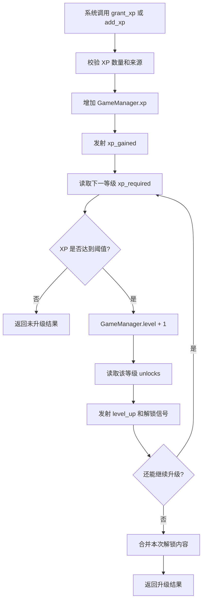

# PRD5: 等级/经验/解锁系统（数据层）

> **优先级**: P0 — 核心成长与内容解锁基础  
> **美术依赖**: 无（纯逻辑/数据层，无 UI、无视觉表现）  
> **预计工期**: 3-4 天  
> **前置依赖**: PRD1（项目骨架 + 核心数据系统）、PRD2（作物生长状态机）、PRD3（背包/库存系统）、PRD4（经济系统 + 商店逻辑）  
> **产出**: LevelManager 全局单例 + 经验获取/升级判定 + 作物/功能/地块解锁查询 + 单元测试场景  
> **最后更新**: 2026-05-22

---

## 1. 目标

实现《像素田园》的等级、经验与解锁数据层系统，包含：

- 玩家经验值增加的统一入口
- 根据 `levels.json` 自动判定升级
- 作物解锁条件查询
- 功能解锁条件查询
- 农田可用地块数量解锁查询
- 升级奖励与解锁内容结构化返回
- 与 CropManager、EconomyManager、GameManager 的经验/等级职责收敛
- 与 EventBus 的经验、升级、解锁信号联动
- 可导出/导入的等级系统存档数据
- 自动化测试场景验证完整升级与解锁流程

完成后，项目应能通过代码调用跑通完整的「获得 XP → 自动升级 → 解锁新作物/新功能/更多地块 → 商店与种植系统按解锁状态限制内容」成长循环，为后续商店 UI、HUD、田园网格、存档系统提供稳定接口。

---

## 2. 核心设计决策（已确认）

| 决策 | 内容 | 来源 |
|------|------|------|
| 等级配置数据来源 | `data/levels.json` 是等级阈值与解锁内容的唯一配置来源 | PRD1 / 现有项目数据 |
| XP 数值权威 | `GameManager.xp` 和 `GameManager.level` 保留为玩家核心状态，LevelManager 作为操作与查询统一入口 | 现有 `game_manager.gd` |
| 升级可连续触发 | 一次获得大量 XP 时允许连续升多级，直到 XP 不足或达到最高等级 | 设计决定 |
| 解锁内容累积 | 当前等级可用内容 = 1 级到当前等级所有 unlocks 的并集 | 《游戏设计文档》9.1 |
| 作物解锁 | 作物以 `levels.json.unlocks.crops` 为准，兼容 `crops.json.unlock_level` 查询 | PRD1 / PRD4 |
| 功能解锁 | 功能以字符串 feature_id 表示，例如 `decoration_mode`、`steal_crops` | 现有 `levels.json` |
| 地块解锁 | `farm_slots` 表示当前等级允许使用的最大农田格数 | 《游戏设计文档》个人田园扩展 |
| 纯数据层 | 不实现经验条 UI、升级弹窗、解锁提示面板、特效动画 | PRD 拆分大纲 |

---

## 3. 等级与经验设计

### 3.1 等级表

当前 `data/levels.json` 包含 7 个等级：

| 等级 | 名称 | 所需累计 XP | 本级新增作物 | 本级新增功能 | 农田格数 |
|:---:|------|:---:|------------|------------|:---:|
| 1 | 新手农夫 | 0 | 胡萝卜、白菜、玉米、土豆 | `basic_farm` | 12 |
| 2 | 小园丁 | 100 | 番茄 | `watering_can_upgrade` | 16 |
| 3 | 种植能手 | 250 | 草莓 | `decoration_mode` | 24 |
| 4 | 田园达人 | 500 | 辣椒、茄子 | `steal_crops`, `expand_land` | 36 |
| 5 | 农场主 | 800 | 南瓜 | `animal_companion` | 48 |
| 6 | 园艺大师 | 1200 | 西兰花 | `public_plaza` | 64 |
| 7 | 传说农夫 | 1800 | — | `golden_decoration`, `special_title` | 80 |

### 3.2 经验获取规则

PRD5 定义经验来源与统一计算规则：

| 来源 source | 触发场景 | XP 规则 | 接入系统 |
|-------------|----------|---------|----------|
| `plant` | 成功种植作物 | +5 XP / 次 | CropManager |
| `harvest` | 成功收获作物 | +10 XP / 次 | CropManager |
| `sell` | 成功出售收获物 | `floor(出售总价 × 0.5)` XP | EconomyManager |
| `steal` | 成功偷菜 | +3 XP / 次 | PRD22 |
| `manual` | 测试或调试直接加经验 | 传入 amount | LevelManager / 测试 |

> PRD5 只实现数据层规则与接口；偷菜经验来源在 PRD22 接入。

### 3.3 XP 阈值规则

- `xp_required` 表示达到该等级所需的**累计 XP**，不是从上一级到当前级的增量。
- 当前等级由玩家累计 XP 与等级表共同决定。
- 达到下一等级阈值时立即升级。
- 达到最高等级后仍可继续累计 XP，但等级不再提升。

示例：

```text
玩家当前 Level 1, XP = 90
获得 20 XP 后 XP = 110
Level 2 需要 100 XP，因此升级到 Level 2
```

---

## 4. 功能需求

### 4.1 LevelManager 全局单例

新增 `scripts/autoload/level_manager.gd`，注册为 Autoload。

**职责**:

- 提供经验增加、等级重算、升级判定接口
- 读取 `DataManager.get_level_data()` 与 `DataManager.levels`
- 管理本次升级解锁内容的计算与广播
- 提供作物、功能、农田格数解锁查询
- 统一替代 GameManager 中分散的 `_check_level_up()` 逻辑
- 导出/导入等级系统扩展数据
- 为 UI、商店、田园系统提供只读查询结果

#### 4.1.1 公共接口

```gdscript
extends Node

# ─── 经验与升级 ───

## 增加经验值，并自动检查升级
## 返回本次 XP 变化与升级结果
func add_xp(amount: int, source: String = "manual") -> Dictionary

## 根据当前 GameManager.xp 重算等级，返回是否发生变化
func recalculate_level() -> Dictionary

## 检查是否可以升级，可连续升级
func check_level_up() -> Dictionary

## 设置玩家等级和经验（测试/读档修正用）
func set_progress(level: int, xp: int) -> void

# ─── 等级查询 ───

## 获取当前等级数据
func get_current_level_data() -> Dictionary

## 获取下一等级数据，满级时返回空字典
func get_next_level_data() -> Dictionary

## 获取最高等级
func get_max_level() -> int

## 判断是否满级
func is_max_level() -> bool

## 获取当前经验进度
func get_xp_progress() -> Dictionary

# ─── 解锁查询 ───

## 判断指定作物是否已解锁
func is_crop_unlocked(crop_id: String) -> bool

## 获取指定作物的解锁等级
func get_crop_unlock_level(crop_id: String) -> int

## 获取当前已解锁作物 ID 列表
func get_unlocked_crops() -> Array

## 获取当前未解锁作物信息列表
func get_locked_crops() -> Array

## 判断指定功能是否已解锁
func is_feature_unlocked(feature_id: String) -> bool

## 获取当前已解锁功能 ID 列表
func get_unlocked_features() -> Array

## 获取当前等级允许的农田格数
func get_unlocked_farm_slots() -> int

## 获取指定等级新增的解锁内容
func get_level_unlocks(level: int) -> Dictionary

## 获取当前等级累计解锁内容
func get_accumulated_unlocks(level: int = -1) -> Dictionary

# ─── 经验规则 ───

## 根据来源和上下文计算 XP
func calculate_xp(source: String, context: Dictionary = {}) -> int

## 按来源授予 XP
func grant_xp(source: String, context: Dictionary = {}) -> Dictionary

# ─── 存档/调试 ───

## 导出等级系统存档数据
func export_save_data() -> Dictionary

## 导入等级系统存档数据
func import_save_data(data: Dictionary) -> void

## [调试] 重置等级进度
func debug_reset_progress() -> void
```

---

## 5. 经验与升级结果结构

所有 XP 增加与升级接口返回统一 Dictionary，便于测试、UI、日志复用。

### 5.1 获得 XP 成功结果

```gdscript
var result := {
    "success": true,
    "xp_added": 10,
    "source": "harvest",
    "xp_before": 90,
    "xp_after": 100,
    "level_before": 1,
    "level_after": 2,
    "leveled_up": true,
    "levels_gained": [2],
    "unlocks": {
        "crops": ["tomato"],
        "features": ["watering_can_upgrade"],
        "farm_slots": 16,
    },
    "message": "获得 10 XP，升级到 2 级",
    "error_code": "",
}
```

### 5.2 失败结果

```gdscript
var result := {
    "success": false,
    "xp_added": 0,
    "source": "manual",
    "xp_before": 0,
    "xp_after": 0,
    "level_before": 1,
    "level_after": 1,
    "leveled_up": false,
    "levels_gained": [],
    "unlocks": {},
    "message": "经验值必须大于 0",
    "error_code": "INVALID_XP_AMOUNT",
}
```

### 5.3 错误码

| error_code | 场景 | 是否产生副作用 |
|------------|------|:---:|
| `INVALID_XP_AMOUNT` | amount 小于等于 0 | 否 |
| `INVALID_SOURCE` | source 为空或未知且无法计算 | 否 |
| `INVALID_LEVEL_DATA` | `levels.json` 缺失或结构错误 | 否 |
| `MAX_LEVEL_REACHED` | 已满级且接口要求必须升级 | 否 |

---

## 6. 详细行为规范

### 6.1 `add_xp(amount, source)`

前置条件：

- `amount > 0`
- `source` 非空
- `DataManager` 已成功加载 `levels.json`

行为：

1. 记录 `xp_before = GameManager.xp` 与 `level_before = GameManager.level`
2. 增加 `GameManager.xp += amount`
3. 更新统计：`GameManager.stats["total_xp_earned"] += amount`
4. 发射 `EventBus.xp_gained(amount, source)`
5. 调用 `check_level_up()` 连续升级
6. 若升级，计算每一级新增 unlocks
7. 返回结构化结果

失败时：

- 返回 `success = false`
- 不修改 XP、等级、统计
- 可发射 `EventBus.ui_notification(message, "warning")`

### 6.2 `check_level_up()`

升级逻辑：

```text
while GameManager.level < max_level:
    next_level_data = DataManager.get_level_data(GameManager.level + 1)
    required_xp = next_level_data["xp_required"]
    if GameManager.xp >= required_xp:
        GameManager.level += 1
        收集该等级新增 unlocks
        发射 level_up / content_unlocked 信号
    else:
        break
```

关键规则：

- 一次 XP 增加可能触发多次升级。
- 每升一级都必须发射一次 `level_up`。
- 最终结果中的 `unlocks` 应合并本次所有升级新增内容。
- 到达满级后停止循环，XP 可继续保留。

### 6.3 `recalculate_level()`

用于读档、调试或数据修正。

行为：

1. 根据 `GameManager.xp` 从等级表中查找应处等级
2. 若应处等级与 `GameManager.level` 不一致，则修正
3. 返回修正前后等级与是否变化

> 该接口默认不发放升级奖励，避免读档时重复触发奖励；如需要播报 UI，可由调用方决定。

### 6.4 `grant_xp(source, context)`

根据来源和上下文自动计算 XP，再调用 `add_xp()`。

经验计算规则：

```gdscript
func calculate_xp(source: String, context: Dictionary = {}) -> int:
    match source:
        "plant":
            return 5
        "harvest":
            return 10
        "sell":
            return int(floor(float(context.get("total_price", 0)) * 0.5))
        "steal":
            return 3
        "manual":
            return int(context.get("amount", 0))
        _:
            return 0
```

---

## 7. 解锁系统

### 7.1 解锁数据结构

单级新增解锁内容来自 `levels.json`：

```json
{
  "level": 4,
  "name": "田园达人",
  "xp_required": 500,
  "unlocks": {
    "crops": ["pepper", "eggplant"],
    "features": ["steal_crops", "expand_land"],
    "farm_slots": 36
  }
}
```

### 7.2 累计解锁规则

`get_accumulated_unlocks(level)` 返回从 1 级到指定等级的累计解锁内容：

```gdscript
{
    "crops": ["carrot", "cabbage", "corn", "potato", "tomato"],
    "features": ["basic_farm", "watering_can_upgrade"],
    "farm_slots": 16,
}
```

规则：

- `crops` 去重合并。
- `features` 去重合并。
- `farm_slots` 取当前等级配置值；如缺失，则继承前一级最大值。

### 7.3 作物解锁查询

```gdscript
func is_crop_unlocked(crop_id: String) -> bool
```

查询优先级：

1. 优先检查 `get_unlocked_crops()` 中是否包含 `crop_id`
2. 若等级表缺失该作物，但 `crops.json` 存在 `unlock_level`，则用 `GameManager.level >= unlock_level` 兼容判断
3. 作物不存在时返回 `false`

### 7.4 功能解锁查询

功能 ID 列表：

| feature_id | 解锁等级 | 用途 | 后续接入 |
|------------|:---:|------|---------|
| `basic_farm` | 1 | 基础田园可用 | PRD8 |
| `watering_can_upgrade` | 2 | 浇水工具升级预留 | 后续工具系统 |
| `decoration_mode` | 3 | 装饰模式 | PRD25 |
| `steal_crops` | 4 | 偷菜功能 | PRD22 |
| `expand_land` | 4 | 扩展土地功能 | PRD8 / PRD10 |
| `animal_companion` | 5 | 动物伙伴 | PRD28 |
| `public_plaza` | 6 | 公共广场 | PRD27 |
| `golden_decoration` | 7 | 金色装饰 | 后续装饰系统 |
| `special_title` | 7 | 特殊称号 | 后续资料页/HUD |

### 7.5 农田格数解锁查询

```gdscript
func get_unlocked_farm_slots() -> int
```

返回当前等级允许玩家使用的最大可耕地块数量：

| 等级 | 可用地块数 |
|:---:|:---:|
| 1 | 12 |
| 2 | 16 |
| 3 | 24 |
| 4 | 36 |
| 5 | 48 |
| 6 | 64 |
| 7 | 80 |

PRD8 田园网格系统应使用该接口限制可耕地数量，而不是直接读取 `levels.json`。

---

## 8. 与现有系统交互

### 8.1 GameManager 集成

当前 `GameManager` 已包含：

- `xp`
- `level`
- `add_xp()`
- `_check_level_up()`
- `get_xp_progress()`

PRD5 实现后推荐调整为：

```gdscript
func add_xp(amount: int, source: String = "") -> void:
    if has_node("/root/LevelManager"):
        LevelManager.add_xp(amount, source)
        return
    # legacy fallback 保留，避免 LevelManager 未注册时报错
```

职责边界：

| 职责 | 权威系统 |
|------|----------|
| XP/Level 数值存储 | GameManager |
| XP 增加、升级判定、解锁查询 | LevelManager |
| 存档主流程 | GameManager |
| 等级数据读取 | DataManager |

### 8.2 CropManager 集成

PRD2 中收获已调用 `GameManager.add_xp(10, "harvest")`。PRD5 实现后建议统一接入：

| 操作 | XP | 接入方式 |
|------|:---:|----------|
| 成功种植 | 5 | `LevelManager.grant_xp("plant", {"crop_id": crop_id})` |
| 成功收获 | 10 | `LevelManager.grant_xp("harvest", {"crop_id": crop_id})` |

> 若当前阶段暂不希望种植给 XP，可先只接入 harvest；但 PRD5 的规则与测试应覆盖 plant。

### 8.3 EconomyManager 集成

PRD4 中出售作物第 6 步预留出售经验。PRD5 实现后：

```gdscript
LevelManager.grant_xp("sell", {
    "item_id": item_id,
    "quantity": quantity,
    "total_price": total_price,
})
```

规则：

- 只有出售成功后才发放 XP。
- 交易失败不发 XP。
- XP 数值为 `floor(total_price * 0.5)`。

### 8.4 EconomyManager 解锁校验替换

PRD4 当前使用 `GameManager.level >= crop.unlock_level` 判断种子解锁。PRD5 实现后应替换为：

```gdscript
LevelManager.is_crop_unlocked(crop_id)
```

这样商店列表、购买校验、锁定提示都以 LevelManager 为统一入口。

### 8.5 DataManager 集成

PRD5 依赖 DataManager 的接口：

```gdscript
DataManager.get_level_data(level)
DataManager.get_max_level()
DataManager.get_crop(crop_id)
DataManager.get_all_crops()
```

若现有 DataManager 未提供 `get_max_level()` 或 `get_all_levels()`，需补充只读查询接口。

---

## 9. EventBus 信号

### 9.1 已有信号

当前 `event_bus.gd` 已包含：

```gdscript
signal xp_gained(amount: int, source: String)
signal level_up(new_level: int)
signal ui_notification(message: String, type: String)
```

### 9.2 新增信号

需要在 `scripts/autoload/event_bus.gd` 增加：

```gdscript
signal unlocks_changed(unlocks: Dictionary)
signal crop_unlocked(crop_id: String, level: int)
signal feature_unlocked(feature_id: String, level: int)
signal farm_slots_changed(new_slots: int)
```

### 9.3 信号发射规则

| 信号 | 时机 | 参数 |
|------|------|------|
| `xp_gained` | XP 成功增加后 | `amount, source` |
| `level_up` | 每升一级发射一次 | `new_level` |
| `unlocks_changed` | 本次升级带来任意解锁内容后 | 合并后的新增 unlocks |
| `crop_unlocked` | 某等级新增作物时，每个作物发射一次 | `crop_id, level` |
| `feature_unlocked` | 某等级新增功能时，每个功能发射一次 | `feature_id, level` |
| `farm_slots_changed` | 升级后 farm_slots 增加时 | `new_slots` |
| `ui_notification` | 升级或失败提示 | `message, type` |

---

## 10. 存档集成

### 10.1 导出数据

```gdscript
func export_save_data() -> Dictionary:
    return {
        "xp": GameManager.xp,
        "level": GameManager.level,
        "unlocked_crops": get_unlocked_crops(),
        "unlocked_features": get_unlocked_features(),
        "farm_slots": get_unlocked_farm_slots(),
    }
```

### 10.2 导入数据

```gdscript
func import_save_data(data: Dictionary) -> void:
    GameManager.xp = int(data.get("xp", GameManager.xp))
    GameManager.level = int(data.get("level", GameManager.level))
    recalculate_level()
```

### 10.3 GameManager 存档接入

`GameManager.save_game()` 中新增：

```gdscript
var level_save_data: Dictionary = {}
if has_node("/root/LevelManager"):
    level_save_data = LevelManager.export_save_data()
```

存档数据增加：

```gdscript
"level_system": level_save_data
```

`GameManager.load_game()` 中读取后调用：

```gdscript
if has_node("/root/LevelManager") and data.has("level_system"):
    LevelManager.import_save_data(data.get("level_system", {}))
```

> 由于 `xp` 和 `level` 已在 GameManager 根级字段保存，`level_system` 主要用于后续扩展与一致性校验。

---

## 11. 边界情况处理

| 场景 | 行为 |
|------|------|
| XP 增加数量为 0 或负数 | 返回 `INVALID_XP_AMOUNT`，无副作用 |
| source 为空 | 返回 `INVALID_SOURCE`，无副作用 |
| 未知 source 调用 `grant_xp()` | 计算 XP 为 0，返回 `INVALID_SOURCE` |
| 一次获得大量 XP | 连续升级，直到满级或 XP 不足 |
| 已满级继续获得 XP | XP 继续累计，不再发 `level_up` |
| `levels.json` 缺失某一级 | 停止升级并 push_warning |
| `unlocks` 字段缺失 | 按空解锁处理，不阻断升级 |
| 作物在 `levels.json` 未出现但 `crops.json.unlock_level` 存在 | 按 `unlock_level` 兼容判断 |
| 作物不存在 | `is_crop_unlocked()` 返回 false |
| 读档后 level 与 xp 不匹配 | `recalculate_level()` 修正 level |

---

## 12. 测试需求

### 12.1 自动化测试场景

创建：

| 文件 | 操作 | 说明 |
|------|------|------|
| `scenes/test/test_level_manager.tscn` | 新增 | LevelManager 测试场景 |
| `scenes/test/test_level_manager.gd` | 新增 | 自动化测试脚本 |

### 12.2 测试场景结构

```text
test_level_manager.tscn
└── TestLevelManager (Node2D)
    └── Label (显示测试结果)
```

### 12.3 测试用例清单

```gdscript
func _ready() -> void:
    print("=== LevelManager 自动化测试 ===")

    test_initial_level_state()
    test_add_xp_no_level_up()
    test_add_xp_level_up_once()
    test_add_xp_multi_level_up()
    test_add_xp_invalid_amount()
    test_grant_xp_plant()
    test_grant_xp_harvest()
    test_grant_xp_sell()
    test_grant_xp_invalid_source()
    test_get_xp_progress()
    test_is_max_level()
    test_crop_unlock_level()
    test_is_crop_unlocked()
    test_get_unlocked_crops_level_1()
    test_get_unlocked_crops_level_4()
    test_get_locked_crops()
    test_feature_unlock()
    test_farm_slots_unlock()
    test_accumulated_unlocks()
    test_recalculate_level_from_xp()
    test_export_import()
    test_level_up_signals()
    test_unlock_signals()

    print("=== 全部测试完成 ===")
```

每个测试函数应：

1. 清理 GameManager 与 LevelManager 状态
2. 设置 XP、等级等前置条件
3. 执行经验增加、升级、查询操作
4. 使用 `assert()` 验证结果、信号、解锁内容
5. 清理测试数据，避免影响下一个测试

### 12.4 关键验收测试示例

#### 单次升级

```gdscript
GameManager.level = 1
GameManager.xp = 90
var result := LevelManager.add_xp(10, "manual")
assert(result["success"] == true)
assert(result["leveled_up"] == true)
assert(GameManager.level == 2)
assert(GameManager.xp == 100)
assert(result["unlocks"]["crops"].has("tomato"))
```

#### 连续升级

```gdscript
GameManager.level = 1
GameManager.xp = 0
var result := LevelManager.add_xp(500, "manual")
assert(GameManager.level == 4)
assert(result["levels_gained"] == [2, 3, 4])
assert(LevelManager.is_crop_unlocked("pepper") == true)
assert(LevelManager.is_feature_unlocked("steal_crops") == true)
```

#### 出售经验计算

```gdscript
var xp_amount := LevelManager.calculate_xp("sell", {"total_price": 50})
assert(xp_amount == 25)
```

#### 作物解锁查询

```gdscript
GameManager.level = 1
assert(LevelManager.is_crop_unlocked("carrot") == true)
assert(LevelManager.is_crop_unlocked("tomato") == false)

GameManager.level = 2
assert(LevelManager.is_crop_unlocked("tomato") == true)
```

---

## 13. 验收标准

### 13.1 经验与升级验收

- [ ] `LevelManager.add_xp(10, "manual")` 可正确增加 GameManager.xp
- [ ] XP 未达到下一等级阈值时不升级
- [ ] XP 达到下一等级阈值时自动升级
- [ ] 一次获得大量 XP 时可连续升级
- [ ] 满级后继续获得 XP 不再提升等级，但 XP 保留
- [ ] XP 增加数量小于等于 0 时返回 `INVALID_XP_AMOUNT` 且无副作用
- [ ] 成功获得 XP 后发射 `xp_gained`
- [ ] 每次升级发射 `level_up`

### 13.2 解锁查询验收

- [ ] 1 级默认解锁 `carrot`、`cabbage`、`corn`、`potato`
- [ ] 2 级解锁 `tomato`
- [ ] 3 级解锁 `strawberry` 与 `decoration_mode`
- [ ] 4 级解锁 `pepper`、`eggplant`、`steal_crops`、`expand_land`
- [ ] 5 级解锁 `pumpkin`、`animal_companion`
- [ ] 6 级解锁 `broccoli`、`public_plaza`
- [ ] 7 级解锁 `golden_decoration`、`special_title`
- [ ] `get_unlocked_crops()` 返回当前等级累计作物列表
- [ ] `get_locked_crops()` 返回未解锁作物及所需等级
- [ ] `get_unlocked_farm_slots()` 按等级返回 12/16/24/36/48/64/80

### 13.3 系统集成验收

- [ ] GameManager.add_xp 可委托 LevelManager 处理（保留 legacy fallback）
- [ ] CropManager 成功种植后可发放 5 XP
- [ ] CropManager 成功收获后可发放 10 XP
- [ ] EconomyManager 成功出售后可按总价 50% 发放 XP
- [ ] EconomyManager 购买种子时可调用 `LevelManager.is_crop_unlocked()` 校验锁定状态
- [ ] PRD4 中 `LOCKED` 逻辑仍正常工作

### 13.4 存档验收

- [ ] `export_save_data()` 可导出 XP、等级、累计解锁内容
- [ ] `import_save_data()` 可恢复 XP 与等级
- [ ] 读档后 `recalculate_level()` 可修正 XP/等级不一致
- [ ] GameManager 存档中可预留 `level_system` 字段

### 13.5 自动化测试验收

- [ ] `test_level_manager.tscn` 可运行且无报错
- [ ] 所有经验增加测试通过
- [ ] 所有升级测试通过
- [ ] 所有解锁查询测试通过
- [ ] 所有信号测试通过
- [ ] 所有存档导入/导出测试通过

---

## 14. 技术约束

1. **Autoload 注册**:
   - 脚本路径: `scripts/autoload/level_manager.gd`
   - 注册名: `LevelManager`
   - 加载顺序: EventBus → DataManager → GameManager → CropManager → InventoryManager → EconomyManager → **LevelManager** → SceneManager → AudioManager
   - 不使用 `class_name`，保持与现有 Autoload 风格一致

2. **数据不可变**:
   - 等级配置只从 DataManager 读取
   - 不在运行时修改 `levels.json` 加载后的原始数据
   - 解锁列表返回副本，防止外部修改内部结果

3. **职责收敛**:
   - LevelManager 是 XP、升级、解锁查询唯一业务入口
   - GameManager 只保留 XP/Level 数值存储和 legacy fallback
   - EconomyManager、CropManager 不直接实现升级判定

4. **信号优先**:
   - XP、升级、解锁变化通过 EventBus 广播
   - 不直接引用 UI、HUD、商店面板或田园场景节点

5. **兼容现有项目**:
   - 保留 GameManager 中已有 `xp`、`level` 字段
   - 保留 `EventBus.xp_gained(amount, source)` 和 `EventBus.level_up(new_level)` 兼容签名
   - 允许 PRD4 未完全替换前继续使用 GameManager.level 判断解锁

6. **性能**:
   - 等级表仅 7 项，查询可直接遍历
   - 解锁列表可按需计算，无需复杂缓存
   - 若后续等级数量大幅增加，再考虑缓存累计解锁

---

## 15. 需要新增/修改的文件

| 文件 | 操作 | 说明 |
|------|------|------|
| `scripts/autoload/level_manager.gd` | 新增 | 等级/经验/解锁系统主体 |
| `scripts/autoload/event_bus.gd` | 修改 | 新增 `unlocks_changed`、`crop_unlocked`、`feature_unlocked`、`farm_slots_changed` 信号 |
| `scripts/autoload/game_manager.gd` | 修改 | `add_xp()` 委托 LevelManager；存档预留 level_system；必要时移除重复升级逻辑 |
| `scripts/autoload/crop_manager.gd` | 修改 | 种植/收获成功后调用 LevelManager 发放 XP |
| `scripts/autoload/economy_manager.gd` | 修改 | 出售成功后发放 XP；购买解锁校验改用 LevelManager |
| `scripts/autoload/data_manager.gd` | 修改 | 如缺失则补充等级表只读查询接口 |
| `project.godot` | 修改 | `[autoload]` 注册 LevelManager |
| `scenes/test/test_level_manager.tscn` | 新增 | LevelManager 测试场景 |
| `scenes/test/test_level_manager.gd` | 新增 | 自动化测试脚本 |

---

## 16. 非目标 (Not in Scope)

以下内容不在 PRD5 范围内：

- 经验条 HUD、等级显示 UI → PRD13
- 升级弹窗、解锁提示面板 → PRD13 / 后续 UI
- `level_up_ring` 等升级特效 → PRD18
- 成就系统正式实现 → PRD26
- Steam 成就同步 → PRD20 / PRD26
- 任务系统、每日委托、订单奖励 → 后续扩展
- 友情点、季节币等多货币成长 → 社交/活动后续 PRD
- 装饰系统实际放置逻辑 → PRD25
- 偷菜系统实际逻辑 → PRD22

PRD5 的目标是：**让玩家成长、经验、等级与内容解锁的纯数据链路稳定跑通，并能被商店、种植、田园网格、UI、存档系统直接复用。**

---

## 17. 后续衔接

| 完成 PRD5 后可启动 | 说明 |
|-------------------|------|
| → PRD6（存档系统） | 可保存/恢复 XP、等级、解锁内容，并进行读档一致性校验 |
| → PRD8（田园场景 + 网格系统） | 使用 `get_unlocked_farm_slots()` 控制可耕地块数量 |
| → PRD10（种植/浇水/收获交互） | 种植前检查作物解锁，交互成功后发放 XP |
| → PRD12（商店 UI 面板） | 使用 `is_crop_unlocked()` 显示种子锁定状态与解锁等级 |
| → PRD13（HUD） | 监听 `xp_gained`、`level_up`、`unlocks_changed` 展示经验条与升级提示 |
| → PRD22（偷菜系统） | 成功偷菜后调用 `grant_xp("steal")` |
| → PRD25（装饰系统） | 使用 `is_feature_unlocked("decoration_mode")` 控制装饰模式入口 |

---

## 附录 A: 升级流程



---

## 附录 B: 解锁内容参考

### B.1 作物解锁顺序

| crop_id | 作物 | 解锁等级 | 说明 |
|---------|------|:---:|------|
| `carrot` | 胡萝卜 | 1 | 基础作物，生长快速 |
| `cabbage` | 白菜 | 1 | 便宜实惠的基础作物 |
| `corn` | 玉米 | 1 | 生长较慢但收益高 |
| `potato` | 土豆 | 1 | 朴实可靠的根茎作物 |
| `tomato` | 番茄 | 2 | 夏季作物，收益不错 |
| `strawberry` | 草莓 | 3 | 春季限定，高收益 |
| `pepper` | 辣椒 | 4 | 火辣的夏季作物 |
| `eggplant` | 茄子 | 4 | 紫色的夏日蔬菜 |
| `pumpkin` | 南瓜 | 5 | 秋季之王，最高收益 |
| `broccoli` | 西兰花 | 6 | 高级蔬菜，营养丰富 |

### B.2 经验来源示例

```text
种植胡萝卜 1 次: +5 XP
收获胡萝卜 1 次: +10 XP
出售 2 个胡萝卜，总价 50 金币: +25 XP
偷菜成功 1 次: +3 XP
```

---

> *本 PRD 完成后，项目应具备稳定的纯数据成长系统，可通过代码完成经验增加、自动升级、作物/功能/地块解锁查询，并为后续 UI、存档、商店与田园系统奠定基础。*
