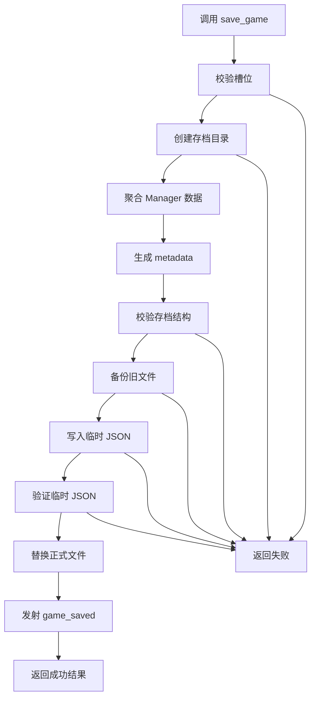
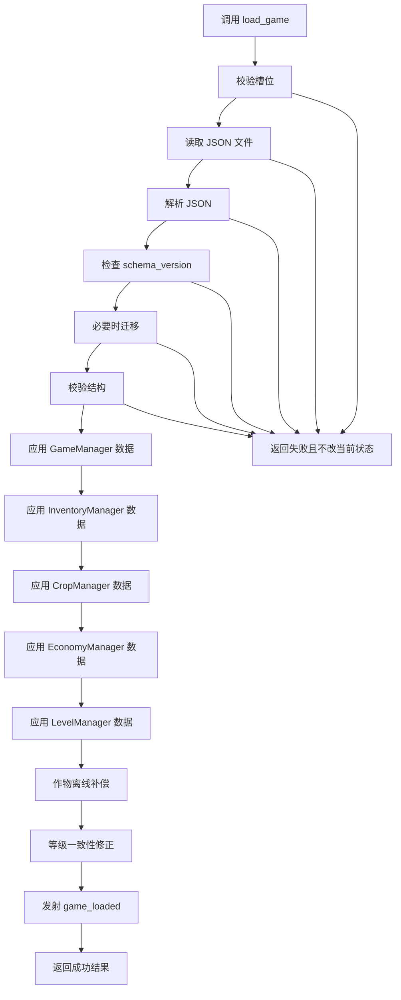

# PRD6: 存档系统（JSON 序列化/反序列化）

> **优先级**: P0 — 核心数据持久化基础  
> **美术依赖**: 无（纯逻辑/数据层，无 UI、无视觉表现）  
> **预计工期**: 4-6 天  
> **前置依赖**: PRD1（项目骨架 + 核心数据系统）、PRD2（作物生长状态机）、PRD3（背包/库存系统）、PRD4（经济系统 + 商店逻辑）、PRD5（等级/经验/解锁系统）  
> **产出**: SaveManager 全局单例 + JSON 存档结构 + 自动/手动存档 + 多槽位读写 + 存档迁移/校验 + 单元测试场景  
> **最后更新**: 2026-05-26

---

## 1. 目标

实现《像素田园》的本地 JSON 存档系统，包含：

- 玩家核心状态序列化与反序列化
- 作物、背包、经济、等级系统数据统一导出/导入
- 多存档槽位管理（默认 3 个手动槽位 + 1 个自动槽位）
- 手动存档、自动存档、启动读档、删除存档
- 存档元信息（版本、保存时间、游玩时长、等级、金币、摘要）
- 存档数据版本号与迁移框架
- JSON 读写错误处理、结构校验与安全回退
- 与 EventBus 的存档成功/失败信号联动
- 自动化测试场景验证完整保存、读取、覆盖、删除、损坏存档处理流程

完成后，项目应能通过纯代码稳定完成「新游戏 → 修改状态 → 保存到槽位 → 重置运行状态 → 从槽位恢复 → 作物离线补偿」的完整持久化流程，为 PRD14（设置/存档管理 UI）和 PRD20（Steam 云存档）提供稳定数据基础。

---

## 2. 核心设计决策（已确认）

| 决策 | 内容 | 来源 |
|------|------|------|
| 本地存档格式 | 使用 JSON 文本文件，便于调试、迁移和 Steam Cloud 同步 | 《游戏设计文档》11.3 |
| 存档路径 | 使用 Godot `user://saves/`，跨平台安全 | Godot 项目规范 |
| 多槽位 | 默认 3 个手动槽位 + 1 个自动槽位 | PRD 大纲与后续 UI 需求 |
| 系统自导出 | 各业务 Manager 提供 `export_save_data()` / `import_save_data()` | PRD2-5 已预留 |
| SaveManager 编排 | SaveManager 负责聚合和落盘，不直接实现作物/背包/等级业务规则 | 设计决定 |
| 版本化存档 | 所有存档包含 `schema_version`，后续字段变化走迁移 | 设计决定 |
| 损坏保护 | 读取失败不得破坏当前运行状态，失败时返回结构化错误 | 设计决定 |
| Steam Cloud 预留 | PRD6 只实现本地 JSON，文件结构需适合 PRD20 直接接入云同步 | 《游戏设计文档》13.1 |

---

## 3. 存档系统范围

### 3.1 本 PRD 覆盖内容

- 存档文件写入与读取
- 存档槽位查询、覆盖、删除
- 业务系统数据聚合
- 读档后分发给各 Manager 恢复状态
- 存档数据校验、迁移与错误处理
- 自动存档定时触发
- 测试用例与调试辅助接口

### 3.2 本 PRD 不覆盖内容

- 存档槽位 UI、确认弹窗、设置菜单 → PRD14
- Steam 云存档 API 接入 → PRD20
- 存档缩略图截图 → PRD14 / 后续视觉 PRD
- 加密、防作弊、压缩 → 后续发布前打磨
- 跨设备冲突解决 UI → PRD20

---

## 4. 存档文件设计

### 4.1 文件目录

```text
user://saves/
├── slot_0.json
├── slot_1.json
├── slot_2.json
├── auto_save.json
└── backup/
    ├── slot_0.bak.json
    ├── slot_1.bak.json
    ├── slot_2.bak.json
    └── auto_save.bak.json
```

PRD6 必须自动创建 `user://saves/` 与 `user://saves/backup/` 目录。

### 4.2 槽位定义

```gdscript
const SAVE_DIR: String = "user://saves/"
const BACKUP_DIR: String = "user://saves/backup/"
const MANUAL_SLOT_COUNT: int = 3
const AUTO_SAVE_SLOT: int = -1
const CURRENT_SCHEMA_VERSION: int = 1
```

| 槽位 | 文件 | 用途 |
|------|------|------|
| `0` | `slot_0.json` | 手动存档 1 |
| `1` | `slot_1.json` | 手动存档 2 |
| `2` | `slot_2.json` | 手动存档 3 |
| `-1` | `auto_save.json` | 自动存档 |

### 4.3 存档根结构

```json
{
  "schema_version": 1,
  "game_version": "0.1.0",
  "created_at": 1779780000,
  "updated_at": 1779783600,
  "slot": 0,
  "metadata": {
    "player_name": "Player",
    "level": 3,
    "xp": 280,
    "gold": 145,
    "playtime_seconds": 7200,
    "current_scene": "farm",
    "summary": "Lv.3 种植能手 / 145 金币 / 12 个物品",
    "is_auto_save": false
  },
  "game": {
    "state": "PLAYING",
    "gold": 145,
    "level": 3,
    "xp": 280,
    "energy": 100,
    "max_energy": 100,
    "stats": {
      "total_xp_earned": 280,
      "total_water_count": 20,
      "total_harvests": 8,
      "total_gold_earned": 320
    },
    "last_online_timestamp": 1779783600
  },
  "inventory": {
    "slots": [
      {"item_id": "watering_can", "quantity": 1},
      {"item_id": "seed_carrot", "quantity": 5},
      null
    ],
    "selected_hotbar": 1
  },
  "crops": {
    "tiles": {
      "0,0": {
        "crop_id": "carrot",
        "stage": 2,
        "watered": true,
        "water_timestamp": 1779783500,
        "water_count": 2,
        "planted_timestamp": 1779783300,
        "mature_timestamp": 0
      }
    }
  },
  "economy": {
    "total_gold_spent": 120,
    "total_gold_earned_from_sales": 260,
    "total_items_bought": 15,
    "total_items_sold": 10,
    "total_transactions": 8
  },
  "level_system": {
    "xp": 280,
    "level": 3,
    "unlocked_crops": ["carrot", "cabbage", "corn", "potato", "tomato", "strawberry"],
    "unlocked_features": ["basic_farm", "watering_can_upgrade", "decoration_mode"],
    "farm_slots": 24
  },
  "settings": {},
  "future": {}
}
```

### 4.4 字段说明

| 字段 | 类型 | 必需 | 说明 |
|------|------|:---:|------|
| `schema_version` | int | ✅ | 存档结构版本，用于迁移 |
| `game_version` | String | ✅ | 当前游戏版本 |
| `created_at` | int | ✅ | 首次创建时间 Unix 时间戳 |
| `updated_at` | int | ✅ | 最近保存时间 Unix 时间戳 |
| `slot` | int | ✅ | 存档槽位，自动存档为 -1 |
| `metadata` | Dictionary | ✅ | UI 和槽位列表展示用摘要 |
| `game` | Dictionary | ✅ | GameManager 核心状态 |
| `inventory` | Dictionary | ✅ | InventoryManager 背包状态 |
| `crops` | Dictionary | ✅ | CropManager 作物/地块状态 |
| `economy` | Dictionary | ✅ | EconomyManager 交易统计 |
| `level_system` | Dictionary | ✅ | LevelManager 等级解锁状态 |
| `settings` | Dictionary | ❌ | 设置数据预留，PRD14 扩展 |
| `future` | Dictionary | ❌ | 后续系统扩展字段，读取时保留 |

---

## 5. 功能需求

### 5.1 SaveManager 全局单例

实现 `scripts/autoload/save_manager.gd`，注册为 Autoload。

**职责**:

- 统一管理存档目录、槽位路径与文件读写
- 聚合各 Manager 的导出数据
- 将存档数据导入各 Manager
- 提供手动存档、读档、删除、槽位列表、自动存档接口
- 校验 JSON 结构与版本
- 执行存档迁移
- 发射存档相关 EventBus 信号
- 避免读档失败污染当前游戏状态

#### 5.1.1 公共接口

```gdscript
extends Node

# ─── 初始化 ───

## 初始化存档目录与自动存档计时器
func initialize() -> void

## 确保存档目录存在
func ensure_save_dirs() -> bool

# ─── 核心存读档 ───

## 保存当前游戏到指定槽位，slot 为 -1 时保存到自动存档
func save_game(slot: int = 0) -> Dictionary

## 从指定槽位读取并应用到当前游戏
func load_game(slot: int = 0) -> Dictionary

## 检查指定槽位是否存在有效存档
func has_save(slot: int = 0) -> bool

## 删除指定槽位存档
func delete_save(slot: int = 0) -> Dictionary

## 获取指定槽位的存档摘要，不完整读取业务数据
func get_save_metadata(slot: int = 0) -> Dictionary

## 获取所有槽位摘要
func list_saves(include_auto: bool = true) -> Array

# ─── 自动存档 ───

## 启用/禁用自动存档
func set_auto_save_enabled(enabled: bool) -> void

## 设置自动存档间隔（秒）
func set_auto_save_interval(seconds: float) -> void

## 立即执行自动存档
func auto_save_now() -> Dictionary

# ─── 数据构建/应用 ───

## 构建完整存档数据，但不写入文件
func build_save_data(slot: int = 0) -> Dictionary

## 应用完整存档数据到运行时 Manager
func apply_save_data(data: Dictionary) -> Dictionary

# ─── 文件与校验 ───

## 获取槽位对应文件路径
func get_save_path(slot: int = 0) -> String

## 从文件读取 JSON 数据
func read_save_file(slot: int = 0) -> Dictionary

## 将 Dictionary 写入槽位文件
func write_save_file(slot: int, data: Dictionary) -> Dictionary

## 校验存档结构
func validate_save_data(data: Dictionary) -> Dictionary

## 迁移旧版本存档到当前 schema
func migrate_save_data(data: Dictionary) -> Dictionary

# ─── 调试/测试 ───

## [调试] 清空所有存档文件
func debug_delete_all_saves() -> void

## [调试] 打印所有槽位摘要
func debug_print_save_slots() -> void
```

---

## 6. 返回结果结构

所有存档操作返回统一 Dictionary，便于测试和 UI 复用。

### 6.1 保存成功

```gdscript
var result := {
    "success": true,
    "operation": "save",
    "slot": 0,
    "path": "user://saves/slot_0.json",
    "timestamp": 1779783600,
    "metadata": {},
    "message": "保存成功",
    "error_code": "",
}
```

### 6.2 读取成功

```gdscript
var result := {
    "success": true,
    "operation": "load",
    "slot": 0,
    "path": "user://saves/slot_0.json",
    "timestamp": 1779783600,
    "metadata": {},
    "message": "读取成功",
    "error_code": "",
}
```

### 6.3 失败结果

```gdscript
var result := {
    "success": false,
    "operation": "load",
    "slot": 2,
    "path": "user://saves/slot_2.json",
    "timestamp": 0,
    "metadata": {},
    "message": "存档文件不存在",
    "error_code": "SAVE_NOT_FOUND",
}
```

### 6.4 错误码

| error_code | 场景 | 是否允许修改运行状态 |
|------------|------|:---:|
| `INVALID_SLOT` | 槽位不在允许范围内 | 否 |
| `SAVE_NOT_FOUND` | 文件不存在 | 否 |
| `SAVE_DIR_FAILED` | 存档目录创建失败 | 否 |
| `FILE_OPEN_FAILED` | 文件打开失败 | 否 |
| `FILE_WRITE_FAILED` | 文件写入失败 | 否 |
| `FILE_READ_FAILED` | 文件读取失败 | 否 |
| `JSON_PARSE_FAILED` | JSON 解析失败 | 否 |
| `INVALID_SAVE_DATA` | 根结构缺失必需字段 | 否 |
| `UNSUPPORTED_SCHEMA_VERSION` | 存档版本高于当前版本 | 否 |
| `MIGRATION_FAILED` | 旧存档迁移失败 | 否 |
| `APPLY_FAILED` | 数据导入到 Manager 失败 | 可部分回滚 |
| `BACKUP_FAILED` | 覆盖前备份失败 | 默认阻止覆盖 |

---

## 7. 详细行为规范

### 7.1 `save_game(slot)`

前置条件：

- `slot` 为 `0..2` 或 `AUTO_SAVE_SLOT(-1)`
- 存档目录可创建或已存在
- 各业务 Manager 已注册或可使用默认空数据

行为：

1. 校验槽位合法性
2. 调用 `ensure_save_dirs()` 创建目录
3. 调用 `build_save_data(slot)` 聚合存档数据
4. 调用 `validate_save_data(data)` 校验结构
5. 若目标文件已存在，先复制到 `backup/` 目录
6. 将 Dictionary 转为 JSON 字符串
7. 写入目标文件
8. 读取一次目标文件并解析，确认落盘数据有效
9. 发射 `EventBus.game_saved(slot, metadata)`
10. 返回成功结果

失败时：

- 返回 `success = false`
- 不删除旧存档
- 已创建的失败临时文件应清理
- 发射 `EventBus.game_save_failed(slot, error_code, message)`

### 7.2 `load_game(slot)`

前置条件：

- `slot` 合法
- 对应文件存在
- JSON 可解析
- 存档结构通过校验或迁移后通过校验

行为：

1. 校验槽位合法性
2. 读取文件文本
3. 解析 JSON 到 Dictionary
4. 校验 `schema_version`
5. 必要时调用 `migrate_save_data(data)`
6. 调用 `validate_save_data(data)`
7. 调用 `apply_save_data(data)` 分发给各 Manager
8. 读档完成后触发作物离线补偿：`CropManager.process_offline_time(last_online_timestamp)`
9. 读档完成后触发等级一致性修正：`LevelManager.recalculate_level()`
10. 发射 `EventBus.game_loaded(slot, metadata)`
11. 返回成功结果

失败时：

- 不修改当前运行状态
- 若已经部分导入，需要调用导入前快照回滚，或在正式应用前使用临时数据完成校验
- 发射 `EventBus.game_load_failed(slot, error_code, message)`

### 7.3 `delete_save(slot)`

行为：

1. 校验槽位合法性
2. 若文件不存在，返回成功但 message 为「槽位已为空」
3. 删除主存档文件
4. 默认保留 backup 文件
5. 发射 `EventBus.save_deleted(slot)`
6. 返回结果

### 7.4 `list_saves(include_auto)`

返回所有槽位摘要：

```gdscript
[
    {
        "slot": 0,
        "exists": true,
        "valid": true,
        "path": "user://saves/slot_0.json",
        "metadata": {
            "level": 3,
            "gold": 145,
            "updated_at": 1779783600,
            "summary": "Lv.3 种植能手 / 145 金币 / 12 个物品"
        },
        "error_code": "",
    },
    {
        "slot": 1,
        "exists": false,
        "valid": false,
        "path": "user://saves/slot_1.json",
        "metadata": {},
        "error_code": "SAVE_NOT_FOUND",
    }
]
```

要求：

- 不存在的槽位也必须返回占位信息
- 损坏存档返回 `exists = true`、`valid = false` 与错误码
- 默认包含自动存档；UI 可选择隐藏自动存档

---

## 8. 数据聚合与系统集成

### 8.1 GameManager 集成

GameManager 需提供或补齐：

```gdscript
func export_save_data() -> Dictionary:
    return {
        "state": str(current_state),
        "gold": gold,
        "level": level,
        "xp": xp,
        "energy": energy,
        "max_energy": max_energy,
        "stats": stats.duplicate(true),
        "last_online_timestamp": Time.get_unix_time_from_system(),
    }
```

导入要求：

- 恢复金币、等级、经验、精力、统计数据
- `current_state` 读档后应设为 `PLAYING`
- 若缺失字段，使用新游戏默认值补齐

### 8.2 InventoryManager 集成

PRD3 已要求：

```gdscript
InventoryManager.export_save_data()
InventoryManager.import_save_data(data)
```

导入要求：

- 槽位数组长度修正为 20
- 无效 item_id 可保留但 `push_warning`，避免玩家物品丢失
- 数量小于 1 的槽位视为空

### 8.3 CropManager 集成

PRD2 已要求：

```gdscript
CropManager.export_save_data()
CropManager.import_save_data(data)
```

推荐导出结构：

```gdscript
{
    "tiles": CropManager.get_all_crops()
}
```

导入要求：

- 键格式统一为 `"x,y"`
- 无效坐标跳过并警告
- 无效 crop_id 跳过并警告
- 读档后执行离线补偿

### 8.4 EconomyManager 集成

PRD4 已要求：

```gdscript
EconomyManager.export_save_data()
EconomyManager.import_save_data(data)
```

导入要求：

- 缺失字段默认为 0
- 负数修正为 0

### 8.5 LevelManager 集成

PRD5 已要求：

```gdscript
LevelManager.export_save_data()
LevelManager.import_save_data(data)
```

导入要求：

- 以 GameManager 的 `xp` / `level` 为数值权威
- 导入后调用 `recalculate_level()` 修正等级一致性
- 解锁内容可按等级重新计算，不依赖存档中的列表作为唯一来源

### 8.6 SaveManager 聚合逻辑

```gdscript
func build_save_data(slot: int = 0) -> Dictionary:
    var now := Time.get_unix_time_from_system()
    return {
        "schema_version": CURRENT_SCHEMA_VERSION,
        "game_version": ProjectSettings.get_setting("application/config/version", "0.1.0"),
        "created_at": _get_existing_created_at(slot, now),
        "updated_at": now,
        "slot": slot,
        "metadata": _build_metadata(slot, now),
        "game": GameManager.export_save_data(),
        "inventory": InventoryManager.export_save_data(),
        "crops": CropManager.export_save_data(),
        "economy": EconomyManager.export_save_data(),
        "level_system": LevelManager.export_save_data(),
        "settings": {},
        "future": {},
    }
```

---

## 9. 自动存档

### 9.1 自动存档触发方式

PRD6 实现基础定时自动存档：

```gdscript
var auto_save_enabled: bool = true
var auto_save_interval: float = 300.0
var _auto_save_timer: float = 0.0

func _process(delta: float) -> void:
    if not auto_save_enabled:
        return
    if GameManager.current_state != GameManager.GameState.PLAYING:
        return
    _auto_save_timer += delta
    if _auto_save_timer >= auto_save_interval:
        _auto_save_timer = 0.0
        auto_save_now()
```

### 9.2 自动存档场景

| 触发场景 | 是否 PRD6 实现 | 说明 |
|----------|:---:|------|
| 每 5 分钟定时 | ✅ | 基础自动存档 |
| 游戏退出前 | ✅ | 可在 `_notification(NOTIFICATION_WM_CLOSE_REQUEST)` 中触发 |
| 场景切换后 | ❌ | PRD8+ 场景稳定后再接入 |
| 关键操作后 | ❌ | 避免频繁写盘，后续按需接入 |
| 读档后立即覆盖自动存档 | ❌ | 避免误覆盖 |

### 9.3 自动存档约束

- 自动存档永远写入 `AUTO_SAVE_SLOT = -1`
- 自动存档不覆盖手动槽位
- 自动存档失败不应中断游戏流程，只发射失败信号和日志
- 自动存档 UI 提示由 PRD13/PRD14 决定，PRD6 只发信号

---

## 10. 存档校验与迁移

### 10.1 根结构校验

`validate_save_data(data)` 至少检查：

- `data` 是 Dictionary
- 包含 `schema_version`
- `schema_version <= CURRENT_SCHEMA_VERSION`
- 包含 `metadata`、`game`、`inventory`、`crops`、`economy`、`level_system`
- `metadata` 是 Dictionary
- `game` 是 Dictionary
- `inventory` 是 Dictionary
- `crops` 是 Dictionary

返回结构：

```gdscript
{
    "success": true,
    "error_code": "",
    "message": "校验通过",
}
```

### 10.2 字段缺失处理

| 缺失字段 | 处理 |
|----------|------|
| `settings` | 补 `{}` |
| `future` | 补 `{}` |
| `metadata.summary` | 重新生成 |
| `game.stats` | 补空统计 |
| `inventory.slots` | 创建空 20 格背包 |
| `crops.tiles` | 补 `{}` |
| `economy` 统计字段 | 补 0 |
| `level_system` 解锁列表 | 按当前等级重算 |

### 10.3 版本迁移框架

```gdscript
func migrate_save_data(data: Dictionary) -> Dictionary:
    var version := int(data.get("schema_version", 0))
    if version > CURRENT_SCHEMA_VERSION:
        return _make_failed_migration("UNSUPPORTED_SCHEMA_VERSION")
    while version < CURRENT_SCHEMA_VERSION:
        match version:
            0:
                data = _migrate_v0_to_v1(data)
                version = 1
            _:
                return _make_failed_migration("MIGRATION_FAILED")
    data["schema_version"] = CURRENT_SCHEMA_VERSION
    return {"success": true, "data": data}
```

PRD6 当前只需要实现 v1，但必须保留迁移框架。

---

## 11. EventBus 信号

### 11.1 需新增/确认的信号

在 `scripts/autoload/event_bus.gd` 中新增或确认以下信号：

```gdscript
signal game_saved(slot: int, metadata: Dictionary)
signal game_loaded(slot: int, metadata: Dictionary)
signal game_save_failed(slot: int, error_code: String, message: String)
signal game_load_failed(slot: int, error_code: String, message: String)
signal save_deleted(slot: int)
signal auto_save_completed(result: Dictionary)
signal auto_save_failed(result: Dictionary)
```

> PRD1 已有 `game_saved()` 与 `game_loaded()` 空参数版本；PRD6 可升级为带参数版本。若为兼容已有调用，也可额外保留无参包装方法。

### 11.2 信号发射规则

| 信号 | 时机 |
|------|------|
| `game_saved` | 手动存档成功后 |
| `game_loaded` | 读档成功且所有 Manager 导入完成后 |
| `game_save_failed` | 手动存档失败后 |
| `game_load_failed` | 读档失败后 |
| `save_deleted` | 删除槽位成功后 |
| `auto_save_completed` | 自动存档成功后 |
| `auto_save_failed` | 自动存档失败后 |

---

## 12. 边界情况处理

| 场景 | 行为 |
|------|------|
| 保存到非法槽位 | 返回 `INVALID_SLOT`，不写文件 |
| 读取非法槽位 | 返回 `INVALID_SLOT`，不改运行状态 |
| 读取空槽位 | 返回 `SAVE_NOT_FOUND` |
| JSON 文件损坏 | 返回 `JSON_PARSE_FAILED`，不改运行状态 |
| 存档版本高于当前版本 | 返回 `UNSUPPORTED_SCHEMA_VERSION` |
| 存档版本低于当前版本 | 尝试迁移，失败返回 `MIGRATION_FAILED` |
| 覆盖存档时备份失败 | 返回 `BACKUP_FAILED`，默认不覆盖旧文件 |
| 写入中途失败 | 保留旧存档，清理临时文件 |
| 业务 Manager 缺失 | 保存时写默认空数据；读档时跳过并警告，返回可恢复失败或部分成功 |
| 背包物品数据不存在 | 保留 item_id 并警告，避免丢失玩家资产 |
| 作物 crop_id 不存在 | 跳过该地块并警告，避免读档崩溃 |
| XP 与等级不匹配 | 读档后由 LevelManager 重算修正 |
| 作物离线时间很长 | 读档后交给 CropManager 处理成熟/枯萎 |

---

## 13. 测试需求

### 13.1 自动化测试场景

创建：

| 文件 | 操作 | 说明 |
|------|------|------|
| `scenes/test/test_save_manager.tscn` | 新增 | SaveManager 测试场景 |
| `scenes/test/test_save_manager.gd` | 新增 | 自动化测试脚本 |

### 13.2 测试场景结构

```text
test_save_manager.tscn
└── TestSaveManager (Node2D)
    └── Label (显示测试结果)
```

### 13.3 测试用例清单

```gdscript
func _ready() -> void:
    print("=== SaveManager 自动化测试 ===")

    test_ensure_save_dirs()
    test_get_save_path()
    test_save_slot_success()
    test_load_slot_success()
    test_has_save()
    test_overwrite_save_creates_backup()
    test_delete_save()
    test_delete_empty_slot()
    test_list_saves()
    test_get_save_metadata()
    test_invalid_slot_save()
    test_invalid_slot_load()
    test_load_missing_save()
    test_validate_save_data_success()
    test_validate_save_data_missing_fields()
    test_migrate_current_version()
    test_auto_save_now()
    test_save_load_inventory_state()
    test_save_load_crop_state()
    test_save_load_economy_stats()
    test_save_load_level_state()
    test_corrupted_json_handling()
    test_save_load_signals()

    print("=== 全部测试完成 ===")
```

每个测试函数应：

1. 清理测试槽位
2. 设置 GameManager、InventoryManager、CropManager、EconomyManager、LevelManager 前置状态
3. 执行保存/读取/删除/列表操作
4. 使用 `assert()` 验证返回结果、文件存在性、运行时状态、信号
5. 清理测试数据，避免影响下一个测试

### 13.4 关键验收测试示例

#### 保存并读取背包状态

```gdscript
InventoryManager.debug_clear()
InventoryManager.add_item("seed_carrot", 5)
var save_result := SaveManager.save_game(0)
assert(save_result["success"] == true)

InventoryManager.debug_clear()
assert(InventoryManager.get_item_count("seed_carrot") == 0)

var load_result := SaveManager.load_game(0)
assert(load_result["success"] == true)
assert(InventoryManager.get_item_count("seed_carrot") == 5)
```

#### 保存并读取等级状态

```gdscript
LevelManager.set_progress(3, 280)
SaveManager.save_game(0)
LevelManager.debug_reset_progress()
SaveManager.load_game(0)
assert(GameManager.level == 3)
assert(GameManager.xp == 280)
assert(LevelManager.is_crop_unlocked("strawberry") == true)
```

#### 损坏 JSON 不污染当前状态

```gdscript
GameManager.gold = 999
# 手动写入非法 JSON 到 slot_1.json
var result := SaveManager.load_game(1)
assert(result["success"] == false)
assert(result["error_code"] == "JSON_PARSE_FAILED")
assert(GameManager.gold == 999)
```

---

## 14. 验收标准

### 14.1 文件与槽位验收

- [ ] 首次运行时自动创建 `user://saves/` 目录
- [ ] `SaveManager.get_save_path(0)` 返回 `user://saves/slot_0.json`
- [ ] `SaveManager.get_save_path(-1)` 返回 `user://saves/auto_save.json`
- [ ] 仅允许槽位 `0`、`1`、`2`、`-1`
- [ ] 非法槽位返回 `INVALID_SLOT`

### 14.2 保存验收

- [ ] `SaveManager.save_game(0)` 可成功写入 JSON 文件
- [ ] 存档 JSON 包含 `schema_version`、`metadata`、`game`、`inventory`、`crops`、`economy`、`level_system`
- [ ] 覆盖已有存档前会创建 backup 文件
- [ ] 保存成功发射 `game_saved`
- [ ] 保存失败发射 `game_save_failed`

### 14.3 读取验收

- [ ] `SaveManager.load_game(0)` 可恢复 GameManager 金币、等级、经验
- [ ] 读档可恢复 InventoryManager 背包槽位和快捷栏选择
- [ ] 读档可恢复 CropManager 作物地块状态
- [ ] 读档可恢复 EconomyManager 交易统计
- [ ] 读档可恢复 LevelManager 等级/解锁状态
- [ ] 读档成功后触发 CropManager 离线补偿
- [ ] 读档成功后触发 LevelManager 等级一致性修正
- [ ] 读档成功发射 `game_loaded`
- [ ] 读档失败发射 `game_load_failed`

### 14.4 槽位管理验收

- [ ] `has_save(0)` 对存在存档返回 true
- [ ] `delete_save(0)` 可删除指定槽位
- [ ] 删除空槽位不会报错
- [ ] `list_saves()` 返回 3 个手动槽位和 1 个自动槽位摘要
- [ ] 损坏存档在 `list_saves()` 中显示 `valid = false`

### 14.5 自动存档验收

- [ ] `auto_save_now()` 写入 `auto_save.json`
- [ ] 自动存档不覆盖手动槽位
- [ ] 自动存档成功发射 `auto_save_completed`
- [ ] 自动存档失败发射 `auto_save_failed`
- [ ] 可通过 `set_auto_save_enabled(false)` 禁用自动存档

### 14.6 错误处理验收

- [ ] 读取不存在文件返回 `SAVE_NOT_FOUND`
- [ ] 读取损坏 JSON 返回 `JSON_PARSE_FAILED`
- [ ] 读取高版本存档返回 `UNSUPPORTED_SCHEMA_VERSION`
- [ ] 读取失败不改变当前运行状态
- [ ] 写入失败不删除旧存档

### 14.7 自动化测试验收

- [ ] `test_save_manager.tscn` 可运行且无报错
- [ ] 所有保存测试通过
- [ ] 所有读取测试通过
- [ ] 所有槽位管理测试通过
- [ ] 所有错误处理测试通过
- [ ] 所有信号测试通过

---

## 15. 技术约束

1. **Autoload 注册**:
   - 脚本路径: `scripts/autoload/save_manager.gd`
   - 注册名: `SaveManager`
   - 加载顺序: EventBus → DataManager → GameManager → CropManager → InventoryManager → EconomyManager → LevelManager → SceneManager → **SaveManager** → AudioManager
   - 不使用 `class_name`，保持与现有 Autoload 风格一致

2. **JSON 兼容性**:
   - 存档数据只能包含 JSON 可序列化类型：Dictionary、Array、String、int、float、bool、null
   - `Vector2i` 坐标必须序列化为 `"x,y"` 字符串
   - 不直接保存 Node、Resource、Callable、Signal 等 Godot 对象

3. **原子写入**:
   - 推荐先写入临时文件 `slot_0.tmp.json`
   - 写入并验证成功后再替换正式文件
   - 覆盖前必须先备份旧文件

4. **职责边界**:
   - SaveManager 不直接计算作物生长、等级升级、背包堆叠、经济交易
   - SaveManager 只调用各 Manager 的导入/导出接口
   - 业务数据修正由对应 Manager 负责

5. **信号优先**:
   - 存档成功、失败、删除、自动存档结果通过 EventBus 广播
   - 不直接引用 UI、HUD、设置面板或存档槽位节点

6. **兼容后续 Steam Cloud**:
   - 存档文件必须是独立 JSON 文件
   - 文件名稳定，不依赖绝对路径
   - 自动存档和手动存档分离，便于云同步策略配置

---

## 16. 需要新增/修改的文件

| 文件 | 操作 | 说明 |
|------|------|------|
| `scripts/autoload/save_manager.gd` | 新增/重写 | 存档系统主体，替换 PRD1 占位逻辑 |
| `scripts/autoload/event_bus.gd` | 修改 | 新增存档成功/失败/删除/自动存档信号 |
| `scripts/autoload/game_manager.gd` | 修改 | 补齐 `export_save_data()` / `import_save_data()`，读档时恢复核心状态 |
| `scripts/autoload/crop_manager.gd` | 修改 | 确认 `export_save_data()` / `import_save_data()` 可用于 SaveManager |
| `scripts/autoload/inventory_manager.gd` | 修改 | 确认背包导入/导出和槽位修正逻辑 |
| `scripts/autoload/economy_manager.gd` | 修改 | 确认经济统计导入/导出 |
| `scripts/autoload/level_manager.gd` | 修改 | 确认等级导入/导出和读档重算 |
| `project.godot` | 修改 | `[autoload]` 注册 SaveManager，并调整加载顺序 |
| `scenes/test/test_save_manager.tscn` | 新增 | SaveManager 测试场景 |
| `scenes/test/test_save_manager.gd` | 新增 | 自动化测试脚本 |

---

## 17. 非目标 (Not in Scope)

以下内容不在 PRD6 范围内：

- 存档管理 UI、槽位卡片、确认弹窗 → PRD14
- 设置项保存 UI 与配置面板 → PRD14
- Steam Cloud API 接入 → PRD20
- 云存档冲突解决 → PRD20
- 成就同步、排行榜同步 → PRD20 / PRD26
- 存档缩略图截图 → PRD14 / 后续视觉系统
- 存档加密、压缩、防篡改 → 发布前打磨
- 移动端平台存档适配 → 移植阶段

PRD6 的目标是：**让项目具备稳定、可测试、可迁移的本地 JSON 存档能力，并能完整保存/恢复 PRD1-5 已实现的核心数据层状态。**

---

## 18. 后续衔接

| 完成 PRD6 后可启动 | 说明 |
|-------------------|------|
| → PRD7（游戏时间系统） | 可保存/恢复游戏内日期、小时、季节、时间倍率 |
| → PRD8（田园场景 + 网格系统） | 可基于存档恢复地块占用与作物状态 |
| → PRD10（种植/浇水/收获交互） | 可验证完整玩法闭环跨会话保存 |
| → PRD14（设置/存档管理 UI） | 直接使用 `list_saves()`、`save_game()`、`load_game()`、`delete_save()` 构建 UI |
| → PRD20（Steam 集成） | 可将 `user://saves/*.json` 纳入 Steam Cloud 同步 |
| → PRD25（装饰系统） | 可复用 SaveManager 的版本化结构保存装饰布局 |

---

## 附录 A: 存档流程



---

## 附录 B: 读档流程



---

## 附录 C: 与 PRD1-5 的数据关系

| 系统 | PRD | 存档字段 | 恢复后校验 |
|------|-----|----------|------------|
| GameManager | PRD1 | `game` | 金币、等级、XP、统计恢复 |
| CropManager | PRD2 | `crops` | 地块作物状态恢复，执行离线补偿 |
| InventoryManager | PRD3 | `inventory` | 20 格背包和快捷栏恢复 |
| EconomyManager | PRD4 | `economy` | 交易统计恢复 |
| LevelManager | PRD5 | `level_system` | 解锁内容按等级重算 |

---

> *本 PRD 完成后，项目应具备稳定的本地 JSON 存档系统，可完整保存/恢复核心数据层状态，并为后续存档 UI、Steam 云存档和更多玩法系统扩展奠定基础。*
