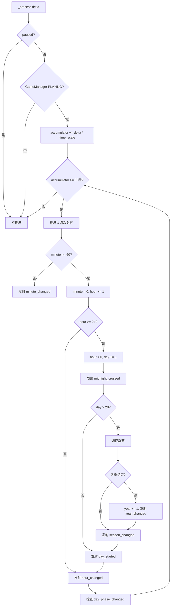

# PRD7: 游戏时间系统（昼夜 / 季节 / 日期）

> **优先级**: P0 — 作物枯萎、季节种植、HUD 与后续场景氛围的时间基础  
> **美术依赖**: 无（纯逻辑/数据层，无 UI、无视觉表现）  
> **预计工期**: 3-5 天  
> **前置依赖**: PRD1（项目骨架 + 核心数据系统）；建议在 PRD6（存档系统）后接入持久化  
> **产出**: TimeManager 全局单例 + 游戏内日期/小时/季节推进 + 时间倍率配置 + 跨日/跨季信号 + 存档导入导出 + 自动化测试场景  
> **最后更新**: 2026-05-27

---

## 1. 目标

实现《像素田园》的游戏内时间系统，包含：

- 游戏内时间流逝：默认 `1 现实分钟 = 1 游戏小时`
- 游戏内日期推进：小时跨越 24 点后进入下一天
- 昼夜阶段划分：晨 / 午 / 昏 / 夜
- 四季轮换：春 / 夏 / 秋 / 冬
- 跨小时、跨日、跨季、跨年事件广播
- 时间暂停、恢复、倍率调整与调试跳时
- 与 CropManager 的枯萎检查联动
- 与 SaveManager 的 JSON 存档集成
- 为 PRD13 HUD、PRD17 场景色调、PRD19 音乐切换提供统一时间数据源

完成后，项目应能通过纯代码稳定推进游戏内时间，并通过 EventBus 广播时间变化事件；作物系统可监听 `midnight_crossed` 进行隔天枯萎判断，后续 UI/场景/音频系统可基于昼夜与季节状态进行展示和切换。

---

## 2. 核心设计决策（已确认）

| 决策 | 内容 | 来源 |
|------|------|------|
| 时间倍率 | 默认 `1 现实分钟 = 1 游戏小时`，即 60 倍速 | 《游戏设计文档》6.1、11.4 |
| 时间系统定位 | PRD7 提供游戏内日历、昼夜、季节；作物阶段计时仍保留时间戳驱动 | PRD2、GDD 11.4 |
| 枯萎联动 | 游戏内跨日时发射 `midnight_crossed`，CropManager 监听后执行枯萎检查 | PRD1 EventBus、PRD2 3.5 |
| 季节周期 | 春 → 夏 → 秋 → 冬 循环 | GDD 作物季节字段 |
| 每季天数 | 默认每季 28 天，可配置 | 模拟经营通用节奏，便于后续扩展 |
| 起始时间 | 新游戏从第 1 年春季第 1 天 6:00 开始 | 设计决定 |
| 存档方式 | 保存游戏内日期、小时、分钟、季节、时间倍率与累计游戏秒数 | PRD6 后续衔接 |
| 无 UI 依赖 | PRD7 只提供数据与信号，不实现 HUD、天空色调、音频切换 | PRD 拆分大纲 |

---

## 3. 系统范围

### 3.1 本 PRD 覆盖内容

- TimeManager Autoload 实现
- 游戏内时间推进与暂停
- 小时 / 日期 / 季节 / 年份跨越检测
- 昼夜阶段计算
- 时间倍率配置
- 当前季节作物可种植查询辅助
- EventBus 时间信号扩展
- SaveManager 导入/导出集成
- 自动化测试场景

### 3.2 本 PRD 不覆盖内容

- HUD 时间显示 → PRD13
- 天空、光照、场景色调变化 → PRD17
- 晨午昏夜 BGM 自动切换 → PRD19
- 天气系统、雨雪风等环境效果 → 后续环境系统 PRD
- 睡觉跳过时间、床交互 → PRD9 / PRD10 / 后续交互 PRD
- 季节活动、限时节日、季节币 → 后期活动系统

---

## 4. 时间模型

### 4.1 基础时间单位

| 字段 | 类型 | 默认值 | 说明 |
|------|------|:---:|------|
| `year` | int | 1 | 游戏内年份，从 1 开始 |
| `season` | String | `spring` | 当前季节 |
| `season_index` | int | 0 | 当前季节索引，0-3 |
| `day` | int | 1 | 当前季节内第几天，1-28 |
| `hour` | int | 6 | 当前小时，0-23 |
| `minute` | int | 0 | 当前分钟，0-59 |
| `game_seconds` | float | 0.0 | 当前日内累计游戏秒数 |
| `total_game_minutes` | int | 360 | 从新游戏开始累计经过的游戏分钟 |
| `time_scale` | float | 60.0 | 游戏秒 / 现实秒，默认 60 倍 |
| `paused` | bool | false | 时间系统是否暂停 |

### 4.2 时间倍率

默认：

```gdscript
const DEFAULT_TIME_SCALE: float = 60.0
```

含义：

```text
1 现实秒 = 60 游戏秒
60 现实秒 = 3600 游戏秒 = 1 游戏小时
24 现实分钟 = 1 游戏天
28 游戏天 = 1 游戏季
112 游戏天 = 1 游戏年
```

### 4.3 季节定义

```gdscript
enum SeasonIndex {
    SPRING = 0,
    SUMMER = 1,
    AUTUMN = 2,
    WINTER = 3,
}

const SEASONS: Array[String] = ["spring", "summer", "autumn", "winter"]
const DAYS_PER_SEASON: int = 28
const HOURS_PER_DAY: int = 24
const MINUTES_PER_HOUR: int = 60
```

| 季节 ID | 中文名 | 索引 | 下一季 |
|---------|--------|:---:|--------|
| `spring` | 春季 | 0 | summer |
| `summer` | 夏季 | 1 | autumn |
| `autumn` | 秋季 | 2 | winter |
| `winter` | 冬季 | 3 | spring（年份 +1） |

### 4.4 昼夜阶段定义

```gdscript
enum DayPhase {
    MORNING,
    AFTERNOON,
    EVENING,
    NIGHT,
}
```

| 阶段 | 时间范围 | 说明 | 后续用途 |
|------|----------|------|----------|
| `morning` | 06:00-11:59 | 早晨 | 田园晨间 BGM、暖色天空 |
| `afternoon` | 12:00-17:59 | 下午 | 默认明亮场景 |
| `evening` | 18:00-20:59 | 黄昏 | 黄昏色调、低 BPM BGM |
| `night` | 21:00-05:59 | 夜晚 | 夜间色调、虫鸣/夜间 BGM |

> PRD7 只计算并广播昼夜阶段，不实现视觉和音频表现。

---

## 5. TimeManager 全局单例

新增 `scripts/autoload/time_manager.gd`，注册为 Autoload。

### 5.1 职责

- 维护游戏内日期、小时、分钟、季节和年份
- 根据 `_process(delta)` 推进游戏内时间
- 检测小时、日期、季节、年份变化
- 计算当前昼夜阶段
- 发射 EventBus 时间信号
- 提供时间查询、格式化、跳时、倍率调整接口
- 导出/导入时间数据供 SaveManager 使用
- 为作物季节限制提供查询辅助

### 5.2 Autoload 注册顺序

在 `project.godot` 中新增 TimeManager，推荐加载顺序：

```text
1. EventBus
2. DataManager
3. GameManager
4. TimeManager      ← 新增，依赖 EventBus / GameManager / DataManager
5. CropManager      ← 可监听 TimeManager 发出的 midnight_crossed
6. InventoryManager
7. EconomyManager
8. LevelManager
9. SceneManager
10. SaveManager     ← 保存/恢复 TimeManager 数据
11. AudioManager
```

> 如果为了减少改动，也可将 TimeManager 放在 CropManager 之后；但必须确保 EventBus 已先加载。

---

## 6. 公共接口

### 6.1 初始化与运行控制

```gdscript
extends Node

## 初始化为新游戏默认时间
func initialize_new_game() -> void

## 暂停时间推进
func pause_time() -> void

## 恢复时间推进
func resume_time() -> void

## 设置时间暂停状态
func set_time_paused(value: bool) -> void

## 时间是否暂停
func is_time_paused() -> bool

## 设置时间倍率，默认 60.0
func set_time_scale(scale: float) -> void

## 获取当前时间倍率
func get_time_scale() -> float
```

### 6.2 时间查询

```gdscript
## 获取完整时间状态
func get_time_state() -> Dictionary

## 获取当前年份
func get_year() -> int

## 获取当前季节 ID，例如 spring
func get_season() -> String

## 获取当前季节中文名
func get_season_name() -> String

## 获取季节内日期，1-28
func get_day() -> int

## 获取当前小时，0-23
func get_hour() -> int

## 获取当前分钟，0-59
func get_minute() -> int

## 获取当前昼夜阶段 ID：morning / afternoon / evening / night
func get_day_phase() -> String

## 是否夜晚
func is_night() -> bool

## 是否跨日边界后的第一小时（00:00-00:59）
func is_after_midnight() -> bool
```

### 6.3 格式化接口

```gdscript
## 返回 HH:MM，例如 06:05
func get_time_text() -> String

## 返回日期文本，例如 第1年 春季 1日
func get_date_text() -> String

## 返回完整文本，例如 第1年 春季 1日 06:00
func get_datetime_text() -> String
```

### 6.4 跳时与调试接口

```gdscript
## 推进指定游戏分钟数，会触发跨小时/跨日/跨季信号
func advance_minutes(minutes: int) -> void

## 推进指定游戏小时数
func advance_hours(hours: int) -> void

## 推进到下一天指定小时，默认 06:00
func advance_to_next_day(target_hour: int = 6) -> void

## [调试] 直接设置日期时间，会发射必要刷新信号
func debug_set_datetime(new_year: int, new_season: String, new_day: int, new_hour: int, new_minute: int) -> void

## [调试] 打印当前时间状态
func debug_print_time() -> void
```

### 6.5 季节种植辅助

```gdscript
## 当前季节是否允许种植指定作物
func can_plant_crop_in_current_season(crop_id: String) -> bool

## 指定季节是否允许种植指定作物
func can_plant_crop_in_season(crop_id: String, season_id: String) -> bool

## 获取当前季节可种植作物列表
func get_current_season_crops() -> Array
```

> 该接口只查询 `DataManager.get_crop(crop_id)["seasons"]`，不检查等级解锁、背包种子数量或地块状态；这些仍由 LevelManager、InventoryManager、CropManager 负责。

### 6.6 存档接口

```gdscript
## 导出时间数据供 SaveManager 保存
func export_save_data() -> Dictionary

## 导入时间数据，读档时调用
func import_save_data(data: Dictionary) -> void
```

---

## 7. 数据结构

### 7.1 运行时状态

```gdscript
var year: int = 1
var season_index: int = 0
var day: int = 1
var hour: int = 6
var minute: int = 0
var game_seconds_accumulator: float = 0.0
var total_game_minutes: int = 360
var time_scale: float = DEFAULT_TIME_SCALE
var paused: bool = false
var current_day_phase: String = "morning"
```

### 7.2 `get_time_state()` 返回结构

```gdscript
{
    "year": 1,
    "season": "spring",
    "season_index": 0,
    "season_name": "春季",
    "day": 1,
    "hour": 6,
    "minute": 0,
    "day_phase": "morning",
    "time_scale": 60.0,
    "paused": false,
    "total_game_minutes": 360,
    "time_text": "06:00",
    "date_text": "第1年 春季 1日",
    "datetime_text": "第1年 春季 1日 06:00"
}
```

### 7.3 存档结构

PRD7 需在 PRD6 存档根结构中新增可选字段 `time`：

```json
{
  "time": {
    "year": 1,
    "season": "spring",
    "season_index": 0,
    "day": 1,
    "hour": 6,
    "minute": 0,
    "time_scale": 60.0,
    "paused": false,
    "total_game_minutes": 360,
    "day_phase": "morning"
  }
}
```

字段说明：

| 字段 | 类型 | 必需 | 说明 |
|------|------|:---:|------|
| `year` | int | ✅ | 游戏内年份 |
| `season` | String | ✅ | 当前季节 ID |
| `season_index` | int | ✅ | 当前季节索引 |
| `day` | int | ✅ | 季节内日期 |
| `hour` | int | ✅ | 当前小时 |
| `minute` | int | ✅ | 当前分钟 |
| `time_scale` | float | ✅ | 时间倍率 |
| `paused` | bool | ✅ | 是否暂停 |
| `total_game_minutes` | int | ✅ | 累计游戏分钟 |
| `day_phase` | String | ❌ | 可由 hour 重新计算，保存仅便于调试 |

---

## 8. 详细行为规范

### 8.1 `_process(delta)` 时间推进

```gdscript
func _process(delta: float) -> void:
    if paused:
        return
    if GameManager.current_state != GameManager.GameState.PLAYING:
        return

    game_seconds_accumulator += delta * time_scale
    while game_seconds_accumulator >= 60.0:
        game_seconds_accumulator -= 60.0
        _advance_one_game_minute()
```

要求：

1. 只有游戏处于 `PLAYING` 状态时推进时间
2. `paused = true` 时不推进
3. 使用累计器处理大 `delta`，避免掉帧导致时间丢失
4. 每推进 1 游戏分钟都更新 `minute` 与 `total_game_minutes`
5. 小时、日期、季节变化必须通过专门函数处理并发射信号

### 8.2 分钟推进

```gdscript
func _advance_one_game_minute() -> void:
    minute += 1
    total_game_minutes += 1

    if minute >= 60:
        minute = 0
        _advance_one_hour()

    _check_day_phase_changed()
```

### 8.3 小时推进

```gdscript
func _advance_one_hour() -> void:
    hour += 1
    if hour >= 24:
        hour = 0
        _advance_one_day()
        EventBus.midnight_crossed.emit()
    EventBus.hour_changed.emit(hour)
```

行为要求：

- 每次小时变化发射 `hour_changed(hour)`
- 从 23:59 推进到 00:00 时：
  1. 日期 +1
  2. 发射 `midnight_crossed`
  3. 发射 `day_started(year, season, day)`
  4. 发射 `hour_changed(0)`

### 8.4 日期推进

```gdscript
func _advance_one_day() -> void:
    day += 1
    if day > DAYS_PER_SEASON:
        day = 1
        _advance_one_season()
    EventBus.day_started.emit(year, get_season(), day)
```

要求：

- 第 28 天之后进入下一季第 1 天
- 每次新一天开始发射 `day_started(year, season, day)`
- `midnight_crossed` 用于枯萎检查；`day_started` 用于 HUD、任务刷新、每日统计

### 8.5 季节推进

```gdscript
func _advance_one_season() -> void:
    season_index += 1
    if season_index >= SEASONS.size():
        season_index = 0
        year += 1
        EventBus.year_changed.emit(year)
    EventBus.season_changed.emit(get_season())
```

要求：

- 春 → 夏 → 秋 → 冬 → 春
- 冬季结束进入春季时年份 +1
- 季节变化时发射 `season_changed(new_season)`
- 年份变化时发射 `year_changed(new_year)`

### 8.6 昼夜阶段变化

```gdscript
func _calculate_day_phase(target_hour: int) -> String:
    if target_hour >= 6 and target_hour < 12:
        return "morning"
    if target_hour >= 12 and target_hour < 18:
        return "afternoon"
    if target_hour >= 18 and target_hour < 21:
        return "evening"
    return "night"
```

行为要求：

- 当昼夜阶段变化时发射 `day_phase_changed(new_phase)`
- 新游戏 06:00 的初始阶段为 `morning`
- 12:00 切换 `afternoon`
- 18:00 切换 `evening`
- 21:00 切换 `night`
- 06:00 从夜晚切回 `morning`

### 8.7 时间跳转

`advance_minutes(minutes)` 必须逐分钟推进或等价地批量推进后补发必要事件。

验收优先级下，推荐先逐分钟推进，保证事件顺序正确：

```gdscript
func advance_minutes(minutes: int) -> void:
    if minutes <= 0:
        return
    for i in range(minutes):
        _advance_one_game_minute()
```

要求：

- 跳过 24 小时时必须发射 24 次 `hour_changed`
- 跨日时必须发射 `midnight_crossed` 和 `day_started`
- 跨季时必须发射 `season_changed`
- 跨年时必须发射 `year_changed`

---

## 9. EventBus 信号

### 9.1 需新增/确认的信号

在 `scripts/autoload/event_bus.gd` 中新增或确认以下信号：

```gdscript
signal minute_changed(hour: int, minute: int)
signal hour_changed(new_hour: int)
signal day_started(year: int, season: String, day: int)
signal season_changed(new_season: String)
signal year_changed(new_year: int)
signal day_phase_changed(new_phase: String)
signal midnight_crossed()
signal time_scale_changed(new_scale: float)
signal time_paused_changed(paused: bool)
```

> 当前项目已存在 `hour_changed(new_hour)`、`day_started(day)`、`season_changed(new_season)`、`midnight_crossed()`。PRD7 需要将 `day_started` 升级为 `day_started(year, season, day)`，并新增分钟、年份、昼夜、倍率、暂停信号。若担心兼容，可额外提供包装发射方法或同步保留旧信号名。

### 9.2 信号发射规则

| 信号 | 时机 | 参数 |
|------|------|------|
| `minute_changed` | 每游戏分钟变化 | `hour, minute` |
| `hour_changed` | 每小时变化 | `new_hour` |
| `midnight_crossed` | 从 23:59 到 00:00 | 无 |
| `day_started` | 新一天开始 | `year, season, day` |
| `season_changed` | 季节变化 | `new_season` |
| `year_changed` | 冬季结束进入新春 | `new_year` |
| `day_phase_changed` | 昼夜阶段变化 | `new_phase` |
| `time_scale_changed` | 设置时间倍率成功 | `new_scale` |
| `time_paused_changed` | 暂停状态变化 | `paused` |

### 9.3 与 CropManager 的联动

CropManager 需要监听：

```gdscript
EventBus.midnight_crossed.connect(_on_midnight_crossed)
```

监听处理：

```gdscript
func _on_midnight_crossed() -> void:
    check_wither_all()
```

PRD7 完成后，CropManager 的每秒轮询枯萎检查可以保留作为兜底，但推荐以 `midnight_crossed` 信号作为主触发源。

---

## 10. SaveManager 集成

### 10.1 SaveManager 存档结构扩展

修改 `scripts/autoload/save_manager.gd` 的 `build_save_data(slot)`，在根结构中加入：

```gdscript
"time": TimeManager.export_save_data(),
```

完整位置建议：

```gdscript
{
    "schema_version": CURRENT_SCHEMA_VERSION,
    "game_version": GAME_VERSION,
    "created_at": now,
    "updated_at": now,
    "slot": slot,
    "metadata": metadata,
    "game": GameManager.export_save_data(),
    "time": TimeManager.export_save_data(),
    "inventory": InventoryManager.export_save_data(),
    "crops": CropManager.export_save_data(),
    "economy": EconomyManager.export_save_data(),
    "level_system": LevelManager.export_save_data(),
    "settings": {},
    "future": {},
}
```

### 10.2 读档应用

修改 `apply_save_data(data)`：

```gdscript
if data.has("time") and data["time"] is Dictionary:
    TimeManager.import_save_data(data["time"])
else:
    TimeManager.initialize_new_game()
```

建议导入顺序：

```text
GameManager → TimeManager → InventoryManager → CropManager → EconomyManager → LevelManager
```

### 10.3 校验与兼容

PRD6 已有存档在 PRD7 之前不包含 `time` 字段，因此 PRD7 必须兼容旧存档：

| 场景 | 行为 |
|------|------|
| 存档缺少 `time` | 不判定损坏，使用新游戏默认时间 |
| `time.season` 无效 | 修正为 `spring` |
| `time.day` 小于 1 | 修正为 1 |
| `time.day` 大于 28 | 修正为 28 |
| `time.hour` 超出 0-23 | 取模或修正为 6 |
| `time.minute` 超出 0-59 | 取模或修正为 0 |
| `time_scale` 小于等于 0 | 使用默认 60.0 |

> `time` 字段在 PRD7 初期作为可选字段处理，避免破坏 PRD6 已生成存档。后续 schema v2 可再将其纳入必需字段。

### 10.4 存档 metadata 扩展

SaveManager 的 `_build_metadata()` 可追加：

```gdscript
"date_text": TimeManager.get_date_text(),
"time_text": TimeManager.get_time_text(),
"season": TimeManager.get_season(),
"day": TimeManager.get_day(),
```

摘要可调整为：

```text
Lv.3 | 春季 5日 14:00 | Gold 145
```

---

## 11. 与现有系统关系

### 11.1 与 GameManager

- TimeManager 只在 `GameManager.current_state == PLAYING` 时推进时间
- GameManager 负责游戏暂停状态；TimeManager 负责独立的时间暂停开关
- 新游戏开始时，GameManager 可调用 `TimeManager.initialize_new_game()`

### 11.2 与 CropManager

- CropManager 当前作物生长阶段仍使用真实时间戳和 `growth_time_per_stage`
- PRD7 只提供游戏内跨日事件，用于枯萎判定联动
- 后续如决定完全使用游戏内时间驱动作物生长，可在 CropManager 内部替换时间源，但 PRD7 不强制改造

### 11.3 与 DataManager

- TimeManager 通过 DataManager 查询作物配置中的 `seasons`
- TimeManager 不修改作物数据

### 11.4 与 SaveManager

- TimeManager 提供 `export_save_data()` / `import_save_data()`
- SaveManager 负责落盘与读取
- TimeManager 不直接读写文件

### 11.5 与后续 HUD / 场景 / 音频

| 后续系统 | 使用 TimeManager 的方式 |
|----------|-------------------------|
| PRD13 HUD | 显示 `get_datetime_text()`、季节、昼夜图标 |
| PRD17 场景美术 | 监听 `day_phase_changed` 调整天空和色调 |
| PRD19 音频 | 监听 `day_phase_changed` 切换晨/午/昏/夜 BGM |
| PRD10 种植交互 | 调用 `can_plant_crop_in_current_season(crop_id)` 限制季节种植 |
| PRD14 存档 UI | 显示 metadata 中的日期时间摘要 |

---

## 12. 边界情况处理

| 场景 | 行为 |
|------|------|
| `delta` 很大 | 使用 while 循环逐分钟补偿，不能丢失跨日事件 |
| 游戏暂停 | 不推进时间，不发射分钟/小时变化信号 |
| GameManager 非 PLAYING | 不推进时间 |
| 设置负数或 0 倍率 | 拒绝或修正为默认倍率 |
| 设置过大倍率 | 限制最大值，建议 `MAX_TIME_SCALE = 3600.0` |
| 读档日期非法 | 自动修正到合法范围并 `push_warning` |
| 读档季节非法 | 修正为 `spring` |
| 跨多个季节跳时 | 必须逐次发射 `season_changed` |
| 冬季第 28 天 23:59 后 | 进入下一年第 1 天春季 00:00，发射 `year_changed` 与 `season_changed` |
| 无 DataManager 作物数据 | 季节作物查询返回空数组，不报错 |

---

## 13. 测试需求

### 13.1 自动化测试场景

创建：

| 文件 | 操作 | 说明 |
|------|------|------|
| `scenes/test/test_time_manager.tscn` | 新增 | TimeManager 测试场景 |
| `scenes/test/test_time_manager.gd` | 新增 | 自动化测试脚本 |

### 13.2 测试场景结构

```text
test_time_manager.tscn
└── TestTimeManager (Node2D)
    └── Label (显示测试结果)
```

### 13.3 测试用例清单

```gdscript
func _ready() -> void:
    print("=== TimeManager 自动化测试 ===")

    test_initial_time_state()
    test_time_scale_setter()
    test_pause_and_resume()
    test_advance_one_hour()
    test_hour_changed_signal()
    test_advance_to_midnight()
    test_midnight_crossed_signal()
    test_day_started_signal()
    test_season_changed_signal()
    test_year_changed_signal()
    test_day_phase_calculation()
    test_day_phase_changed_signal()
    test_datetime_formatting()
    test_can_plant_crop_in_current_season()
    test_export_import_save_data()
    test_import_invalid_data_fallback()

    print("=== 全部测试完成 ===")
```

### 13.4 关键测试示例

#### 初始时间

```gdscript
TimeManager.initialize_new_game()
assert(TimeManager.get_year() == 1)
assert(TimeManager.get_season() == "spring")
assert(TimeManager.get_day() == 1)
assert(TimeManager.get_hour() == 6)
assert(TimeManager.get_minute() == 0)
assert(TimeManager.get_day_phase() == "morning")
```

#### 跨日信号

```gdscript
var midnight_count := 0
EventBus.midnight_crossed.connect(func(): midnight_count += 1)

TimeManager.debug_set_datetime(1, "spring", 1, 23, 59)
TimeManager.advance_minutes(1)

assert(TimeManager.get_day() == 2)
assert(TimeManager.get_hour() == 0)
assert(TimeManager.get_minute() == 0)
assert(midnight_count == 1)
```

#### 跨季节

```gdscript
var changed_season := ""
EventBus.season_changed.connect(func(new_season: String): changed_season = new_season)

TimeManager.debug_set_datetime(1, "spring", 28, 23, 59)
TimeManager.advance_minutes(1)

assert(TimeManager.get_season() == "summer")
assert(TimeManager.get_day() == 1)
assert(changed_season == "summer")
```

#### 跨年

```gdscript
var new_year := 0
EventBus.year_changed.connect(func(year: int): new_year = year)

TimeManager.debug_set_datetime(1, "winter", 28, 23, 59)
TimeManager.advance_minutes(1)

assert(TimeManager.get_year() == 2)
assert(TimeManager.get_season() == "spring")
assert(TimeManager.get_day() == 1)
assert(new_year == 2)
```

#### 存档导入导出

```gdscript
TimeManager.debug_set_datetime(2, "autumn", 12, 18, 30)
var data := TimeManager.export_save_data()

TimeManager.initialize_new_game()
TimeManager.import_save_data(data)

assert(TimeManager.get_year() == 2)
assert(TimeManager.get_season() == "autumn")
assert(TimeManager.get_day() == 12)
assert(TimeManager.get_hour() == 18)
assert(TimeManager.get_minute() == 30)
assert(TimeManager.get_day_phase() == "evening")
```

---

## 14. 验收标准

### 14.1 文件与注册验收

- [ ] 新增 `scripts/autoload/time_manager.gd`
- [ ] `project.godot` 注册 TimeManager Autoload
- [ ] TimeManager 加载顺序在 EventBus 之后
- [ ] 项目运行无语法错误、无 Autoload 缺失错误

### 14.2 时间推进验收

- [ ] 新游戏默认时间为第 1 年春季第 1 天 06:00
- [ ] 默认倍率下，现实 60 秒推进 1 游戏小时
- [ ] `pause_time()` 后时间不再推进
- [ ] `resume_time()` 后时间恢复推进
- [ ] `set_time_scale(120.0)` 后时间推进速度翻倍
- [ ] 大 `delta` 不丢失分钟、小时、跨日事件

### 14.3 日期与季节验收

- [ ] 23:59 推进 1 分钟后变为次日 00:00
- [ ] 跨日时发射 `midnight_crossed`
- [ ] 跨日时发射 `day_started(year, season, day)`
- [ ] 春季第 28 天结束后进入夏季第 1 天
- [ ] 夏 → 秋、秋 → 冬 正确切换
- [ ] 冬季第 28 天结束后进入下一年春季第 1 天
- [ ] 跨季发射 `season_changed(new_season)`
- [ ] 跨年发射 `year_changed(new_year)`

### 14.4 昼夜验收

- [ ] 06:00-11:59 返回 `morning`
- [ ] 12:00-17:59 返回 `afternoon`
- [ ] 18:00-20:59 返回 `evening`
- [ ] 21:00-05:59 返回 `night`
- [ ] 昼夜阶段变化时发射 `day_phase_changed(new_phase)`

### 14.5 查询与格式化验收

- [ ] `get_time_text()` 返回 `HH:MM` 格式
- [ ] `get_date_text()` 返回中文日期格式
- [ ] `get_datetime_text()` 返回日期 + 时间
- [ ] `get_time_state()` 返回完整字段
- [ ] `can_plant_crop_in_current_season("carrot")` 按 `crops.json` 的季节字段正确返回
- [ ] `get_current_season_crops()` 返回当前季节可种植作物列表

### 14.6 存档验收

- [ ] `export_save_data()` 返回 JSON 可序列化 Dictionary
- [ ] `import_save_data()` 可恢复年份、季节、日期、小时、分钟、倍率和暂停状态
- [ ] SaveManager 保存时包含 `time` 字段
- [ ] SaveManager 读取包含 `time` 的存档后恢复 TimeManager 状态
- [ ] 读取旧存档缺少 `time` 字段时不报错，并使用默认时间
- [ ] SaveManager metadata 可包含季节与时间摘要

### 14.7 联动验收

- [ ] CropManager 可监听 `midnight_crossed` 并调用 `check_wither_all()`
- [ ] 通过 TimeManager 跳到次日后，成熟作物可触发枯萎检查
- [ ] GameManager 非 PLAYING 状态时 TimeManager 不推进

### 14.8 自动化测试验收

- [ ] `test_time_manager.tscn` 可运行且无报错
- [ ] 初始时间测试通过
- [ ] 时间推进测试通过
- [ ] 暂停/恢复/倍率测试通过
- [ ] 跨日/跨季/跨年信号测试通过
- [ ] 昼夜阶段测试通过
- [ ] 存档导入导出测试通过

---

## 15. 技术约束

1. **GDScript 代码规范**:
   - 不使用 `class_name`，保持与当前 Autoload 风格一致
   - 变量使用 snake_case
   - 常量使用 UPPER_SNAKE_CASE
   - 所有公开方法需有简短注释

2. **信号优先原则**:
   - 时间变化通过 EventBus 广播
   - TimeManager 不直接引用 HUD、场景色调节点、AudioManager 播放逻辑

3. **职责边界**:
   - TimeManager 不负责作物阶段成长计算
   - TimeManager 不负责存档文件读写
   - TimeManager 不负责 UI 展示
   - TimeManager 不负责天气、节日、任务刷新具体业务

4. **性能约束**:
   - `_process(delta)` 中只做轻量时间累计
   - 作物季节列表查询可直接遍历 10 种作物，无性能压力
   - 跳时调试可逐分钟推进；正式睡觉/长跳时如性能不足可后续优化批量事件发射

5. **JSON 兼容性**:
   - `export_save_data()` 只能返回 Dictionary、Array、String、int、float、bool、null
   - 不保存 Signal、Callable、Node、Resource 等对象

6. **兼容旧存档**:
   - PRD7 不应让 PRD6 已生成的存档失效
   - `time` 字段缺失时必须可正常读档

---

## 16. 需要新增/修改的文件

| 文件 | 操作 | 说明 |
|------|------|------|
| `scripts/autoload/time_manager.gd` | 新增 | 游戏时间系统主体 |
| `scripts/autoload/event_bus.gd` | 修改 | 新增/调整时间相关信号 |
| `scripts/autoload/save_manager.gd` | 修改 | 存档根结构加入 `time`，读档时恢复 TimeManager |
| `scripts/autoload/crop_manager.gd` | 修改 | 监听 `midnight_crossed` 触发 `check_wither_all()` |
| `scripts/autoload/game_manager.gd` | 可选修改 | 新游戏初始化时调用 `TimeManager.initialize_new_game()` |
| `project.godot` | 修改 | 注册 TimeManager Autoload |
| `scenes/test/test_time_manager.tscn` | 新增 | TimeManager 测试场景 |
| `scenes/test/test_time_manager.gd` | 新增 | 自动化测试脚本 |

---

## 17. 非目标 (Not in Scope)

以下内容不在 PRD7 范围内：

- 时间 HUD、季节图标、日期面板 → PRD13
- 天空渐变、昼夜色调、灯光、阴影 → PRD17
- 雨雪天气、风、萤火虫、花瓣等环境特效 → PRD18 / 后续天气系统
- 晨午昏夜 BGM、环境音切换 → PRD19
- 睡觉、床、跳过夜晚的角色交互 → PRD9 / PRD10 / 后续交互系统
- 季节活动、季节币、限时商店 → 后期活动系统
- 完全用游戏内时间替换作物真实时间戳成长 → 后续平衡调整

PRD7 的目标是：**建立稳定、可存档、可广播事件的游戏内日历与昼夜/季节基础，而不引入 UI、美术、音频或复杂天气玩法。**

---

## 18. 后续衔接

| 完成 PRD7 后可启动 | 说明 |
|-------------------|------|
| → PRD8（田园场景 + 网格系统） | 可基于当前季节决定地块提示和背景占位色 |
| → PRD10（种植/浇水/收获交互） | 可接入季节种植限制与跨日枯萎联动 |
| → PRD13（HUD） | 直接显示 TimeManager 的日期、时间、季节、昼夜阶段 |
| → PRD17（场景美术） | 监听 `day_phase_changed` 调整天空和场景色调 |
| → PRD19（音频集成） | 监听昼夜阶段切换对应 BGM |
| → PRD14（设置/存档 UI） | 存档槽位可显示游戏内日期时间摘要 |

---

## 附录 A: 时间推进流程



---

## 附录 B: 存档结构增量示例

```json
{
  "schema_version": 1,
  "game_version": "0.1.0",
  "updated_at": 1779783600,
  "metadata": {
    "level": 3,
    "gold": 145,
    "date_text": "第1年 春季 5日",
    "time_text": "14:00",
    "summary": "Lv.3 | 春季 5日 14:00 | Gold 145"
  },
  "game": {},
  "time": {
    "year": 1,
    "season": "spring",
    "season_index": 0,
    "day": 5,
    "hour": 14,
    "minute": 0,
    "time_scale": 60.0,
    "paused": false,
    "total_game_minutes": 9000,
    "day_phase": "afternoon"
  },
  "inventory": {},
  "crops": {},
  "economy": {},
  "level_system": {},
  "settings": {},
  "future": {}
}
```

---

## 附录 C: 与 PRD1-6 的关系

| 系统 | 已有 PRD | PRD7 关系 |
|------|----------|-----------|
| EventBus | PRD1 | 扩展时间信号，所有时间事件通过信号广播 |
| DataManager | PRD1 | 查询作物季节字段，用于季节种植判断 |
| CropManager | PRD2 | 监听 `midnight_crossed` 执行枯萎检查 |
| InventoryManager | PRD3 | 无直接依赖；季节种植只判断作物配置，不检查种子数量 |
| EconomyManager | PRD4 | 无直接依赖；后续季节价格波动可扩展 |
| LevelManager | PRD5 | 无直接依赖；季节功能解锁后可扩展 |
| SaveManager | PRD6 | 保存/恢复 TimeManager 状态，并在 metadata 展示时间摘要 |

---

> *本 PRD 完成后，项目将具备统一的游戏内时间、日期、昼夜和季节基础，为作物跨日枯萎、季节种植限制、HUD 展示、场景氛围和音频切换提供稳定数据源。*
