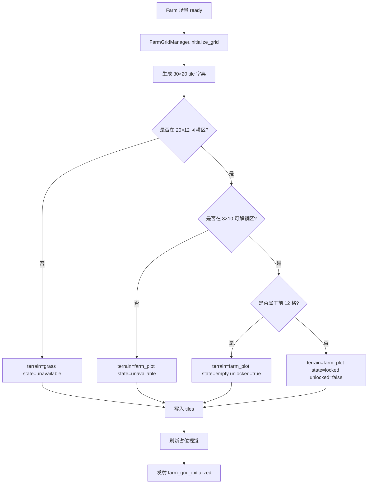

# PRD8: 田园场景 + 网格系统

> **优先级**: P0 — 从纯数据层进入可视化可玩原型的第一步  
> **美术依赖**: 🟡 最小占位视觉（Godot 内置 TileMapLayer / ColorRect / Label / 简单色块，无正式美术资产）  
> **预计工期**: 4-6 天  
> **前置依赖**: PRD1（项目骨架 + 核心数据系统）；建议已完成 PRD7（游戏时间系统），可选联动 PRD2 / PRD5 / PRD6  
> **产出**: 可运行的田园场景 + 30×20 网格地图 + 20×12 可耕区域 + 地块状态数据层 + 色块占位渲染 + 网格坐标转换 + 基础调试交互 + 自动化测试场景  
> **最后更新**: 2026-05-28

---

## 1. 目标

实现《像素田园》的个人田园基础场景与网格系统，包含：

- 田园场景 `scenes/farm/farm.tscn`
- 30×20 Tile 主地图，单格 16×16 像素，对应基础分辨率 480×320
- 20×12 种植区域，可标记空闲、干土、湿土、占用、不可用等状态
- 初始可用地块 3×4 = 12 格，最大可扩展到 8×10 = 80 格
- 使用 Godot 内置节点或程序化 TileSet / ColorRect 进行占位表现
- 草地、干土、湿土、锁定地块、边界 / 小路等基础色块区分
- 鼠标屏幕坐标、世界坐标、网格坐标之间的转换接口
- 地块状态查询、修改、序列化与反序列化
- 与 EventBus 发射地块状态变化事件
- 为 PRD9 角色移动和 PRD10 种植 / 浇水 / 收获交互提供场景与地块基础

完成后，项目应能运行进入一张可视化田园地图：玩家可以看到草地区、可耕地、初始解锁地块和锁定扩展地块；代码可通过 `FarmGridManager` 查询、修改地块状态，并可被后续作物系统与交互系统复用。

---

## 2. 核心设计决策

| 决策 | 内容 | 来源 |
|------|------|------|
| 引擎与语言 | Godot 4.4+ / 4.6 兼容，GDScript | 前期框架调研、现有项目 |
| 基础 Tile 大小 | 16×16 像素 | GDD 3.2、框架调研 |
| 田园地图尺寸 | 30×20 Tile，即 480×320 | GDD 3.1、PRD 大纲 |
| 种植区域尺寸 | 20×12 可耕地逻辑区域 | GDD 3.3.1 |
| 初始可用地块 | 3×4 = 12 格 | GDD 3.3.1、levels.json |
| 最大扩展地块 | 8×10 = 80 格 | GDD 3.3.1、levels.json |
| 视觉策略 | 色块 + Label / 调试网格，无正式 Sprite | PRD 拆分大纲 |
| 场景职责 | 只负责地块空间、状态和占位显示，不做角色、不做完整种植闭环 | PRD8 范围边界 |
| 保存方式 | FarmGridManager 提供导出 / 导入接口，SaveManager 可后续接入 | PRD6 衔接 |
| 与 CropManager 关系 | PRD8 不替代作物状态机，只提供地块容器与坐标 | PRD2 衔接 |

---

## 3. 系统范围

### 3.1 本 PRD 覆盖内容

- 创建个人田园场景
- 创建网格管理脚本 `FarmGridManager`
- 创建地块状态数据结构
- 生成 30×20 Tile 地图
- 标记 20×12 可耕区域
- 根据等级 / 配置初始化可用地块数量
- 地块状态到占位色块的渲染映射
- 鼠标位置转地块坐标
- 地块状态增删改查接口
- 地块状态变化事件
- 简单调试交互：点击地块循环切换状态或显示坐标信息
- 测试场景与基础自动化测试

### 3.2 本 PRD 不覆盖内容

- 角色移动、碰撞、面对方向 → PRD9
- 选择种子、种植、浇水、收获完整交互 → PRD10
- 作物 Sprite、生长阶段视觉 → PRD16
- 正式 TileSet、背景山丘、栅栏、小路美术 → PRD17
- 背包 UI、快捷栏、HUD 时间金币显示 → PRD11 / PRD13
- 天空色调、昼夜光照、天气特效 → PRD17 / PRD18
- 商店、房间、广场等其他场景 → 后续 PRD
- 好友田园同步、偷菜逻辑 → PRD21 / PRD22 / PRD23

---

## 4. 场景设计

### 4.1 文件结构

新增以下文件：

| 文件 | 操作 | 说明 |
|------|------|------|
| `scenes/farm/farm.tscn` | 新增 | 个人田园主场景 |
| `scenes/farm/farm.gd` | 新增 | 田园场景入口脚本，连接网格管理器与调试 UI |
| `scripts/farm/farm_grid_manager.gd` | 新增 | 网格与地块状态管理核心脚本 |
| `scripts/farm/farm_tile_data.gd` | 可选新增 | 地块数据类；也可用 Dictionary 实现 |
| `scenes/test/test_farm_grid_manager.tscn` | 新增 | FarmGridManager 自动化测试场景 |
| `scenes/test/test_farm_grid_manager.gd` | 新增 | 自动化测试脚本 |

> 当前项目已有 `scenes/farm/.gitkeep`，PRD8 需在该目录下补齐正式场景文件。

### 4.2 场景节点结构

推荐 `farm.tscn` 结构：

```text
Farm (Node2D)
├── BackgroundLayer (Node2D)
│   └── BackgroundColor (ColorRect)                 # 可选，铺满 480×320 的天空 / 背景占位
├── GridRoot (Node2D)
│   ├── GroundTileMap (TileMapLayer 或 TileMap)      # 草地 / 小路 / 边界占位
│   ├── SoilTileMap (TileMapLayer 或 TileMap)        # 地块状态占位
│   └── GridOverlay (Node2D)                         # 调试网格线，可选
├── DebugLayer (CanvasLayer)
│   ├── CoordinateLabel (Label)                      # 显示鼠标当前格子
│   └── TileStateLabel (Label)                       # 显示当前地块状态
└── FarmGridManager (Node)                           # 挂载 farm_grid_manager.gd
```

如果为了降低 TileSet 制作成本，也允许使用纯 `Node2D` 绘制：

```gdscript
func _draw() -> void:
    for y in range(MAP_HEIGHT):
        for x in range(MAP_WIDTH):
            draw_rect(Rect2(Vector2(x, y) * TILE_SIZE, Vector2.ONE * TILE_SIZE), color)
```

PRD8 验收只要求表现为 16×16 对齐色块，不强制必须使用正式 TileSet 资源。

### 4.3 地图尺寸

| 参数 | 值 | 说明 |
|------|:---:|------|
| `TILE_SIZE` | 16 | 单格像素尺寸 |
| `MAP_WIDTH` | 30 | 地图宽度，Tile 数 |
| `MAP_HEIGHT` | 20 | 地图高度，Tile 数 |
| 基础分辨率 | 480×320 | 与 PRD1 viewport 一致 |
| `FARM_AREA_WIDTH` | 20 | 可耕区域宽度 |
| `FARM_AREA_HEIGHT` | 12 | 可耕区域高度 |
| `MAX_UNLOCKED_FARM_WIDTH` | 8 | 最大实际可种植宽度 |
| `MAX_UNLOCKED_FARM_HEIGHT` | 10 | 最大实际可种植高度 |
| `INITIAL_UNLOCKED_WIDTH` | 3 | 初始可用宽度 |
| `INITIAL_UNLOCKED_HEIGHT` | 4 | 初始可用高度 |

### 4.4 区域布局

推荐在 30×20 地图中居中偏下放置可耕区域：

```text
地图坐标：x = 0..29, y = 0..19

┌──────────────────────────────┐
│ y0-y2    背景 / 天空占位       │
│ y3-y4    草地 / 小路 / 装饰占位 │
│ y5-y16   20×12 可耕区域        │
│ y17-y19  前景草地 / 小路        │
└──────────────────────────────┘

可耕区域起点：FARM_ORIGIN = Vector2i(5, 5)
可耕区域范围：x = 5..24, y = 5..16
实际最大可解锁区域：建议从 FARM_ORIGIN 开始的 8×10，即 x = 5..12, y = 5..14
初始可用区域：从 FARM_ORIGIN 开始的 3×4，即 x = 5..7, y = 5..8
```

说明：

- 20×12 是设计层面的可耕区域容量，用于后续扩展和视觉规划
- 8×10 是玩法最大可种植地块数量（80 格）
- 20×12 中未纳入 8×10 的部分可作为装饰、道路、后续扩展预留或不可用地块
- PRD8 只需明确状态，不需要实现解锁动画或购买土地流程

---

## 5. 地块状态模型

### 5.1 地块类型与状态

PRD8 区分「地形类型」和「地块运行状态」。

#### 地形类型 `terrain_type`

| ID | 中文 | 说明 | 默认颜色 |
|----|------|------|----------|
| `grass` | 草地 | 普通不可耕草地区域 | `#5FAE4D` |
| `path` | 小路 | 后续移动路径 / 装饰占位 | `#C2A36B` |
| `farm_plot` | 可耕地 | 可承载种植逻辑的地块 | 根据状态变化 |
| `blocked` | 阻挡 / 边界 | 后续碰撞或装饰区域 | `#3E5C36` |

#### 地块状态 `plot_state`

| ID | 中文 | 说明 | 默认颜色 |
|----|------|------|----------|
| `unavailable` | 不可用 | 不在可耕区或暂不可操作 | `#4B6F44` |
| `locked` | 未解锁 | 后续等级 / 扩展解锁 | `#2F3D2E` |
| `empty` | 空闲地块 | 已解锁，可种植但未播种 | `#8B7355` |
| `dry_soil` | 干土 | 已开垦 / 可种植土壤 | `#8B5A2B` |
| `wet_soil` | 湿土 | 已浇水土壤 | `#5C4033` |
| `occupied` | 已占用 | 已种植作物，占位显示 | `#6B4E2E` |
| `highlighted` | 高亮 | 鼠标悬停或调试选中，不进入存档 | 半透明白色边框 |

PRD8 不需要区分作物阶段；`occupied` 仅用于表示该地块已被作物系统占用。作物具体 `crop_id`、阶段、浇水时间仍由 CropManager 管理。

### 5.2 地块数据结构

推荐每个 Tile 使用 Dictionary：

```gdscript
{
    "grid_pos": Vector2i(5, 5),
    "terrain_type": "farm_plot",
    "plot_state": "empty",
    "unlocked": true,
    "occupied": false,
    "crop_tile_ref": "",          # 可选，后续关联 CropManager 的地块 key
    "last_updated_at": 0,
}
```

字段说明：

| 字段 | 类型 | 必需 | 说明 |
|------|------|:---:|------|
| `grid_pos` | Vector2i | ✅ | 地图格子坐标 |
| `terrain_type` | String | ✅ | 地形类型 |
| `plot_state` | String | ✅ | 地块状态 |
| `unlocked` | bool | ✅ | 是否已解锁 |
| `occupied` | bool | ✅ | 是否被作物 / 物体占用 |
| `crop_tile_ref` | String | ❌ | 后续与 CropManager 对齐的地块 key |
| `last_updated_at` | int | ❌ | 状态更新时间戳，可用于调试 / 存档 |

### 5.3 坐标 Key 规范

为了和 JSON 存档兼容，运行时 `Vector2i` 坐标在序列化时必须转为字符串 key：

```gdscript
func tile_pos_to_key(tile_pos: Vector2i) -> String:
    return "%d,%d" % [tile_pos.x, tile_pos.y]

func key_to_tile_pos(key: String) -> Vector2i:
    var parts := key.split(",")
    return Vector2i(int(parts[0]), int(parts[1]))
```

---

## 6. FarmGridManager

新增 `scripts/farm/farm_grid_manager.gd`。

### 6.1 职责

- 初始化 30×20 地图数据
- 标记可耕区域与初始解锁地块
- 管理地块状态查询和修改
- 提供坐标转换工具
- 驱动占位视觉刷新
- 导出 / 导入可存档数据
- 发射地块状态变化事件
- 为 PRD9 / PRD10 提供地块可交互判断

### 6.2 常量定义

```gdscript
const TILE_SIZE: int = 16
const MAP_WIDTH: int = 30
const MAP_HEIGHT: int = 20
const FARM_ORIGIN: Vector2i = Vector2i(5, 5)
const FARM_AREA_WIDTH: int = 20
const FARM_AREA_HEIGHT: int = 12
const INITIAL_UNLOCKED_WIDTH: int = 3
const INITIAL_UNLOCKED_HEIGHT: int = 4
const MAX_UNLOCKED_FARM_WIDTH: int = 8
const MAX_UNLOCKED_FARM_HEIGHT: int = 10

const TERRAIN_GRASS := "grass"
const TERRAIN_PATH := "path"
const TERRAIN_FARM_PLOT := "farm_plot"
const TERRAIN_BLOCKED := "blocked"

const PLOT_UNAVAILABLE := "unavailable"
const PLOT_LOCKED := "locked"
const PLOT_EMPTY := "empty"
const PLOT_DRY_SOIL := "dry_soil"
const PLOT_WET_SOIL := "wet_soil"
const PLOT_OCCUPIED := "occupied"
```

### 6.3 核心属性

```gdscript
var tiles: Dictionary = {}             # String key "x,y" -> Dictionary tile_data
var unlocked_plot_count: int = 12
var hovered_tile: Vector2i = Vector2i(-1, -1)
var selected_tile: Vector2i = Vector2i(-1, -1)
var debug_mode: bool = true
```

### 6.4 初始化接口

```gdscript
## 初始化完整田园网格
func initialize_grid() -> void

## 根据玩家等级或指定数量刷新已解锁地块
func initialize_unlocked_plots(plot_count: int = 12) -> void

## 重置为新游戏默认地块状态
func reset_to_default() -> void
```

初始化要求：

1. 生成 30×20 的全量 tile 数据
2. 非可耕区默认 `terrain_type = grass`，`plot_state = unavailable`
3. 20×12 可耕区默认 `terrain_type = farm_plot`
4. 最大 8×10 内但未解锁的地块标记为 `locked`
5. 初始 3×4 地块标记为 `empty`
6. 超出 8×10 但仍在 20×12 范围内的格子可标记为 `unavailable` 或保留装饰预留状态

### 6.5 查询接口

```gdscript
## 判断网格坐标是否在地图范围内
func is_in_map_bounds(tile_pos: Vector2i) -> bool

## 判断网格坐标是否在 20×12 可耕区域内
func is_in_farm_area(tile_pos: Vector2i) -> bool

## 判断网格坐标是否在最大 8×10 可解锁区域内
func is_in_unlockable_plot_area(tile_pos: Vector2i) -> bool

## 获取地块数据；不存在返回空 Dictionary
func get_tile_data(tile_pos: Vector2i) -> Dictionary

## 获取地形类型
func get_terrain_type(tile_pos: Vector2i) -> String

## 获取地块状态
func get_plot_state(tile_pos: Vector2i) -> String

## 判断是否已解锁
func is_plot_unlocked(tile_pos: Vector2i) -> bool

## 判断是否可种植：在地图内、可耕地、已解锁、未占用、状态为空 / 干土 / 湿土
func can_plant_on_tile(tile_pos: Vector2i) -> bool

## 判断是否可浇水：已解锁、可耕地、被作物占用或干土、未处于湿土
func can_water_tile(tile_pos: Vector2i) -> bool

## 判断是否可清理：已解锁且被占用或特殊状态
func can_clear_tile(tile_pos: Vector2i) -> bool

## 获取全部已解锁可耕地坐标
func get_unlocked_plot_positions() -> Array[Vector2i]

## 获取全部可种植坐标
func get_plantable_positions() -> Array[Vector2i]
```

### 6.6 修改接口

```gdscript
## 设置地块状态
func set_plot_state(tile_pos: Vector2i, new_state: String) -> bool

## 设置地块是否解锁
func set_plot_unlocked(tile_pos: Vector2i, unlocked: bool) -> bool

## 标记地块被占用
func set_tile_occupied(tile_pos: Vector2i, occupied: bool, crop_tile_ref: String = "") -> bool

## 将地块恢复为空闲
func clear_tile(tile_pos: Vector2i) -> bool

## 将干土 / 空地标记为湿土
func mark_tile_watered(tile_pos: Vector2i) -> bool

## 按数量扩展已解锁地块
func unlock_plots_by_count(target_count: int) -> int
```

修改要求：

- 所有修改必须先校验坐标合法性
- 无效坐标返回 `false`，并使用 `push_warning` 打印问题
- 状态变化后必须刷新对应视觉
- 状态变化后必须发射 EventBus 信号
- `occupied = true` 时建议同步 `plot_state = occupied`
- `clear_tile()` 后应恢复 `plot_state = empty`、`occupied = false`、`crop_tile_ref = ""`

### 6.7 坐标转换接口

```gdscript
## 网格坐标转世界坐标，返回 tile 左上角
func grid_to_world(tile_pos: Vector2i) -> Vector2

## 网格坐标转世界中心点
func grid_to_world_center(tile_pos: Vector2i) -> Vector2

## 世界坐标转网格坐标
func world_to_grid(world_pos: Vector2) -> Vector2i

## 屏幕 / 鼠标坐标转网格坐标
func screen_to_grid(screen_pos: Vector2, camera: Camera2D = null) -> Vector2i

## 坐标转 JSON key
func tile_pos_to_key(tile_pos: Vector2i) -> String

## JSON key 转坐标
func key_to_tile_pos(key: String) -> Vector2i
```

坐标转换要求：

- `grid_to_world(Vector2i(0, 0)) == Vector2(0, 0)`
- `grid_to_world_center(Vector2i(0, 0)) == Vector2(8, 8)`
- `world_to_grid(Vector2(0, 0)) == Vector2i(0, 0)`
- `world_to_grid(Vector2(15, 15)) == Vector2i(0, 0)`
- `world_to_grid(Vector2(16, 16)) == Vector2i(1, 1)`
- 负坐标应返回负格子坐标，但后续 `is_in_map_bounds` 为 false

---

## 7. 占位视觉规范

### 7.1 颜色表

| 类型 / 状态 | 颜色 | 说明 |
|-------------|------|------|
| 草地 | `#5FAE4D` | 普通背景草地 |
| 深草 / 边界 | `#3E5C36` | 地图边缘或阻挡 |
| 小路 | `#C2A36B` | 后续路径占位 |
| 未解锁地块 | `#2F3D2E` | 深色，表示暂不可用 |
| 空闲地块 | `#8B7355` | 可种植土色 |
| 干土 | `#8B5A2B` | 已开垦 / 干燥 |
| 湿土 | `#5C4033` | 已浇水 |
| 已占用 | `#6B4E2E` | 后续作物占位 |
| 鼠标悬停 | 白色 35% 透明边框 | 调试提示 |
| 选中 | 黄色 60% 透明边框 | 调试选中 |

### 7.2 渲染方式

推荐优先级：

1. **程序化 TileMapLayer + 运行时 TileSet**：更贴近后续正式 TileSet 替换
2. **Node2D `_draw()` 色块渲染**：实现最快，适合 PRD8
3. **大量 ColorRect 实例**：简单但节点数较多，600 格仍可接受

验收不限制实现方式，但必须满足：

- 每格视觉大小严格 16×16
- 地块边界清晰可辨
- 可区分草地、锁定地块、空闲地块、湿土地块
- 鼠标移动时可看到当前格子高亮或调试文字

### 7.3 调试 Label

`DebugLayer` 至少显示：

```text
Tile: (5, 5)
Terrain: farm_plot
State: empty
Unlocked: true
Occupied: false
```

当鼠标不在地图范围内：

```text
Tile: out of bounds
```

---

## 8. EventBus 信号

### 8.1 需新增信号

在 `scripts/autoload/event_bus.gd` 中新增：

```gdscript
signal farm_grid_initialized(width: int, height: int)
signal farm_tile_hovered(tile_pos: Vector2i, tile_data: Dictionary)
signal farm_tile_selected(tile_pos: Vector2i, tile_data: Dictionary)
signal farm_tile_state_changed(tile_pos: Vector2i, old_state: String, new_state: String)
signal farm_tile_unlocked(tile_pos: Vector2i)
signal farm_tile_occupied_changed(tile_pos: Vector2i, occupied: bool)
signal farm_grid_changed()
```

### 8.2 信号发射规则

| 信号 | 时机 | 参数 |
|------|------|------|
| `farm_grid_initialized` | 网格初始化完成 | `width, height` |
| `farm_tile_hovered` | 鼠标悬停格子变化 | `tile_pos, tile_data` |
| `farm_tile_selected` | 点击 / 调试选中地块 | `tile_pos, tile_data` |
| `farm_tile_state_changed` | `plot_state` 变化 | `tile_pos, old_state, new_state` |
| `farm_tile_unlocked` | 地块从未解锁变已解锁 | `tile_pos` |
| `farm_tile_occupied_changed` | 占用状态变化 | `tile_pos, occupied` |
| `farm_grid_changed` | 任意影响整体网格的变化 | 无 |

### 8.3 与既有 EventBus 的关系

PRD1-PRD7 已定义作物、背包、经济、等级、时间、存档信号。PRD8 新增的 `farm_*` 信号只描述「场景网格 / 地块」变化，不应替代：

- `crop_planted`
- `crop_watered`
- `crop_harvested`
- `crop_cleared`

PRD10 进行完整交互时，可以同时触发作物信号和地块信号。例如浇水时：

1. CropManager 更新作物浇水状态
2. FarmGridManager 将地块设为 `wet_soil` 或保持 `occupied` 并设置湿润视觉
3. EventBus 发射 `crop_watered(tile_pos)`
4. EventBus 发射 `farm_tile_state_changed(tile_pos, old_state, new_state)`

---

## 9. 存档接口

PRD8 需要提供可 JSON 序列化的导出 / 导入接口，但不强制改造 SaveManager。若 PRD6 已完成，可在 SaveManager 中接入。

### 9.1 导出结构

```gdscript
func export_save_data() -> Dictionary:
    return {
        "schema_version": 1,
        "map_width": MAP_WIDTH,
        "map_height": MAP_HEIGHT,
        "tile_size": TILE_SIZE,
        "farm_origin": {"x": FARM_ORIGIN.x, "y": FARM_ORIGIN.y},
        "unlocked_plot_count": unlocked_plot_count,
        "tiles": {
            "5,5": {
                "terrain_type": "farm_plot",
                "plot_state": "empty",
                "unlocked": true,
                "occupied": false,
                "crop_tile_ref": ""
            }
        }
    }
```

### 9.2 SaveManager 根结构建议

如接入 PRD6 存档，建议在根结构中加入：

```json
{
  "farm_grid": {
    "schema_version": 1,
    "map_width": 30,
    "map_height": 20,
    "tile_size": 16,
    "farm_origin": { "x": 5, "y": 5 },
    "unlocked_plot_count": 12,
    "tiles": {}
  }
}
```

### 9.3 导入接口

```gdscript
## 从存档恢复地块状态
func import_save_data(data: Dictionary) -> void
```

导入要求：

- 缺少 `farm_grid` 或数据为空时，使用 `reset_to_default()`
- 坐标 key 无效时跳过并 `push_warning`
- 超出地图范围的 tile 跳过
- 缺少字段时使用默认值补齐
- 导入后刷新全图视觉
- 导入后发射 `farm_grid_changed`

---

## 10. 与既有系统关系

### 10.1 与 PRD1 / DataManager

- 使用 PRD1 的项目配置、目录结构和 EventBus
- PRD8 本身不依赖作物 JSON，但后续调试可读取 `levels.json` 中的 `farm_slots`
- `FarmGridManager` 不修改 DataManager 的只读配置

### 10.2 与 PRD2 / CropManager

- CropManager 负责作物生命周期、浇水、生长、枯萎、收获
- FarmGridManager 负责地块是否可放置、是否占用、坐标与视觉状态
- 二者通过 `tile_pos` / `"x,y"` key 建立关联
- PRD8 不实现作物生长阶段，也不改写 CropManager 的状态机
- 后续 PRD10 种植成功时，应调用 FarmGridManager 标记 `occupied = true`
- 后续 PRD10 收获 / 清除成功时，应调用 FarmGridManager 恢复 `empty`

### 10.3 与 PRD5 / LevelManager

- PRD5 已定义等级对应 `farm_slots`
- PRD8 可提供 `unlock_plots_by_count(target_count)`，供 LevelManager 或 GameManager 在升级后调用
- PRD8 不实现升级逻辑，也不主动发放土地扩展奖励

等级与地块数量建议映射：

| 等级 | `farm_slots` | PRD8 行为 |
|:---:|:---:|------|
| 1 | 12 | 解锁初始 3×4 区域 |
| 2 | 16 | 解锁 16 格 |
| 3 | 24 | 解锁 24 格 |
| 4 | 36 | 解锁 36 格 |
| 5 | 48 | 解锁 48 格 |
| 6 | 64 | 解锁 64 格 |
| 7 | 80 | 解锁最大 8×10 区域 |

### 10.4 与 PRD6 / SaveManager

- FarmGridManager 提供 `export_save_data()` / `import_save_data()`
- SaveManager 如接入，负责将 `farm_grid` 写入 JSON
- FarmGridManager 不直接读写文件
- 旧存档缺少 `farm_grid` 时应使用默认 12 格初始田园

### 10.5 与 PRD7 / TimeManager

- PRD8 不直接依赖时间推进
- 可选：根据 TimeManager 当前季节在调试 Label 中显示季节，或后续用于地块提示
- 昼夜色调、季节美术变化不在 PRD8 范围内

### 10.6 与 PRD9 / PRD10

| 后续 PRD | 使用 PRD8 的方式 |
|----------|------------------|
| PRD9 角色移动 + 交互 | 使用地图边界、地块中心点、地形类型判断交互目标 |
| PRD10 种植 / 浇水 / 收获 | 使用 `can_plant_on_tile()`、`can_water_tile()`、`set_tile_occupied()` 等接口完成地块级交互 |
| PRD13 HUD | 可显示当前鼠标地块、操作提示 |
| PRD16 作物视觉 | 在地块中心点挂载作物 Sprite 或占位节点 |
| PRD17 场景美术 | 替换色块为正式 TileSet |

---

## 11. 详细行为规范

### 11.1 网格初始化

`initialize_grid()` 行为：

```gdscript
func initialize_grid() -> void:
    tiles.clear()
    for y in range(MAP_HEIGHT):
        for x in range(MAP_WIDTH):
            var tile_pos := Vector2i(x, y)
            var tile_data := _create_default_tile_data(tile_pos)
            tiles[tile_pos_to_key(tile_pos)] = tile_data
    initialize_unlocked_plots(INITIAL_UNLOCKED_WIDTH * INITIAL_UNLOCKED_HEIGHT)
    EventBus.farm_grid_initialized.emit(MAP_WIDTH, MAP_HEIGHT)
    EventBus.farm_grid_changed.emit()
```

要求：

- 初始化后 `tiles.size() == 600`
- `Vector2i(5, 5)` 至 `Vector2i(7, 8)` 共 12 格为 `empty`
- 最大可解锁区域内其余地块为 `locked`
- 20×12 可耕区内但不属于 8×10 最大区域的地块为 `unavailable`
- 地图外坐标不存在于 `tiles`

### 11.2 解锁顺序

`unlock_plots_by_count(target_count)` 应按稳定顺序解锁：

1. 从 `FARM_ORIGIN` 开始
2. 先按行从左到右
3. 再从上到下
4. 最多解锁 80 格

示例：

```text
12 格：3×4 初始区域
16 格：前 16 个 row-major 地块
24 格：前 24 个 row-major 地块
80 格：8×10 全部地块
```

验收只要求数量正确、顺序稳定，不要求视觉上必须保持矩形。

### 11.3 地块状态修改

`set_plot_state(tile_pos, new_state)` 要求：

- `new_state` 必须是允许状态之一
- 非地图内坐标返回 `false`
- 非 `farm_plot` 地形不允许设置为 `empty` / `dry_soil` / `wet_soil` / `occupied`
- 未解锁地块不允许设置为 `empty` 以外的可操作状态，除非先调用 `set_plot_unlocked`
- 状态未变化时返回 `true`，但不重复发射 `farm_tile_state_changed`
- 状态变化后调用视觉刷新

### 11.4 鼠标调试交互

在 `farm.gd` 中实现最低限度调试交互：

```gdscript
func _unhandled_input(event: InputEvent) -> void:
    if event is InputEventMouseMotion:
        _update_hovered_tile(event.position)
    if event is InputEventMouseButton and event.pressed and event.button_index == MOUSE_BUTTON_LEFT:
        _select_hovered_tile()
```

调试行为建议：

- 鼠标移动时更新 `hovered_tile`
- 左键点击地图内地块时更新 `selected_tile`
- 点击后 Label 显示该地块完整状态
- Debug 模式下可按固定顺序循环：`empty → dry_soil → wet_soil → occupied → empty`
- 对 `locked` / `unavailable` 地块点击只显示状态，不改变状态

> PRD8 的点击调试不能被视为正式种植交互；正式交互由 PRD10 实现。

---

## 12. 边界情况处理

| 场景 | 行为 |
|------|------|
| 鼠标在地图外 | Label 显示 out of bounds，不发射选中信号 |
| 坐标为负数 | `is_in_map_bounds` 返回 false，查询返回空 Dictionary |
| 坐标超过 30×20 | 返回 false / 空数据，不崩溃 |
| 设置未知状态 | 返回 false，`push_warning` |
| 未解锁地块被请求种植 | `can_plant_on_tile` 返回 false |
| 已占用地块被请求种植 | `can_plant_on_tile` 返回 false |
| 空闲地块被清理 | 返回 true，但状态保持 empty |
| 导入存档尺寸不一致 | 以当前常量为准，只导入范围内 tile |
| 导入缺失字段 | 使用默认字段补齐 |
| EventBus 未注册新增信号 | 项目启动应暴露错误，需补齐信号定义 |
| TileMapLayer 不可用 | 可降级为 Node2D `_draw()` 色块实现 |

---

## 13. 测试需求

### 13.1 自动化测试场景

新增：

| 文件 | 操作 | 说明 |
|------|------|------|
| `scenes/test/test_farm_grid_manager.tscn` | 新增 | FarmGridManager 测试入口 |
| `scenes/test/test_farm_grid_manager.gd` | 新增 | 自动化测试脚本 |

### 13.2 测试场景结构

```text
test_farm_grid_manager.tscn
└── TestFarmGridManager (Node2D)
    ├── FarmGridManager (Node)
    └── Label
```

### 13.3 测试用例清单

```gdscript
func _ready() -> void:
    print("=== FarmGridManager 自动化测试 ===")

    test_grid_initialization()
    test_map_bounds()
    test_farm_area_bounds()
    test_unlockable_area_bounds()
    test_initial_unlocked_plot_count()
    test_grid_to_world()
    test_world_to_grid()
    test_tile_key_conversion()
    test_get_tile_data()
    test_set_plot_state()
    test_invalid_plot_state_rejected()
    test_can_plant_on_tile()
    test_set_tile_occupied()
    test_clear_tile()
    test_mark_tile_watered()
    test_unlock_plots_by_count()
    test_export_import_save_data()
    test_event_bus_signals()

    print("=== FarmGridManager 测试完成 ===")
```

### 13.4 关键测试示例

#### 初始化尺寸

```gdscript
FarmGridManager.initialize_grid()
assert(FarmGridManager.tiles.size() == 600)
assert(FarmGridManager.get_plot_state(Vector2i(5, 5)) == "empty")
assert(FarmGridManager.get_plot_state(Vector2i(8, 5)) == "locked")
```

#### 坐标转换

```gdscript
assert(FarmGridManager.grid_to_world(Vector2i(0, 0)) == Vector2(0, 0))
assert(FarmGridManager.grid_to_world_center(Vector2i(0, 0)) == Vector2(8, 8))
assert(FarmGridManager.world_to_grid(Vector2(15, 15)) == Vector2i(0, 0))
assert(FarmGridManager.world_to_grid(Vector2(16, 16)) == Vector2i(1, 1))
```

#### 种植可用性

```gdscript
var tile_pos := Vector2i(5, 5)
assert(FarmGridManager.can_plant_on_tile(tile_pos) == true)
FarmGridManager.set_tile_occupied(tile_pos, true, "5,5")
assert(FarmGridManager.can_plant_on_tile(tile_pos) == false)
FarmGridManager.clear_tile(tile_pos)
assert(FarmGridManager.can_plant_on_tile(tile_pos) == true)
```

#### 解锁数量

```gdscript
FarmGridManager.unlock_plots_by_count(24)
assert(FarmGridManager.get_unlocked_plot_positions().size() == 24)

FarmGridManager.unlock_plots_by_count(999)
assert(FarmGridManager.get_unlocked_plot_positions().size() == 80)
```

#### 存档导入导出

```gdscript
FarmGridManager.set_plot_state(Vector2i(5, 5), "wet_soil")
var data := FarmGridManager.export_save_data()
FarmGridManager.reset_to_default()
FarmGridManager.import_save_data(data)
assert(FarmGridManager.get_plot_state(Vector2i(5, 5)) == "wet_soil")
```

---

## 14. 验收标准

### 14.1 文件与场景验收

- [ ] 新增 `scenes/farm/farm.tscn`
- [ ] 新增 `scenes/farm/farm.gd`
- [ ] 新增 `scripts/farm/farm_grid_manager.gd`
- [ ] 新增测试场景 `scenes/test/test_farm_grid_manager.tscn`
- [ ] 新增测试脚本 `scenes/test/test_farm_grid_manager.gd`
- [ ] 田园场景可在 Godot 中打开且无报错
- [ ] 运行田园场景可看到 30×20 色块地图

### 14.2 网格数据验收

- [ ] 初始化后生成 600 个 tile 数据
- [ ] `TILE_SIZE == 16`
- [ ] `MAP_WIDTH == 30`
- [ ] `MAP_HEIGHT == 20`
- [ ] `FARM_ORIGIN == Vector2i(5, 5)`
- [ ] 20×12 可耕区域判断正确
- [ ] 最大 8×10 可解锁区域判断正确
- [ ] 初始已解锁地块数量为 12
- [ ] 最大可解锁地块数量不超过 80

### 14.3 地块状态验收

- [ ] 初始 12 个地块为 `empty`
- [ ] 未解锁地块为 `locked`
- [ ] 不可耕区域为 `unavailable`
- [ ] `set_plot_state()` 可修改合法地块状态
- [ ] 非法状态会被拒绝且不破坏原状态
- [ ] `set_tile_occupied()` 会标记地块占用
- [ ] `clear_tile()` 会恢复空闲地块
- [ ] `mark_tile_watered()` 会将合法地块标记为湿土

### 14.4 坐标转换验收

- [ ] `grid_to_world(Vector2i(0, 0))` 返回 `Vector2(0, 0)`
- [ ] `grid_to_world_center(Vector2i(0, 0))` 返回 `Vector2(8, 8)`
- [ ] `world_to_grid(Vector2(15, 15))` 返回 `Vector2i(0, 0)`
- [ ] `world_to_grid(Vector2(16, 16))` 返回 `Vector2i(1, 1)`
- [ ] `tile_pos_to_key(Vector2i(5, 8))` 返回 `"5,8"`
- [ ] `key_to_tile_pos("5,8")` 返回 `Vector2i(5, 8)`

### 14.5 占位视觉验收

- [ ] 草地区、锁定地块、空闲地块、湿土地块颜色可区分
- [ ] 每个格子严格 16×16 对齐
- [ ] 鼠标移动到地图内时可显示当前坐标
- [ ] 鼠标移动到地图外时显示 out of bounds
- [ ] 点击已解锁地块可显示或切换调试状态
- [ ] 不依赖任何正式美术 Sprite 资源

### 14.6 EventBus 验收

- [ ] `farm_grid_initialized` 在初始化完成后发射
- [ ] `farm_tile_state_changed` 在地块状态变化时发射
- [ ] `farm_tile_unlocked` 在地块解锁时发射
- [ ] `farm_tile_occupied_changed` 在占用状态变化时发射
- [ ] `farm_grid_changed` 在整体网格变化时发射

### 14.7 存档验收

- [ ] `export_save_data()` 返回 JSON 可序列化 Dictionary
- [ ] 导出数据包含地图尺寸、tile_size、farm_origin、unlocked_plot_count、tiles
- [ ] `import_save_data()` 可恢复地块状态
- [ ] 导入缺失字段不会崩溃
- [ ] 导入非法坐标会跳过并保持项目运行

### 14.8 自动化测试验收

- [ ] `test_farm_grid_manager.tscn` 可运行且无报错
- [ ] 初始化测试通过
- [ ] 坐标转换测试通过
- [ ] 地块状态修改测试通过
- [ ] 解锁数量测试通过
- [ ] 导入 / 导出测试通过
- [ ] EventBus 信号测试通过

---

## 15. 技术约束

1. **GDScript 代码规范**:
   - 变量使用 snake_case
   - 常量使用 UPPER_SNAKE_CASE
   - 所有公开方法需有简短注释
   - 如作为普通节点脚本使用，不强制 `class_name`

2. **职责边界**:
   - FarmGridManager 不负责作物成长逻辑
   - FarmGridManager 不负责背包扣除种子
   - FarmGridManager 不负责金币、经验、等级升级
   - FarmGridManager 不直接读写存档文件
   - FarmGridManager 不加载正式美术资源

3. **数据可序列化**:
   - 存档导出不得包含 Node、Resource、Signal、Callable、Vector2i 原始对象
   - Vector2i 必须转为字符串 key 或 `{x, y}` 对象

4. **信号优先原则**:
   - 地块变化通过 EventBus 广播
   - 后续系统监听事件或主动调用接口，不应直接修改 `tiles` 内部 Dictionary

5. **像素对齐**:
   - 所有地块绘制必须对齐 16px 网格
   - 禁用模糊缩放，沿用 PRD1 的 Nearest 过滤设置

6. **性能约束**:
   - 600 个 tile 的全量绘制可接受
   - 鼠标移动时只刷新 hover 或必要 UI，不做重型数据重建
   - 状态变化时可先全图 `queue_redraw()`，后续如有性能问题再局部优化

---

## 16. 需要新增 / 修改的文件

| 文件 | 操作 | 说明 |
|------|------|------|
| `scenes/farm/farm.tscn` | 新增 | 个人田园场景 |
| `scenes/farm/farm.gd` | 新增 | 田园场景控制与调试交互 |
| `scripts/farm/farm_grid_manager.gd` | 新增 | 网格与地块状态管理 |
| `scripts/farm/farm_tile_data.gd` | 可选新增 | 地块数据类，如采用 Dictionary 可不建 |
| `scripts/autoload/event_bus.gd` | 修改 | 增加 farm_grid / farm_tile 相关信号 |
| `scripts/autoload/save_manager.gd` | 可选修改 | 接入 `farm_grid` 存档字段 |
| `scripts/autoload/level_manager.gd` | 可选修改 | 升级时调用地块解锁接口 |
| `project.godot` | 可选修改 | 临时将主场景切到 `farm.tscn` 便于调试；提交前可保持测试场景 |
| `scenes/test/test_farm_grid_manager.tscn` | 新增 | 自动化测试场景 |
| `scenes/test/test_farm_grid_manager.gd` | 新增 | 自动化测试脚本 |

---

## 17. 非目标 (Not in Scope)

以下内容不在 PRD8 范围内：

- 玩家角色、移动、碰撞、动画、面朝方向 → PRD9
- 种子选择、种植、浇水、收获完整玩法闭环 → PRD10
- 背包面板、快捷栏、HUD、操作提示正式 UI → PRD11 / PRD13
- 商店 UI、购买种子、出售作物 → PRD12 / PRD4
- 正式作物 Sprite、生长阶段视觉、成熟发光 → PRD16
- 正式 TileSet、背景山丘、栅栏、小路、工具棚、水井等场景美术 → PRD17
- 粒子特效、天气效果、昼夜色调、音频切换 → PRD18 / PRD19
- 好友田园、拜访、偷菜、P2P 同步 → PRD21-PRD23
- 装饰物摆放、旋转、碰撞、布局编辑 → PRD25

PRD8 的目标是：**用最小占位视觉建立稳定的田园空间、地块状态和网格坐标基础，让后续角色、交互、作物视觉和正式场景美术可以直接接入。**

---

## 18. 后续衔接

| 完成 PRD8 后可启动 | 说明 |
|-------------------|------|
| → PRD9（角色移动 + 交互系统） | 在田园场景中加入 ColorRect 占位角色，使用网格中心与地形判断交互目标 |
| → PRD10（种植 / 浇水 / 收获交互） | 复用地块可种植 / 可浇水 / 占用接口，整合 CropManager、InventoryManager、TimeManager |
| → PRD13（HUD） | 显示时间、金币、快捷栏与当前地块操作提示 |
| → PRD16（作物视觉系统） | 在 FarmGridManager 的地块中心点挂载作物占位 / Sprite |
| → PRD17（田园场景美术） | 用正式 TileSet 替换 PRD8 色块，不改地块数据接口 |
| → PRD25（装饰系统） | 复用网格坐标和占用判断实现装饰摆放 |

---

## 附录 A: 网格初始化示意



---

## 附录 B: 默认地图布局示意

```text
图例：G=草地，L=锁定，E=已解锁空地，U=可耕区预留不可用

x: 00                              29
   G G G G G G G G G G G G G G G G G G G G G G G G G G G G G G
   G G G G G G G G G G G G G G G G G G G G G G G G G G G G G G
   G G G G G G G G G G G G G G G G G G G G G G G G G G G G G G
   G G G G G G G G G G G G G G G G G G G G G G G G G G G G G G
   G G G G G G G G G G G G G G G G G G G G G G G G G G G G G G
   G G G G G E E E L L L L L U U U U U U U U U U U U G G G G G
   G G G G G E E E L L L L L U U U U U U U U U U U U G G G G G
   G G G G G E E E L L L L L U U U U U U U U U U U U G G G G G
   G G G G G E E E L L L L L U U U U U U U U U U U U G G G G G
   G G G G G L L L L L L L L U U U U U U U U U U U U G G G G G
   G G G G G L L L L L L L L U U U U U U U U U U U U G G G G G
   G G G G G L L L L L L L L U U U U U U U U U U U U G G G G G
   G G G G G L L L L L L L L U U U U U U U U U U U U G G G G G
   G G G G G L L L L L L L L U U U U U U U U U U U U G G G G G
   G G G G G L L L L L L L L U U U U U U U U U U U U G G G G G
   G G G G G U U U U U U U U U U U U U U U U U U U U G G G G G
   G G G G G U U U U U U U U U U U U U U U U U U U U G G G G G
   G G G G G G G G G G G G G G G G G G G G G G G G G G G G G G
   G G G G G G G G G G G G G G G G G G G G G G G G G G G G G G
   G G G G G G G G G G G G G G G G G G G G G G G G G G G G G G
```

---

## 附录 C: 与 PRD1-7 的关系

| 系统 | 已有 PRD | PRD8 关系 |
|------|----------|-----------|
| EventBus | PRD1 | 新增田园网格和地块状态信号 |
| DataManager | PRD1 | 可读取 levels.json 的 farm_slots，但不强制依赖 |
| CropManager | PRD2 | 后续通过 tile_pos 与地块占用状态联动 |
| InventoryManager | PRD3 | PRD8 不扣除种子；PRD10 种植交互时再联动 |
| EconomyManager | PRD4 | 无直接关系；后续土地扩展购买可联动 |
| LevelManager | PRD5 | 可根据等级解锁更多地块 |
| SaveManager | PRD6 | 可保存 / 恢复 `farm_grid` 字段 |
| TimeManager | PRD7 | 可为后续季节地块提示和昼夜场景氛围提供数据 |

---

> *本 PRD 完成后，项目将从纯逻辑系统进入可视化田园原型阶段，具备稳定的 30×20 场景网格、可耕地状态管理、坐标转换和色块占位显示，为角色移动与完整种植交互闭环奠定基础。*