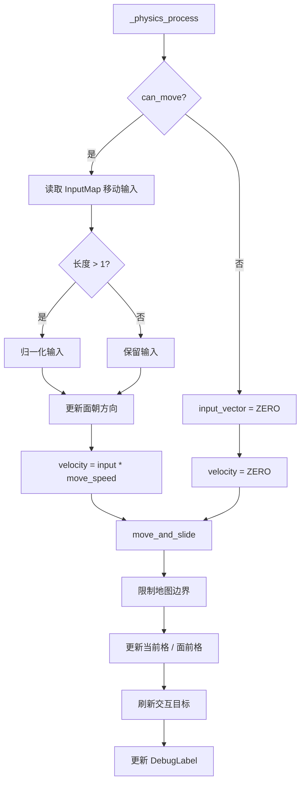
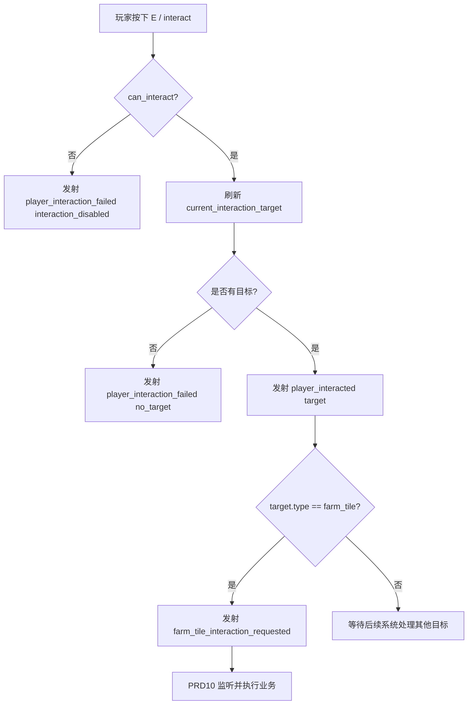

# PRD9: 角色移动 + 交互系统

> **优先级**: P0 — 可视化可玩原型的角色控制与交互基础  
> **美术依赖**: 🟡 最小占位视觉（Godot 内置 CharacterBody2D / ColorRect / Label / 简单几何体，无正式角色 Sprite）  
> **预计工期**: 4-6 天  
> **前置依赖**: PRD1（项目骨架 + 核心数据系统）；强依赖 PRD8（田园场景 + 网格系统）；建议已完成 PRD7（游戏时间系统）  
> **产出**: 可在田园场景中移动的占位玩家角色 + 4 方向移动控制 + 面朝方向 + 碰撞边界 + 交互范围检测 + 交互目标识别 + EventBus 交互事件 + 自动化测试场景  
> **最后更新**: 2026-06-01

---

## 1. 目标

实现《像素田园》的基础玩家角色移动与交互系统，包含：

- 玩家角色节点 `Player`，基于 `CharacterBody2D` 实现 4 方向移动
- 使用 `ColorRect` / `Polygon2D` / 简单色块作为 32×48 像素占位角色
- WASD / 方向键输入响应，沿用 PRD1 的 InputMap
- 玩家面朝方向记录与查询
- 地图边界约束，避免角色走出 30×20 田园地图
- 基础碰撞区域与阻挡地形处理
- 交互范围 `Area2D`，根据面朝方向或角色中心检测附近地块 / 对象
- 地块交互目标识别：当前面前格、当前脚下格、鼠标选中格的基础查询
- 最小调试 UI：显示角色坐标、网格坐标、面朝方向、当前可交互目标
- EventBus 交互信号扩展
- 自动化 / 半自动化测试场景

完成后，玩家应能在 PRD8 田园场景中看到一个色块占位角色，并使用键盘在地图内移动；角色移动时更新面朝方向，靠近或面向可交互地块时可通过 `interact` 输入触发交互事件。PRD9 不实现种植、浇水、收获的业务效果，只建立稳定的角色控制、位置、方向和交互目标基础，为 PRD10 完整交互闭环做准备。

---

## 2. 核心设计决策

| 决策 | 内容 | 来源 |
|------|------|------|
| 引擎与语言 | Godot 4.4+ / 4.6 兼容，GDScript | 前期框架调研、现有项目 |
| 玩家节点类型 | `CharacterBody2D` | GDD 技术架构 Character Controller |
| 占位视觉 | 32×48 像素色块 / 简单几何体，后续 PRD15 替换 Sprite | PRD 大纲、GDD 角色尺寸 |
| 移动方式 | 4 方向键盘移动，支持斜向输入归一化 | GDD 2.1 操作方式 |
| 输入来源 | 使用 PRD1 已定义 InputMap：`move_up/down/left/right`、`interact` | PRD1 |
| 场景落点 | 优先加入 `scenes/farm/farm.tscn` | PRD8 衔接 |
| 地图空间 | 30×20 Tile，单格 16×16 像素，基础分辨率 480×320 | PRD8 |
| 交互范围 | 面朝方向前方 1 格 + 可选圆形 Area2D 检测 | GDD 2.1、PRD10 需求 |
| 职责边界 | 只识别交互目标并广播事件，不执行种植 / 浇水 / 收获业务 | PRD9 范围边界 |
| 后续替换 | PRD15 替换占位视觉为 AnimatedSprite2D，不改变移动接口 | PRD15 衔接 |

---

## 3. 系统范围

### 3.1 本 PRD 覆盖内容

- 新增玩家角色控制脚本 `PlayerController`
- 新增玩家角色场景 `player.tscn`
- 将玩家角色挂入田园场景
- 实现基础移动速度、加速度可选、输入向量计算
- 实现面朝方向记录：上 / 下 / 左 / 右
- 实现地图边界限制
- 实现基础碰撞体 `CollisionShape2D`
- 实现交互检测区域 `Area2D`
- 实现面前地块坐标计算
- 实现交互输入处理与 EventBus 广播
- 实现调试 Label 展示移动与交互信息
- 新增测试场景与测试脚本

### 3.2 本 PRD 不覆盖内容

- 正式角色 Sprite Sheet、动画状态机、idle / walk / interact 动画 → PRD15
- 种植 / 浇水 / 收获实际业务闭环 → PRD10
- 作物视觉和生长阶段 Sprite → PRD16
- 背包 UI、快捷栏选择种子 / 工具 → PRD11 / PRD13
- NPC 对话、商店交互、好友房间入口 → 后续场景 / 社交 PRD
- 音效、脚步声、交互音效 → PRD19
- 多人角色同步、P2P 位置同步 → PRD23
- 移动端虚拟摇杆 / 触屏点击移动 → 移动端适配后续 PRD

---

## 4. 场景与文件设计

### 4.1 需要新增 / 修改的文件

| 文件 | 操作 | 说明 |
|------|------|------|
| `scenes/character/player.tscn` | 新增 | 玩家占位角色场景 |
| `scripts/character/player_controller.gd` | 新增 | 玩家移动、方向与交互控制脚本 |
| `scenes/farm/farm.tscn` | 修改 | 加入 Player 实例与可选调试 UI |
| `scenes/farm/farm.gd` | 修改 | 连接 Player、FarmGridManager 与调试信息 |
| `scripts/autoload/event_bus.gd` | 修改 | 新增角色移动与交互相关信号 |
| `scenes/test/test_player_controller.tscn` | 新增 | PlayerController 测试场景 |
| `scenes/test/test_player_controller.gd` | 新增 | 自动化 / 半自动化测试脚本 |
| `project.godot` | 可选修改 | 确认 InputMap 已包含 PRD9 需要的 Action |

> 当前项目已有 `scripts/character/.gitkeep`，PRD9 需要在该目录下补齐正式脚本文件。

### 4.2 玩家场景节点结构

推荐 `player.tscn` 结构：

```text
Player (CharacterBody2D)
├── BodyPivot (Node2D)
│   ├── BodyVisual (ColorRect 或 Polygon2D)          # 32×48 占位角色主体
│   ├── DirectionMarker (ColorRect 或 Line2D)        # 可选，显示面朝方向
│   └── NameLabel (Label)                            # 可选，调试显示 Player
├── CollisionShape2D                                 # 脚底或身体碰撞
├── InteractionArea (Area2D)
│   └── InteractionShape (CollisionShape2D)           # 交互范围
└── DebugLabel (Label)                                # 可选，显示方向 / 坐标
```

占位视觉建议：

```text
角色整体：32×48
碰撞范围：16×12，位于角色底部脚下
交互范围：面前 16×16 或半径 20 的区域
```

### 4.3 田园场景挂载位置

在 PRD8 `farm.tscn` 的基础上增加玩家：

```text
Farm (Node2D)
├── BackgroundLayer
├── GridRoot
├── EntityLayer (Node2D)
│   └── Player (CharacterBody2D)
├── DebugLayer (CanvasLayer)
│   ├── CoordinateLabel
│   ├── TileStateLabel
│   └── PlayerDebugLabel
└── FarmGridManager (Node)
```

要求：

- `EntityLayer` 位于地块视觉之上，DebugLayer 之下
- Player 初始位置建议为初始农田下方或左侧安全地块中心，例如 `Vector2(8 * 16 + 8, 13 * 16 + 8)`
- Player 不应遮挡 DebugLayer
- 后续 PRD17 可通过 YSort / CanvasItem 排序优化遮挡，PRD9 暂不强制

---

## 5. 玩家控制模型

### 5.1 基础参数

| 参数 | 默认值 | 说明 |
|------|:---:|------|
| `PLAYER_WIDTH` | 32 | 占位角色宽度，像素 |
| `PLAYER_HEIGHT` | 48 | 占位角色高度，像素 |
| `COLLISION_WIDTH` | 14-16 | 脚底碰撞宽度 |
| `COLLISION_HEIGHT` | 10-12 | 脚底碰撞高度 |
| `MOVE_SPEED` | 80.0 | 每秒移动像素；可调，适配 480×320 画面 |
| `INTERACTION_DISTANCE` | 16 | 面前一格交互距离 |
| `INTERACTION_RADIUS` | 20 | Area2D 检测半径，可选 |
| `SPAWN_GRID_POS` | `Vector2i(8, 13)` | 默认出生网格 |

### 5.2 面朝方向定义

```gdscript
enum FacingDirection {
    DOWN,
    UP,
    LEFT,
    RIGHT,
}

const FACING_TO_VECTOR := {
    FacingDirection.DOWN: Vector2i(0, 1),
    FacingDirection.UP: Vector2i(0, -1),
    FacingDirection.LEFT: Vector2i(-1, 0),
    FacingDirection.RIGHT: Vector2i(1, 0),
}
```

方向更新规则：

1. 有水平输入且水平绝对值大于等于垂直绝对值时，优先更新为 LEFT / RIGHT
2. 有垂直输入且垂直绝对值大于水平绝对值时，更新为 UP / DOWN
3. 没有输入时保持最后一次方向
4. 斜向移动允许，但面朝方向只记录一个主方向
5. 初始面朝方向为 DOWN

### 5.3 输入映射

沿用 PRD1 的 InputMap：

```text
move_up:       W, Up
move_down:     S, Down
move_left:     A, Left
move_right:    D, Right
interact:      E
cancel:        Mouse Right, Escape
```

PRD9 需要确认：

- `Input.is_action_pressed("move_up")` 可正常检测
- `Input.is_action_just_pressed("interact")` 可触发交互
- 不在 PRD9 新增冲刺、翻滚、工具快捷键等 Action

### 5.4 移动状态

```gdscript
var move_speed: float = 80.0
var input_vector: Vector2 = Vector2.ZERO
var facing_direction: FacingDirection = FacingDirection.DOWN
var last_non_zero_direction: Vector2 = Vector2.DOWN
var can_move: bool = true
var can_interact: bool = true
var current_grid_pos: Vector2i = Vector2i.ZERO
var front_grid_pos: Vector2i = Vector2i.ZERO
var current_interaction_target: Dictionary = {}
```

---

## 6. PlayerController 公共接口

新增 `scripts/character/player_controller.gd`。

### 6.1 职责

- 读取移动输入
- 更新 `CharacterBody2D.velocity`
- 调用 `move_and_slide()` 执行移动
- 限制角色不越过地图边界
- 更新面朝方向
- 计算角色当前地块与面前地块
- 查询可交互目标
- 处理 `interact` 输入并广播事件
- 提供移动 / 交互开关，供 UI、对话、过场等后续系统暂停控制

### 6.2 初始化与配置接口

```gdscript
## 设置角色出生位置为指定网格中心
func set_spawn_grid(tile_pos: Vector2i) -> void

## 设置角色世界坐标
func set_world_position(world_pos: Vector2) -> void

## 绑定 FarmGridManager，用于边界、地块查询和交互目标识别
func set_farm_grid_manager(manager: Node) -> void

## 重置玩家到默认状态
func reset_player() -> void
```

### 6.3 移动控制接口

```gdscript
## 启用 / 禁用移动
func set_can_move(value: bool) -> void

## 当前是否允许移动
func is_movement_enabled() -> bool

## 获取当前输入向量
func get_input_vector() -> Vector2

## 获取当前移动速度
func get_move_speed() -> float

## 设置移动速度
func set_move_speed(value: float) -> void

## 获取当前是否正在移动
func is_moving() -> bool
```

### 6.4 方向与坐标接口

```gdscript
## 获取面朝方向枚举
func get_facing_direction() -> FacingDirection

## 获取面朝方向 ID：down / up / left / right
func get_facing_direction_id() -> String

## 获取面朝方向向量
func get_facing_vector() -> Vector2i

## 获取玩家当前脚下网格坐标
func get_current_grid_pos() -> Vector2i

## 获取玩家面前一格坐标
func get_front_grid_pos() -> Vector2i

## 获取玩家脚底世界坐标，用于网格换算
func get_feet_world_position() -> Vector2
```

### 6.5 交互接口

```gdscript
## 启用 / 禁用交互
func set_can_interact(value: bool) -> void

## 当前是否允许交互
func is_interaction_enabled() -> bool

## 刷新当前可交互目标
func update_interaction_target() -> void

## 获取当前可交互目标
func get_current_interaction_target() -> Dictionary

## 是否存在可交互目标
func has_interaction_target() -> bool

## 尝试执行交互；成功触发事件时返回 true
func try_interact() -> bool
```

---

## 7. 移动行为规范

### 7.1 输入读取

```gdscript
func _read_input() -> Vector2:
    var direction := Vector2.ZERO
    direction.x = Input.get_action_strength("move_right") - Input.get_action_strength("move_left")
    direction.y = Input.get_action_strength("move_down") - Input.get_action_strength("move_up")
    if direction.length() > 1.0:
        direction = direction.normalized()
    return direction
```

要求：

- 水平和垂直输入可组合成斜向移动
- 斜向移动必须归一化，不能比单方向更快
- `can_move == false` 时输入向量应视为 `Vector2.ZERO`
- 游戏暂停或菜单打开时，后续系统可调用 `set_can_move(false)`

### 7.2 `_physics_process(delta)`

```gdscript
func _physics_process(delta: float) -> void:
    input_vector = _read_input() if can_move else Vector2.ZERO
    _update_facing_direction(input_vector)
    velocity = input_vector * move_speed
    move_and_slide()
    _clamp_to_map_bounds()
    _update_grid_positions()
    update_interaction_target()
```

要求：

- 移动逻辑放在 `_physics_process`
- 坐标和交互目标在移动后刷新
- 移动状态变化时可发射信号
- 不在 `_process` 中重复处理物理移动

### 7.3 地图边界限制

角色不能离开 30×20 Tile 地图范围：

```text
地图世界范围：x = 0..480, y = 0..320
角色脚底 / 碰撞中心应限制在地图内
```

推荐边界：

```gdscript
const MAP_MIN := Vector2(0, 0)
const MAP_MAX := Vector2(480, 320)
```

行为要求：

- 玩家脚底坐标不得小于 `Vector2(0, 0)`
- 玩家脚底坐标不得大于 `Vector2(480, 320)`
- 角色视觉顶部可以接近屏幕上方，但脚底不应越界
- 后续如有 Camera2D，可继续沿用同一世界边界

### 7.4 阻挡地形处理

PRD9 的最低要求为地图边界碰撞；如接入 PRD8 地形状态，则需要：

| 地形 / 状态 | 是否阻挡移动 | 说明 |
|-------------|:---:|------|
| `grass` | 否 | 普通可走区域 |
| `path` | 否 | 小路可走 |
| `farm_plot` + `empty` | 否 | PRD9 暂允许走过地块，后续可调整 |
| `farm_plot` + `occupied` | 可选 | PRD9 可不阻挡，避免种植后卡位 |
| `blocked` | 是 | 边界 / 装饰 / 障碍 |
| 地图外 | 是 | 必须阻挡 |

> 为降低早期复杂度，PRD9 不强制实现 Tile 级碰撞，只需保证地图边界与可交互地块计算正确。正式碰撞层可在 PRD17 场景美术阶段完善。

---

## 8. 交互系统设计

### 8.1 交互目标类型

PRD9 支持识别以下目标类型，但不执行具体业务：

| 目标类型 | ID | 来源 | 说明 |
|----------|----|------|------|
| 地块 | `farm_tile` | FarmGridManager | 面前一格或脚下地块 |
| 作物 | `crop` | CropManager 可选查询 | 地块上已有作物时可识别 |
| NPC | `npc` | Area2D 可选 | 后续商店老板 / 引导精灵 |
| 入口 | `scene_entrance` | Area2D 可选 | 房间、商店、广场入口 |
| 装饰物 | `decoration` | Area2D 可选 | 后续装饰交互 |

PRD9 必需实现 `farm_tile` 目标识别，其他类型只预留结构和接口。

### 8.2 交互目标数据结构

```gdscript
{
    "type": "farm_tile",
    "grid_pos": Vector2i(5, 5),
    "world_pos": Vector2(88, 88),
    "terrain_type": "farm_plot",
    "plot_state": "empty",
    "unlocked": true,
    "occupied": false,
    "node": null,
    "priority": 10,
}
```

字段说明：

| 字段 | 类型 | 必需 | 说明 |
|------|------|:---:|------|
| `type` | String | ✅ | 交互目标类型 |
| `grid_pos` | Vector2i | ✅ | 地块目标坐标；非地块目标可为 `Vector2i(-1, -1)` |
| `world_pos` | Vector2 | ✅ | 目标世界坐标 |
| `terrain_type` | String | ❌ | 地形类型 |
| `plot_state` | String | ❌ | 地块状态 |
| `unlocked` | bool | ❌ | 地块是否解锁 |
| `occupied` | bool | ❌ | 是否占用 |
| `node` | Node | ❌ | Area2D 检测到的对象节点 |
| `priority` | int | ❌ | 多目标排序优先级 |

### 8.3 面前地块计算

```gdscript
func get_front_grid_pos() -> Vector2i:
    return get_current_grid_pos() + get_facing_vector()
```

要求：

- `current_grid_pos` 使用脚底世界坐标换算
- `front_grid_pos` 使用面朝方向 +1 格
- 如果面前格超出地图，交互目标为空
- 优先检测面前格；如面前格不可交互，可选检测脚下格

### 8.4 交互目标刷新

推荐逻辑：

```gdscript
func update_interaction_target() -> void:
    current_interaction_target.clear()
    if farm_grid_manager == null:
        return

    var target_pos := get_front_grid_pos()
    if not farm_grid_manager.is_in_map_bounds(target_pos):
        return

    var tile_data := farm_grid_manager.get_tile_data(target_pos)
    if tile_data.is_empty():
        return

    current_interaction_target = {
        "type": "farm_tile",
        "grid_pos": target_pos,
        "world_pos": farm_grid_manager.grid_to_world_center(target_pos),
        "terrain_type": tile_data.get("terrain_type", ""),
        "plot_state": tile_data.get("plot_state", ""),
        "unlocked": tile_data.get("unlocked", false),
        "occupied": tile_data.get("occupied", false),
        "node": null,
        "priority": 10,
    }
```

最低要求：

- 面前格在地图内时可生成 `farm_tile` 目标
- 面前格在地图外时目标为空
- DebugLabel 显示当前目标
- 每次目标变化时可发射 `player_interaction_target_changed`

### 8.5 交互输入处理

```gdscript
func _unhandled_input(event: InputEvent) -> void:
    if event.is_action_pressed("interact"):
        try_interact()
```

`try_interact()` 行为：

1. 如果 `can_interact == false`，返回 `false`
2. 调用 `update_interaction_target()` 刷新目标
3. 如果没有目标，发射可选失败提示信号并返回 `false`
4. 如果有目标，发射 `EventBus.player_interacted(target)`
5. 如果目标为地块，额外发射 `EventBus.farm_tile_interaction_requested(grid_pos, target)`
6. 返回 `true`

PRD9 不应在 `try_interact()` 内：

- 种植作物
- 浇水作物
- 收获作物
- 扣除背包物品
- 修改金币 / 经验

这些行为由 PRD10 监听交互请求后实现。

---

## 9. EventBus 信号

### 9.1 需新增信号

在 `scripts/autoload/event_bus.gd` 中新增：

```gdscript
signal player_spawned(world_pos: Vector2, grid_pos: Vector2i)
signal player_moved(world_pos: Vector2, grid_pos: Vector2i)
signal player_direction_changed(direction: String, direction_vector: Vector2i)
signal player_movement_enabled_changed(enabled: bool)
signal player_interaction_target_changed(target: Dictionary)
signal player_interacted(target: Dictionary)
signal player_interaction_failed(reason: String)
signal farm_tile_interaction_requested(tile_pos: Vector2i, target: Dictionary)
```

### 9.2 信号发射规则

| 信号 | 时机 | 参数 |
|------|------|------|
| `player_spawned` | 玩家初始化或重置出生点 | `world_pos, grid_pos` |
| `player_moved` | 玩家网格坐标或世界坐标发生有效变化 | `world_pos, grid_pos` |
| `player_direction_changed` | 面朝方向变化 | `direction, direction_vector` |
| `player_movement_enabled_changed` | 移动开关变化 | `enabled` |
| `player_interaction_target_changed` | 当前交互目标变化 | `target` |
| `player_interacted` | 玩家按下交互并命中目标 | `target` |
| `player_interaction_failed` | 玩家按下交互但无目标或被禁用 | `reason` |
| `farm_tile_interaction_requested` | 交互目标为地块 | `tile_pos, target` |

### 9.3 与既有信号关系

PRD9 的交互信号只表达「玩家请求交互」，不替代 PRD2 / PRD8 的业务信号：

- 不替代 `crop_planted`
- 不替代 `crop_watered`
- 不替代 `crop_harvested`
- 不替代 `crop_cleared`
- 不替代 `farm_tile_state_changed`

PRD10 可监听 `farm_tile_interaction_requested`，根据当前工具 / 快捷栏 / 地块状态调用 CropManager、InventoryManager 和 FarmGridManager。

---

## 10. 与既有系统关系

### 10.1 与 PRD1 / InputMap

- 使用 PRD1 已定义的移动和交互 Action
- 若项目中缺少 Action，PRD9 需要补齐但不新增复杂输入体系
- 不绕过 InputMap 直接读取键码，保证后续移动端 / 手柄适配空间

### 10.2 与 PRD8 / FarmGridManager

PRD9 强依赖 FarmGridManager：

| FarmGridManager 能力 | PRD9 使用方式 |
|---------------------|---------------|
| `world_to_grid()` | 将角色脚底世界坐标换算为当前地块 |
| `grid_to_world_center()` | 设置出生点或获取交互目标中心 |
| `is_in_map_bounds()` | 判断移动 / 交互是否在地图内 |
| `get_tile_data()` | 生成交互目标数据 |
| `get_terrain_type()` | 可选判断阻挡地形 |
| `get_plot_state()` | DebugLabel 显示地块状态 |

PRD9 不直接修改 `FarmGridManager.tiles` 内部数据。

### 10.3 与 PRD2 / CropManager

- PRD9 可选查询面前地块是否有作物，用于 DebugLabel 显示
- PRD9 不调用 `plant_crop()`、`water_crop()`、`harvest_crop()`、`clear_crop()`
- PRD10 再整合角色交互与作物操作

### 10.4 与 PRD3 / InventoryManager

- PRD9 不读取快捷栏选择，不消耗物品
- PRD10 / PRD13 将根据快捷栏当前工具决定交互行为

### 10.5 与 PRD6 / SaveManager

PRD9 可选保存玩家位置与方向，但不强制接入 SaveManager。

建议未来存档字段：

```json
{
  "player": {
    "world_pos": { "x": 136, "y": 216 },
    "grid_pos": { "x": 8, "y": 13 },
    "facing_direction": "down",
    "scene": "farm"
  }
}
```

PRD9 如实现导出 / 导入接口，应提供：

```gdscript
func export_save_data() -> Dictionary
func import_save_data(data: Dictionary) -> void
```

但验收不强制 SaveManager 立即落盘该字段。

### 10.6 与 PRD7 / TimeManager

- PRD9 不直接依赖游戏时间
- DebugLabel 可选显示当前时间用于场景调试
- 后续睡觉 / 床交互可通过 PRD9 的交互目标机制接入 TimeManager

### 10.7 与 PRD15 / 角色动画系统

PRD15 应在不破坏 PRD9 对外接口的前提下：

- 将 ColorRect 占位替换为 `AnimatedSprite2D`
- 根据 `is_moving()` 和 `get_facing_direction_id()` 切换 idle / walk 动画
- 在交互时播放 plant / water / harvest 等动画
- 保留 `PlayerController` 的移动、方向、交互目标接口

---

## 11. 详细行为规范

### 11.1 玩家初始化

`reset_player()` 行为：

1. 将 `can_move = true`
2. 将 `can_interact = true`
3. 将 `facing_direction = DOWN`
4. 将玩家移动到默认出生格中心
5. 刷新 `current_grid_pos` 与 `front_grid_pos`
6. 刷新交互目标
7. 发射 `player_spawned(world_pos, grid_pos)`

### 11.2 坐标换算

脚底坐标建议：

```gdscript
func get_feet_world_position() -> Vector2:
    return global_position
```

要求：

- `CharacterBody2D.global_position` 代表角色脚底 / 碰撞中心，而不是视觉左上角
- 占位视觉应相对 `global_position` 向上偏移，例如 `BodyVisual.position = Vector2(-16, -48)`
- 网格换算基于脚底点，避免角色头部影响当前格判断

### 11.3 面朝方向更新

```gdscript
func _update_facing_direction(direction: Vector2) -> void:
    if direction == Vector2.ZERO:
        return

    var old_direction := facing_direction
    if abs(direction.x) >= abs(direction.y):
        facing_direction = FacingDirection.RIGHT if direction.x > 0.0 else FacingDirection.LEFT
    else:
        facing_direction = FacingDirection.DOWN if direction.y > 0.0 else FacingDirection.UP

    if facing_direction != old_direction:
        EventBus.player_direction_changed.emit(get_facing_direction_id(), get_facing_vector())
```

### 11.4 交互优先级

当同时存在多个目标时，按优先级排序：

| 优先级 | 目标 | 说明 |
|:---:|------|------|
| 100 | NPC / 入口 Area2D | 后续对象交互优先 |
| 80 | 装饰物 / 可拾取物 | 后续扩展 |
| 50 | 有作物地块 | 后续 PRD10 根据状态判断收获 / 浇水 |
| 10 | 普通可耕地块 | 默认地块目标 |
| 0 | 普通草地 | 通常不显示交互提示 |

PRD9 最低实现可只返回 `farm_tile`，但数据结构必须支持后续扩展优先级。

### 11.5 调试显示

`PlayerDebugLabel` 至少显示：

```text
Player: (136, 216)
Grid: (8, 13)
Facing: down
Front Tile: (8, 14)
Target: farm_tile empty unlocked=true
```

没有目标时：

```text
Target: none
```

### 11.6 输入与 UI 冲突

- PRD9 不实现 UI 面板，但应预留移动 / 交互开关
- 当未来背包、商店、菜单打开时，可调用 `set_can_move(false)` 和 `set_can_interact(false)`
- `open_bag`、`open_menu` 等输入由后续 UI PRD 处理，不在 PRD9 中占用

---

## 12. 边界情况处理

| 场景 | 行为 |
|------|------|
| 同时按下相反方向键 | 输入相互抵消，该轴速度为 0 |
| 同时按下斜向键 | 归一化移动，速度不超过单方向速度 |
| 输入向量为 0 | 角色停止，保持最后面朝方向 |
| 角色移动到地图边界 | 位置被限制在地图范围内，不越界 |
| FarmGridManager 未绑定 | 角色仍可移动，但无法生成地块交互目标，输出 warning |
| 面前地块在地图外 | 交互目标为空，按 E 发射失败原因 `no_target` |
| `can_move == false` | 不响应移动输入，但可选择是否仍允许交互 |
| `can_interact == false` | 按 E 不触发目标业务，发射失败原因 `interaction_disabled` |
| EventBus 缺少新增信号 | 项目启动应暴露错误，需补齐信号定义 |
| DebugLabel 不存在 | 不影响核心移动与交互，只跳过 UI 更新 |
| 玩家出生格非法 | 回退到地图中心或 `SPAWN_GRID_POS` |

---

## 13. 测试需求

### 13.1 自动化 / 半自动化测试场景

新增：

| 文件 | 操作 | 说明 |
|------|------|------|
| `scenes/test/test_player_controller.tscn` | 新增 | PlayerController 测试入口 |
| `scenes/test/test_player_controller.gd` | 新增 | 测试脚本 |

### 13.2 测试场景结构

```text
test_player_controller.tscn
└── TestPlayerController (Node2D)
    ├── FarmGridManager (Node)
    ├── Player (CharacterBody2D)
    └── Label
```

### 13.3 测试用例清单

```gdscript
func _ready() -> void:
    print("=== PlayerController 自动化测试 ===")

    test_initial_spawn()
    test_facing_direction_defaults_to_down()
    test_set_world_position_updates_grid()
    test_set_spawn_grid()
    test_get_front_grid_pos_down()
    test_get_front_grid_pos_up()
    test_get_front_grid_pos_left()
    test_get_front_grid_pos_right()
    test_move_speed_setter()
    test_movement_enable_disable()
    test_interaction_enable_disable()
    test_interaction_target_from_front_tile()
    test_interaction_target_out_of_bounds()
    test_try_interact_with_tile_target()
    test_try_interact_without_target()
    test_event_bus_signals()

    print("=== PlayerController 测试完成 ===")
```

### 13.4 关键测试示例

#### 出生点

```gdscript
player.set_farm_grid_manager(farm_grid_manager)
player.set_spawn_grid(Vector2i(8, 13))
assert(player.get_current_grid_pos() == Vector2i(8, 13))
assert(player.get_facing_direction_id() == "down")
```

#### 面前地块

```gdscript
player.set_spawn_grid(Vector2i(8, 13))
player.debug_set_facing_direction("down")
assert(player.get_front_grid_pos() == Vector2i(8, 14))

player.debug_set_facing_direction("up")
assert(player.get_front_grid_pos() == Vector2i(8, 12))

player.debug_set_facing_direction("left")
assert(player.get_front_grid_pos() == Vector2i(7, 13))

player.debug_set_facing_direction("right")
assert(player.get_front_grid_pos() == Vector2i(9, 13))
```

#### 交互目标

```gdscript
player.set_spawn_grid(Vector2i(5, 5))
player.debug_set_facing_direction("right")
player.update_interaction_target()

var target := player.get_current_interaction_target()
assert(target.get("type") == "farm_tile")
assert(target.get("grid_pos") == Vector2i(6, 5))
```

#### 交互信号

```gdscript
var interacted := false
EventBus.player_interacted.connect(func(target: Dictionary): interacted = true)

player.set_spawn_grid(Vector2i(5, 5))
player.debug_set_facing_direction("right")
assert(player.try_interact() == true)
assert(interacted == true)
```

### 13.5 调试辅助接口

为测试方向与坐标，允许在 debug build 中提供：

```gdscript
## [调试] 直接设置面朝方向
func debug_set_facing_direction(direction_id: String) -> void

## [调试] 强制刷新坐标与交互目标
func debug_refresh_state() -> void

## [调试] 打印玩家状态
func debug_print_state() -> void
```

---

## 14. 验收标准

### 14.1 文件与场景验收

- [ ] 新增 `scenes/character/player.tscn`
- [ ] 新增 `scripts/character/player_controller.gd`
- [ ] `scenes/farm/farm.tscn` 中包含 Player 实例
- [ ] `scenes/farm/farm.tscn` 可运行且无报错
- [ ] 运行田园场景可看到占位角色色块
- [ ] 新增测试场景 `scenes/test/test_player_controller.tscn`
- [ ] 新增测试脚本 `scenes/test/test_player_controller.gd`

### 14.2 移动验收

- [ ] 按 W / Up 可向上移动
- [ ] 按 S / Down 可向下移动
- [ ] 按 A / Left 可向左移动
- [ ] 按 D / Right 可向右移动
- [ ] 松开按键后角色停止
- [ ] 斜向输入速度不会超过单方向速度
- [ ] `set_can_move(false)` 后角色不再响应移动输入
- [ ] `set_can_move(true)` 后角色恢复移动
- [ ] 玩家不能移动出 30×20 地图边界

### 14.3 方向验收

- [ ] 初始面朝方向为 `down`
- [ ] 向上移动后 `get_facing_direction_id()` 返回 `up`
- [ ] 向下移动后返回 `down`
- [ ] 向左移动后返回 `left`
- [ ] 向右移动后返回 `right`
- [ ] 停止移动后保持最后面朝方向
- [ ] 方向变化时发射 `player_direction_changed`

### 14.4 坐标验收

- [ ] `get_current_grid_pos()` 返回玩家脚底所在地块
- [ ] `get_front_grid_pos()` 返回面朝方向前方一格
- [ ] 玩家出生在合法地图范围内
- [ ] `set_spawn_grid(Vector2i(8, 13))` 后玩家位于该格中心
- [ ] 玩家移动后 DebugLabel 坐标实时更新

### 14.5 交互验收

- [ ] 玩家面前有地图内地块时生成 `farm_tile` 交互目标
- [ ] 玩家面前为地图外时交互目标为空
- [ ] 按 E 时调用 `try_interact()`
- [ ] 有目标时发射 `player_interacted(target)`
- [ ] 目标为地块时发射 `farm_tile_interaction_requested(tile_pos, target)`
- [ ] 无目标时发射 `player_interaction_failed("no_target")`
- [ ] `set_can_interact(false)` 后按 E 不触发交互成功事件
- [ ] DebugLabel 显示当前目标类型、坐标和地块状态

### 14.6 EventBus 验收

- [ ] `player_spawned` 在初始化 / 重置后发射
- [ ] `player_moved` 在玩家位置变化时发射
- [ ] `player_direction_changed` 在方向变化时发射
- [ ] `player_interaction_target_changed` 在目标变化时发射
- [ ] `player_interacted` 在成功交互时发射
- [ ] `farm_tile_interaction_requested` 在地块交互时发射
- [ ] `player_interaction_failed` 在交互失败时发射

### 14.7 自动化测试验收

- [ ] `test_player_controller.tscn` 可运行且无报错
- [ ] 初始出生点测试通过
- [ ] 面朝方向测试通过
- [ ] 当前格 / 面前格计算测试通过
- [ ] 移动和交互开关测试通过
- [ ] 交互目标生成测试通过
- [ ] EventBus 信号测试通过

---

## 15. 技术约束

1. **GDScript 代码规范**:
   - 变量使用 snake_case
   - 常量使用 UPPER_SNAKE_CASE
   - 所有公开方法需有简短注释
   - 如作为普通节点脚本使用，不强制 `class_name`

2. **输入抽象原则**:
   - 必须通过 `InputMap` Action 读取输入
   - 不直接硬编码具体键位
   - 为后续手柄和移动端虚拟摇杆保留适配空间

3. **职责边界**:
   - PlayerController 不负责作物业务逻辑
   - PlayerController 不负责背包扣除、金币、经验、等级
   - PlayerController 不直接修改 FarmGridManager 内部 tiles 字典
   - PlayerController 不负责正式动画资源

4. **信号优先原则**:
   - 成功交互必须通过 EventBus 广播
   - 后续系统监听交互请求后执行具体业务
   - 不在 PlayerController 中直接引用 PRD10 业务逻辑

5. **像素对齐与视觉约束**:
   - 占位角色尺寸遵循 32×48 像素规格
   - 角色脚底坐标应与 16×16 Tile 网格换算稳定
   - ColorRect / Polygon2D 不依赖正式 Sprite 资源

6. **性能约束**:
   - `_physics_process` 中只做轻量输入、移动和目标刷新
   - 交互目标查询优先使用面前一格，不做全图扫描
   - DebugLabel 更新应简单，不生成大量临时节点

7. **扩展兼容**:
   - PRD15 替换 Sprite 不应改动移动和交互接口
   - PRD23 同步网络角色时可复用世界坐标、方向和移动状态

---

## 16. 需要新增 / 修改的文件

| 文件 | 操作 | 说明 |
|------|------|------|
| `scenes/character/player.tscn` | 新增 | 占位玩家角色场景，基于 CharacterBody2D |
| `scripts/character/player_controller.gd` | 新增 | 玩家移动、方向、交互目标识别核心脚本 |
| `scenes/farm/farm.tscn` | 修改 | 加入 EntityLayer 与 Player 实例 |
| `scenes/farm/farm.gd` | 修改 | 绑定 FarmGridManager、Player、DebugLabel |
| `scripts/autoload/event_bus.gd` | 修改 | 新增玩家移动与交互相关信号 |
| `project.godot` | 可选修改 | 确认 / 补齐 InputMap Action |
| `scenes/test/test_player_controller.tscn` | 新增 | PlayerController 测试场景 |
| `scenes/test/test_player_controller.gd` | 新增 | PlayerController 测试脚本 |

---

## 17. 非目标 (Not in Scope)

以下内容不在 PRD9 范围内：

- 正式角色 Sprite Sheet、AnimatedSprite2D、idle / walk 动画 → PRD15
- 种植、浇水、收获、清除枯萎作物的完整流程 → PRD10
- 快捷栏工具选择、背包 UI、种子选择 → PRD11 / PRD13
- NPC 对话、商店老板、引导精灵 → 后续 NPC / 商店 PRD
- 角色脚步声、交互音效、BGM 切换 → PRD19
- 多人角色位置同步、好友同屏 → PRD23
- 正式场景障碍、YSort 遮挡、TileSet 碰撞层 → PRD17
- 移动端虚拟摇杆、点击移动、触屏交互热区 → 移动端适配 PRD

PRD9 的目标是：**建立一个稳定、可测试、可扩展的玩家角色移动与交互请求基础，让玩家能在 PRD8 田园地图中移动、面向目标并发起交互，为 PRD10 的种植 / 浇水 / 收获闭环奠定输入和空间基础。**

---

## 18. 后续衔接

| 完成 PRD9 后可启动 | 说明 |
|-------------------|------|
| → PRD10（种植 / 浇水 / 收获交互） | 监听 `farm_tile_interaction_requested`，结合快捷栏工具和地块状态调用 CropManager / InventoryManager / FarmGridManager |
| → PRD13（HUD） | 显示当前交互提示、当前工具、地块信息、玩家状态 |
| → PRD15（角色 Sprite 动画系统） | 将 ColorRect 替换为 AnimatedSprite2D，根据移动和方向切换动画 |
| → PRD17（场景美术） | 用正式 TileSet 碰撞层完善阻挡地形和场景遮挡 |
| → PRD19（音频集成） | 根据移动和地面类型播放脚步声，根据交互播放音效 |
| → PRD23（P2P 同步） | 同步玩家位置、方向、移动状态和交互事件 |

---

## 附录 A: 玩家移动流程



---

## 附录 B: 交互请求流程



---

## 附录 C: 与 PRD1-8 的关系

| 系统 | 已有 PRD | PRD9 关系 |
|------|----------|-----------|
| InputMap | PRD1 | 使用移动和交互 Action |
| EventBus | PRD1 | 新增玩家移动与交互信号 |
| DataManager | PRD1 | 无直接依赖 |
| CropManager | PRD2 | PRD9 不执行业务，仅为 PRD10 提供交互请求 |
| InventoryManager | PRD3 | 无直接依赖；PRD10 再结合快捷栏和种子工具 |
| EconomyManager | PRD4 | 无直接关系 |
| LevelManager | PRD5 | 无直接关系 |
| SaveManager | PRD6 | 可选保存玩家位置与方向 |
| TimeManager | PRD7 | 无直接依赖；后续床 / 时间交互可接入 |
| FarmGridManager | PRD8 | 强依赖坐标转换、地块查询和地图边界 |

---

> *本 PRD 完成后，项目将具备玩家可控角色、稳定面朝方向、地图内移动边界和可扩展交互请求机制。PRD10 可以在此基础上整合背包、作物、网格和时间系统，跑通「靠近地块 → 选择工具 / 种子 → 按 E 交互 → 种植 / 浇水 / 收获」的可玩闭环。*
